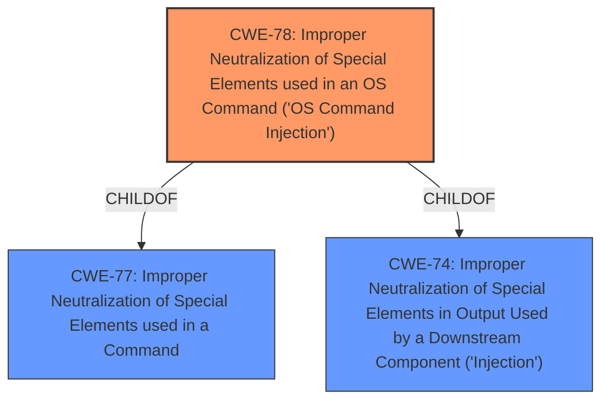

# Raw Analyzer Response for CVE-2021-20035

# Summary
| CWE ID | CWE Name | Confidence | CWE Abstraction Level | CWE Vulnerability Mapping Label | CWE-Vulnerability Mapping Notes |
|---|---|---|---|---|---|
| CWE-78 | Improper Neutralization of Special Elements used in an OS Command ('OS Command Injection') | 0.8 | Base | Allowed | Primary CWE |
| CWE-77 | Improper Neutralization of Special Elements used in a Command | 0.7 | Class | Allowed | Secondary Candidate|

## Evidence and Confidence

*   **Confidence Score:** 0.8
*   **Evidence Strength:** HIGH

## Relationship Analysis
The primary relationship influencing my decision is the hierarchical one. CWE-78 is a child of CWE-77 and CWE-74, providing a more specific classification for OS command injection than its parents. The vulnerability description mentions command injection, which aligns well with CWE-78. The "CanAlsoBe" relationship between CWE-78 and CWE-88 (Argument Injection) was also considered, but the description focuses on the **improper neutralization**, making CWE-78 a better fit.

## Vulnerability Chain
The vulnerability chain starts with **improper neutralization of special elements** in the management interface, leading to the ability to inject arbitrary commands.

## Summary of Analysis
My analysis is strongly based on the provided evidence, specifically the vulnerability description mentioning **"improper neutralization of special elements"** which allows for **"inject arbitrary commands"**. This aligns well with the definition of CWE-78, which describes the **improper neutralization of special elements** used in constructing OS commands.

The retriever results also show CWE-78 as a potential match. The relationships in the graph, particularly the child-of relationship to CWE-77 and CWE-74, help refine the selection to the most specific CWE. CWE-78 is at the Base level of abstraction, which is the optimal level as the description is specific to OS commands.

Relevant CWE Information:

# Enhanced Context (25 CWEs)

## CWE-74: Improper Neutralization of Special Elements in Output Used by a Downstream Component ('Injection')
**Abstraction Level**: Class
**Similarity Score**: 0.77
**Source**: dense

**Description**:
The product constructs all or part of a command, data structure, or record using externally-influenced input from an upstream component, but it does not neutralize or incorrectly neutralizes special elements that could modify how it is parsed or interpreted when it is sent to a downstream component.

**Mapping Guidance**:
- Usage: Discouraged
- Rationale: CWE-74 is high-level and often misused when lower-level weaknesses are more appropriate.

## CWE-78: Improper Neutralization of Special Elements used in an OS Command ('OS Command Injection')
**Abstraction Level**: base
**Similarity Score**: 4.59
**Source**: graph

**Description**:
CWE-78: Improper Neutralization of Special Elements used in an OS Command ('OS Command Injection')

**Mapping Guidance**:
- Usage: Allowed
- Rationale: This CWE entry is at the Base level of abstraction, which is a preferred level of abstraction for mapping to the root causes of vulnerabilities.

**Relationships**:
- CANFOLLOW -> CWE-184
- CANALSOBE -> CWE-88
- CHILDOF -> CWE-77
- CHILDOF -> CWE-77
- CHILDOF -> CWE-74

CWE-78 is selected as the primary CWE because the vulnerability allows a remote authenticated attacker to **inject arbitrary commands**.

CWE-77: Improper Neutralization of Special Elements used in a Command
**Abstraction Level**: Class

CWE-77 was considered but not selected as the primary weakness. While it covers command injection, CWE-78 is more specific because it explicitly focuses on OS commands. Since the vulnerability description mentions command injection with the potential for DoS, CWE-78 is a more precise fit.