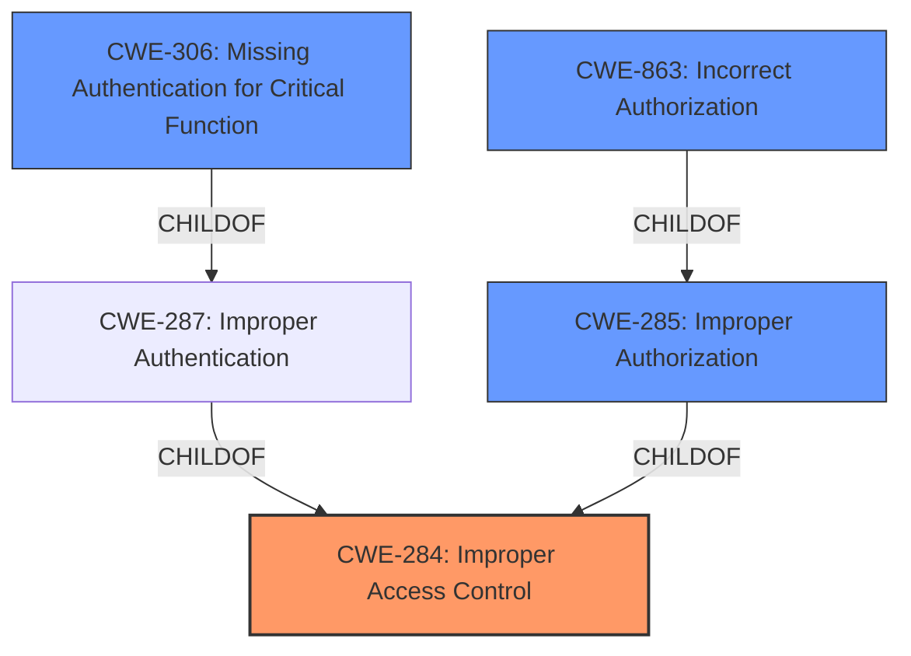

# Raw Analyzer Response for CVE-2021-20050

# Summary
| CWE ID | CWE Name | Confidence | CWE Abstraction Level | CWE Vulnerability Mapping Label | CWE-Vulnerability Mapping Notes |
|---|---|---|---|---|---|
| CWE-284 | Improper Access Control | 0.75 | Pillar | Primary | Discouraged |
| CWE-306 | Missing Authentication for Critical Function | 0.6 | Base | Secondary | Allowed |

## Evidence and Confidence

*   **Confidence Score:** 0.7
*   **Evidence Strength:** MEDIUM

## Relationship Analysis
The primary CWE identified is CWE-284, which is a high-level Pillar. The Retriever Results show potential child CWEs like CWE-306, CWE-863, and CWE-285. These are more specific and could potentially refine the classification.
CWE-306 is a child of CWE-287 (Improper Authentication), which itself is a child of CWE-284. This hierarchical relationship suggests that if authentication is completely missing for critical functions, CWE-306 is a more precise classification than the general CWE-284.
CWE-863 is a child of CWE-285 (Improper Authorization), which is also a child of CWE-284. This relationship would be more applicable if authorization checks were performed incorrectly.

## Vulnerability Chain
The chain of events is as follows:
1.  **Root Cause:** **Improper access control** due to potentially **missing authentication**.
2.  **Weakness:** APIs are accessible without user login.
3.  **Impact:** Exposure of configuration metadata.

## Summary of Analysis
The initial assessment based on the vulnerability description and key phrases points to **CWE-284: Improper Access Control**. The description explicitly states "**improper access control**" as the root cause. The Retriever Results also list CWE-284 as the top candidate. However, CWE-284 is a Pillar, and the mapping guidance discourages its use due to its high-level nature.

The description mentions "multiple restricted management APIs being accessible without a user login." This strongly suggests that authentication is either missing or insufficient. Among the suggested alternatives to CWE-284, **CWE-306: Missing Authentication for Critical Function** is a strong contender. If the APIs require authentication but lack it entirely, then CWE-306 is more appropriate.

Therefore, based on the provided evidence, **CWE-284** is selected as the primary CWE due to the direct mention of "**improper access control**," but with a lower confidence since it's a high-level Pillar. **CWE-306** is included as a secondary CWE because the description specifies APIs are accessible "without a user login," suggesting **missing authentication** for critical functions.

Relevant CWE Information:

# Enhanced Context (25 CWEs)

## CWE-284: Improper Access Control
**Abstraction:** Pillar
**Status:** Incomplete

### Description
The product does not restrict or incorrectly restricts access to a resource from an unauthorized actor.

### Extended Description

Access control involves the use of several protection mechanisms such as:

  - Authentication (proving the identity of an actor)

  - Authorization (ensuring that a given actor can access a resource), and

  - Accountability (tracking of activities that were performed)

When any mechanism is not applied or otherwise fails, attackers can compromise the security of the product by gaining privileges, reading sensitive information, executing commands, evading detection, etc.

There are two distinct behaviors that can introduce access control weaknesses:

  - Specification: incorrect privileges, permissions, ownership, etc. are explicitly specified for either the user or the resource (for example, setting a password file to be world-writable, or giving administrator capabilities to a guest user). This action could be performed by the program or the administrator.

  - Enforcement: the mechanism contains errors that prevent it from properly enforcing the specified access control requirements (e.g., allowing the user to specify their own privileges, or allowing a syntactically-incorrect ACL to produce insecure settings). This problem occurs within the program itself, in that it does not actually enforce the intended security policy that the administrator specifies.

### Alternative Terms
Authorization: The terms "access control" and "authorization" are often used interchangeably, although many people have distinct definitions. The CWE usage of "access control" is intended as a general term for the various mechanisms that restrict which users can access which resources, and "authorization" is more narrowly defined. It is unlikely that there will be community consensus on the use of these terms.

### Relationships
None

### Mapping Guidance
**Usage:** Discouraged
**Rationale:** CWE-284 is extremely high-level, a Pillar. Its name, "Improper Access Control," is often misused in low-information vulnerability reports [REF-1287] or by active use of the OWASP Top Ten, such as "A01:2021-Broken Access Control". It is not useful for trend analysis.
**Comments:** Consider using descendants of CWE-284 that are more specific to the kind of access control involved, such as those involving authorization (Missing Authorization (CWE-862), Incorrect Authorization (CWE-863), Incorrect Permission Assignment for Critical Resource (CWE-732), etc.); authentication (Missing Authentication (CWE-306) or Weak Authentication (CWE-1390)); Incorrect User Management (CWE-286); Improper Restriction of Communication Channel to Intended Endpoints (CWE-923); etc.
**Reasons:**
- Frequent Misuse
- Abstraction
**Suggested Alternatives:**
- CWE-862: Missing Authorization
- CWE-863: Incorrect Authorization
- CWE-732: Incorrect Permission Assignment for Critical Resource
- CWE-306: Missing Authentication
- CWE-1390: Weak Authentication
- CWE-923: Improper Restriction of Communication Channel to Intended Endpoints

## CWE-306: Missing Authentication for Critical Function
**Abstraction:** Base
**Status:** Draft

### Description
The product does not perform any authentication for functionality that requires a provable user identity or consumes a significant amount of resources.

### Extended Description
Not provided

### Alternative Terms
None

### Relationships
ChildOf -> CWE-287
ChildOf -> CWE-287

### Mapping Guidance
**Usage:** Allowed
**Rationale:** This CWE entry is at the Base level of abstraction, which is a preferred level of abstraction for mapping to the root causes of vulnerabilities.
**Comments:** Carefully read both the name and description to ensure that this mapping is an appropriate fit. Do not try to 'force' a mapping to a lower-level Base/Variant simply to comply with this preferred level of abstraction.
**Reasons:**
- Acceptable-Use

### CWEs Considered but Not Used:

*   **CWE-266: Incorrect Privilege Assignment:** This CWE was not selected because the vulnerability description focuses on missing authentication rather than incorrect assignment of privileges.
*   **CWE-287: Improper Authentication:** While related to authentication, CWE-287 is a Class, and CWE-306 provides more specificity if authentication is entirely missing. If the authentication was present but weak, CWE-287 or its child CWE-1390 (Weak Authentication) would be more appropriate.
*   **CWE-285: Improper Authorization:** The vulnerability description emphasizes APIs being accessible without login, pointing more towards a missing authentication issue than an authorization flaw.
*   **CWE-863: Incorrect Authorization:** Similar to CWE-285, this CWE focuses on incorrect authorization checks. The key issue is the lack of authentication, not an incorrect authorization process.
*   **CWE-200: Exposure of Sensitive Information to an Unauthorized Actor:** While the vulnerability leads to exposure of configuration metadata, the root cause is the **improper access control** and **missing authentication**, not the direct exposure of sensitive information.
*   **CWE-613: Insufficient Session Expiration:** This CWE is not applicable because the description indicates APIs are accessible without login, not that sessions are expiring improperly.
*   **CWE-22: Improper Limitation of a Pathname to a Restricted Directory ('Path