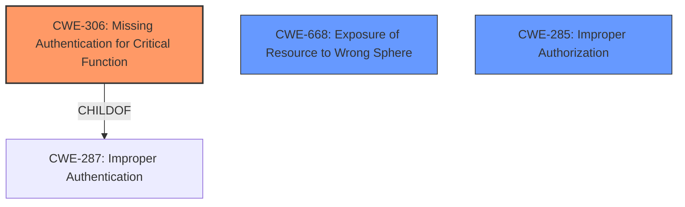

# Enhanced Analysis for CVE-2021-20067

# Summary
| CWE ID | CWE Name | Confidence | CWE Abstraction Level | CWE Vulnerability Mapping Label | CWE-Vulnerability Mapping Notes |
|---|---|---|---|---|---|
| CWE-306 | Missing Authentication for Critical Function | 1.0 | Base | Allowed | Primary CWE |
| CWE-668 | Exposure of Resource to Wrong Sphere | 0.7 | Class | Discouraged | Secondary Candidate |
| CWE-285 | Improper Authorization | 0.6 | Class | Discouraged | Secondary Candidate |

## Evidence and Confidence

*   **Confidence Score:** 1.0
*   **Evidence Strength:** HIGH

## Relationship Analysis
The primary CWE is CWE-306, which is a Base level CWE and a child of CWE-287 (Improper Authentication). This relationship indicates that the vulnerability is a specific case of a broader authentication issue. CWE-287 is a Class level CWE and is discouraged. The other candidate is CWE-668, which is also a Class and therefore discouraged. CWE-306 is at the optimal level of abstraction, and represents the root cause of the issue.



## Vulnerability Chain
The vulnerability chain starts with the **missing authentication** (**CWE-306**) for accessing sensitive syslog events, leading to the **exposure of sensitive information** to unauthorized users.

## Summary of Analysis
The initial analysis strongly pointed towards CWE-306 (Missing Authentication for Critical Function) as the primary weakness. The vulnerability description explicitly states that the issue allows attackers to view sensitive syslog events without authentication.

The evidence from "CVE Reference Links Content Summary" states:

*   "The vulnerability exists due to the **lack of authentication** required to view sensitive syslog events within Racom's MIDGE Firmware 4.4.40.105"
*   "Information Exposure: Sensitive syslog information is displayed to unauthenticated users."

The retriever results also list CWE-306 as the top candidate.

Given this evidence, CWE-306 is the most appropriate choice. It accurately reflects the root cause of the vulnerability. It is also a Base level CWE, which is the preferred level of abstraction. The other candidates are Class level CWEs and are less specific.

**CWE-668 (Exposure of Resource to Wrong Sphere):** This CWE was considered because the vulnerability results in the exposure of sensitive syslog events to unauthenticated users. However, CWE-668 is a high-level Class CWE, and CWE-306 provides a more specific description of the root cause which is the **missing authentication**. Therefore, CWE-668 is not the best fit. Also, the mapping guidance for CWE-668 discourages its use.

**CWE-285 (Improper Authorization):** This CWE was considered because the vulnerability allows attackers to view sensitive information without proper authorization. However, the **missing authentication** is the root cause. Therefore, CWE-285 is not the best fit. Also, the mapping guidance for CWE-285 discourages its use.

**CWE-425 (Direct Request ('Forced Browsing')):** This CWE was considered because the attacker directly requests a resource without proper authorization. However, the root cause is the **lack of authentication** required to access the resource, making CWE-306 a more accurate representation of the vulnerability.

**CWE-288 (Authentication Bypass Using an Alternate Path or Channel):** While this CWE might seem relevant, the description focuses on *bypassing* authentication, implying that authentication mechanisms exist but are circumvented. In this case, authentication is simply **missing**, not bypassed.

Therefore, CWE-306 is at the optimal level of specificity and best represents the root cause of this vulnerability.


## CWE Relationship Analysis

Current CWEs represent these abstraction levels: .


### Vulnerability Chain Analysis

**Chain starting from CWE-288:**
- 288 (Authentication Bypass Using an Alternate Path or Channel) - ROOT


**Chain starting from CWE-306:**
- 306 (Missing Authentication for Critical Function) - ROOT


### CWE Relationship Diagram

```mermaid
graph TD
    classDef primary fill:#f96,stroke:#333,stroke-width:2px
    classDef secondary fill:#69f,stroke:#333
    classDef tertiary fill:#9e9,stroke:#333
```