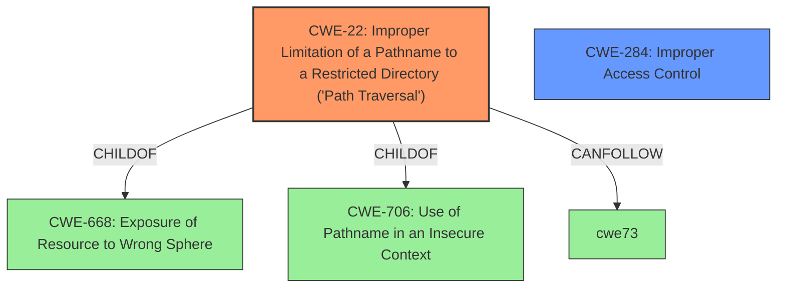

# Raw Analyzer Response for CVE-2021-20072

# Summary
| CWE ID | CWE Name | Confidence | CWE Abstraction Level | CWE Vulnerability Mapping Label | CWE-Vulnerability Mapping Notes |
|---|---|---|---|---|---|
| CWE-22 | Improper Limitation of a Pathname to a Restricted Directory ('Path Traversal') | 1.0 | Base | Allowed | Primary CWE |
| CWE-284 | Improper Access Control | 0.7 | Pillar | Discouraged | Secondary Candidate |

## Evidence and Confidence

*   **Confidence Score:** 0.9
*   **Evidence Strength:** HIGH

## Relationship Analysis
The primary CWE, CWE-22, is a base-level weakness that describes the core issue of path traversal. CWE-284, a pillar-level weakness, represents a high-level view of improper access control. While access control is relevant, CWE-22 provides a more specific and accurate description of the vulnerability. CWE-22 is a child of CWE-668 "Exposure of Resource to Wrong Sphere" and CWE-706 "Use of Pathname in an Insecure Context".

## Vulnerability Chain
The vulnerability chain starts with the **improper handling of user-supplied paths** (CWE-22), leading to the ability to **arbitrarily access and delete files**. The initial flaw is the lack of proper input validation and sanitization, which allows attackers to manipulate file paths and escape the intended restricted directory.

## Summary of Analysis
The initial analysis identified CWE-22 as the primary weakness due to the **authenticated directory traversal**. The vulnerability description clearly states that an attacker can "arbitrarily access and delete files via an authenticated directory traversal." This aligns directly with the definition of CWE-22, which focuses on the **improper limitation of a pathname to a restricted directory**.

The retriever results also support this, with CWE-22 scoring highly. The evidence from the "CVE Reference Links Content Summary" confirms the root cause: "**An authenticated directory traversal vulnerability exists in the configuration and tcpdump download functionality**." It also highlights the **weaknesses** as "**Improper handling of user-supplied paths allowing directory traversal**" and "**Lack of input sanitization leading to arbitrary file access and deletion**."

CWE-284 was considered but deemed less specific. While access control is involved, the core issue is the path traversal itself. The MITRE mapping guidance discourages the use of CWE-284 due to its high-level nature.

The selection of CWE-22 is at the optimal level of specificity because it accurately describes the root cause of the vulnerability and is a base-level CWE, which is preferred.

Relevant CWE Information:

# Enhanced Context (25 CWEs)

## CWE-41: Improper Resolution of Path Equivalence
**Abstraction Level**: Base
**Similarity Score**: 0.77

This CWE was not selected because the vulnerability is about bypassing directory restrictions, not about misinterpreting equivalent paths.

## CWE-184: Incomplete List of Disallowed Inputs
**Abstraction Level**: Base
**Similarity Score**: 0.77

While this CWE is related to input validation, the primary issue is the directory traversal, not the incompleteness of a list of disallowed inputs. This could be a secondary weakness if a denylist was used and incomplete.

## CWE-807: Reliance on Untrusted Inputs in a Security Decision
**Abstraction Level**: Base
**Similarity Score**: 0.77

This CWE is not applicable because the vulnerability isn't about making security decisions based on untrusted inputs, but rather about the lack of proper input sanitization for pathnames.

## CWE-668: Exposure of Resource to Wrong Sphere
**Abstraction Level**: Class
**Similarity Score**: 0.77

This CWE is too high-level. CWE-22 is a more specific and appropriate choice.

## CWE-23: Relative Path Traversal
**Abstraction Level**: Base
**Similarity Score**: 0.77

CWE-23 is very similar to CWE-22. CWE-22 was selected because the vulnerability description does not explicitly mention the use of ".." sequences (relative path traversal), though it is implied.

## CWE-280: Improper Handling of Insufficient Permissions or Privileges 
**Abstraction Level**: Base
**Similarity Score**: 0.77

This CWE is not applicable because the vulnerability is not related to insufficient permissions or privileges.

## CWE-274: Improper Handling of Insufficient Privileges
**Abstraction Level**: Base
**Similarity Score**: 0.76

Similar to CWE-280, this CWE is not relevant to the vulnerability.

## CWE-73: External Control of File Name or Path
**Abstraction Level**: Base
**Similarity Score**: 0.76

While this CWE is related to external control of file names or paths, CWE-22 is more specific as it focuses on the improper limitation of a pathname to a restricted directory.

## CWE-345: Insufficient Verification of Data Authenticity
**Abstraction Level**: Class
**Similarity Score**: 0.76

This CWE is not applicable because the vulnerability is not about verifying the authenticity of data.

## CWE-266: Incorrect Privilege Assignment
**Abstraction Level**: Base
**Similarity Score**: 0.76

This CWE is not relevant because the vulnerability is not about incorrect privilege assignment.

## CWE-59: Improper Link Resolution Before File Access ('Link Following')
**Abstraction Level**: Base
**Similarity Score**: 6712.37

This CWE is not applicable as the vulnerability does not involve symbolic links.

## CWE-427: Uncontrolled Search Path Element
**Abstraction Level**: Base
**Similarity Score**: 6551.27

This CWE is not applicable because the vulnerability is not about uncontrolled search paths.

## CWE-78: Improper Neutralization of Special Elements used in an OS Command ('OS Command Injection')
**Abstraction Level**: base
**Similarity Score**: 5.03

This CWE is not applicable because the vulnerability is not related to OS command injection.

## CWE-98: Improper Control of Filename for Include/Require Statement in PHP Program ('PHP Remote File Inclusion')
**Abstraction Level**: variant
**Similarity Score**: 4.53

This CWE is not applicable because the vulnerability is not specific to PHP remote file inclusion.

## CWE-434: Unrestricted Upload of File with Dangerous Type
**Abstraction Level**: base
**Similarity Score**: 4.33

This CWE is not applicable because the vulnerability is not about unrestricted file uploads.

## CWE-425: Direct Request ('Forced Browsing')
**Abstraction Level**: base
**Similarity Score**: 4.33

This CWE is not the primary issue, as the core weakness is the path traversal itself, which allows access to restricted resources.

## CWE-471: Modification of Assumed-Immutable Data (MAID)
**Abstraction Level**: base
**Similarity Score**: 4.33

This CWE is not relevant because the vulnerability does not involve the modification of assumed-immutable data.

## CWE-79: Improper Neutralization of Input During Web Page Generation ('Cross-site Scripting')
**Abstraction Level**: base
**Similarity Score**: 4.33

This CWE is not applicable because the vulnerability is not related to cross-site scripting.

## CWE-426: Untrusted Search Path
**Abstraction Level**: base
**Similarity Score**: 3.64

This CWE is not applicable because the vulnerability is not about untrusted search paths.