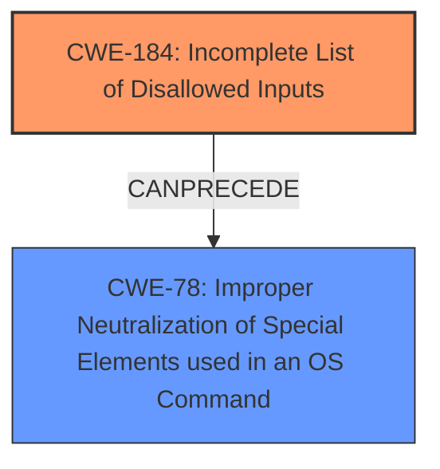

# Enhanced Analysis for CVE-2021-20081

# Summary
| CWE ID | CWE Name | Confidence | CWE Abstraction Level | CWE Vulnerability Mapping Label | CWE-Vulnerability Mapping Notes |
|---|---|---|---|---|---|
| CWE-184 | Incomplete List of Disallowed Inputs | 1.0 | Base | Primary | Allowed |
| CWE-78 | Improper Neutralization of Special Elements used in an OS Command ('OS Command Injection') | 0.8 | Base | Secondary | Allowed |

## Evidence and Confidence

*   **Confidence Score:** 0.9
*   **Evidence Strength:** HIGH

## Relationship Analysis
The primary CWE, CWE-184 (Incomplete List of Disallowed Inputs), is a base-level CWE that accurately describes the **root cause** of the vulnerability, where the application fails to completely restrict dangerous inputs. CWE-78 (Improper Neutralization of Special Elements used in an OS Command) is considered as a secondary weakness, highlighting the impact of the **incomplete list**, leading to potential OS command injection. CWE-184 can precede CWE-78.



## Vulnerability Chain
The vulnerability chain starts with an **incomplete list of disallowed inputs (CWE-184)**. This **incomplete list** allows an attacker to inject special elements into an OS command, leading to **Improper Neutralization (CWE-78)**. This culminates in the ability to execute arbitrary commands with SYSTEM privileges.

## Summary of Analysis
The initial analysis identified CWE-184 as the primary weakness due to the **root cause** being an **incomplete list of disallowed inputs**. The vulnerability description and CVE Reference Links Content Summary clearly state that the application attempts to restrict certain keywords but fails to do so completely due to **improper input sanitization**. This aligns directly with the description of CWE-184. The relationship analysis further supports this by showing that CWE-184 can precede CWE-78, which represents the impact of the weakness.

The evidence from the vulnerability description includes the key phrase "**incomplete list of disallowed inputs**." The CVE Reference Links Content Summary provides further details, stating, "The vulnerability stems from an insufficient input sanitization implementation... The application attempts to restrict the use of certain keywords (e.g., "echo") in script commands, but only splits the input string by spaces... Attackers can bypass this restriction by using other delimiters."

CWE-78 is included as a secondary CWE because the **incomplete list** leads to the possibility of OS command injection. This is supported by the CVE Reference Links Content Summary, which mentions that the application allows the execution of user-provided script commands, which, when combined with the input sanitization weakness, results in arbitrary command execution.

The selection of CWE-184 is at the optimal level of specificity because it directly represents the **root cause** of the vulnerability. While CWE-20 (Improper Input Validation) could be considered, it is a more general weakness and less specific than CWE-184.
CWE-78 is also at the optimal level of specificity as it clearly defines the impact of the **incomplete list**, leading to OS command injection.

Relevant CWE Information:

# Enhanced Context (25 CWEs)
The following CWEs were identified as potentially relevant to this vulnerability:

## CWE-184: Incomplete List of Disallowed Inputs
**Abstraction Level**: Base
**Similarity Score**: 0.81
**Source**: dense

**Description**:
The product implements a protection mechanism that relies on a list of inputs (or properties of inputs) that are not allowed by policy or otherwise require other action to neutralize before additional processing takes place, but the list is incomplete.

**Mapping Guidance**:
- Usage: Allowed
- Rationale: This CWE entry is at the Base level of abstraction, which is a preferred level of abstraction for mapping to the root causes of vulnerabilities.

## CWE-78: Improper Neutralization of Special Elements used in an OS Command ('OS Command Injection')
**Abstraction Level**: base
**Similarity Score**: 5.03
**Source**: graph

**Description**:
CWE-78: Improper Neutralization of Special Elements used in an OS Command ('OS Command Injection')

**Mapping Guidance**:
- Usage: Allowed
- Rationale: This CWE entry is at the Base level of abstraction, which is a preferred level of abstraction for mapping to the root causes of vulnerabilities.

**Relationships**:
- CANFOLLOW -> CWE-184
- CANALSOBE -> CWE-88
- CHILDOF -> CWE-77
- CHILDOF -> CWE-77
- CHILDOF -> CWE-74


## CWE Relationship Analysis

Current CWEs represent these abstraction levels: .


### Vulnerability Chain Analysis

**Chain starting from CWE-88:**
- 88 (Improper Neutralization of Argument Delimiters in a Command ('Argument Injection')) - ROOT


**Chain starting from CWE-78:**
- 78 (Improper Neutralization of Special Elements used in an OS Command ('OS Command Injection')) - ROOT


### CWE Relationship Diagram

```mermaid
graph TD
    classDef primary fill:#f96,stroke:#333,stroke-width:2px
    classDef secondary fill:#69f,stroke:#333
    classDef tertiary fill:#9e9,stroke:#333
```