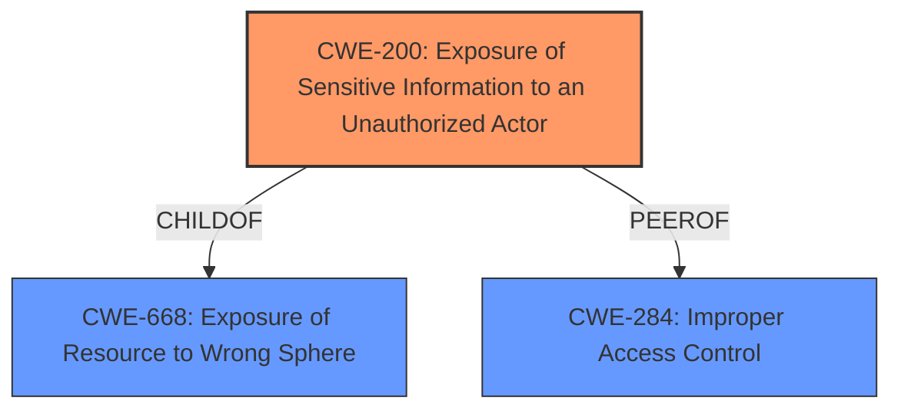

# Analysis Report for CVE-2021-20092

# Vulnerability Analysis Report: CVE-2021-20092

## Description


## Analysis (with Relationship Data)

# Summary
| CWE ID    | CWE Name                                                                          | Confidence | CWE Abstraction Level | CWE Vulnerability Mapping Label | CWE-Vulnerability Mapping Notes |
| :--------- | :--------------------------------------------------------------------------------- | :--------- | :---------------------- | :------------------------------ | :------------------------------ |
| CWE-200     | Exposure of Sensitive Information to an Unauthorized Actor                     | 0.85       | Class                   | Primary CWE                 | Discouraged                   |
| CWE-284 | Improper Access Control                                                             | 0.75       | Pillar                    | Secondary Candidate               | Discouraged                   |

## Evidence and Confidence

*   **Confidence Score:** 0.80
*   **Evidence Strength:** HIGH

## Relationship Analysis
The primary CWE is CWE-200 Exposure of Sensitive Information to an Unauthorized Actor which is a Class level weakness. CWE-200 is a child of CWE-668 Exposure of Resource to Wrong Sphere. CWE-284 Improper Access Control is a high-level Pillar that represents the general category of access control issues. The relationship between CWE-284 and its children (including authentication and authorization issues) is also considered.


## Vulnerability Chain
The vulnerability chain starts with **improper access control**, leading to the **exposure of sensitive information** to unauthorized actors.

## Summary of Analysis
Initial Analysis:
The vulnerability description clearly states that the web interfaces of Buffalo WSR-2533DHPL2 and WSR-2533DHP3 firmware versions <= 1.02 and WSR-2533DHP3 firmware version <= 1.24 **do not properly restrict access to sensitive information** from an unauthorized actor. The CVE Reference Links Content Summary reinforces this by stating that the **root_cause** is the **improper restriction of access to sensitive information**, and the impact is that "An unauthorized actor can access sensitive information." The **weaknesses** section lists "Improper Access Control". This suggests a primary weakness related to access control issues leading to information exposure.

Criticism and Conclusion:
While "Improper Access Control" is a valid high-level description, CWE-200 "Exposure of Sensitive Information to an Unauthorized Actor" better captures the specific impact of the vulnerability. The vulnerability allows unauthorized access to sensitive information, such as the admin password and LAN IP address. Although CWE-200 is discouraged, it fits the specifics of this vulnerability better than the other options. The evidence is strong as the vulnerability description and CVE details align with the characteristics of CWE-200.

The selected CWEs are at the optimal level of specificity because they accurately describe the **root cause** and impact of the vulnerability. CWE-200 describes the **exposure of sensitive information**, and CWE-284 covers the **improper access control** that leads to this exposure.

Relevant CWE Information:

# Enhanced Context (25 CWEs)
The following CWEs were identified as potentially relevant to this vulnerability:

## CWE-653: Improper Isolation or Compartmentalization
**Abstraction Level**: Class
**Similarity Score**: 0.78

## CWE-41: Improper Resolution of Path Equivalence
**Abstraction Level**: Base
**Similarity Score**: 0.78

## CWE-538: Insertion of Sensitive Information into Externally-Accessible File or Directory
**Abstraction Level**: Base
**Similarity Score**: 0.77

## CWE-668: Exposure of Resource to Wrong Sphere
**Abstraction Level**: Class
**Similarity Score**: 0.77

## CWE-212: Improper Removal of Sensitive Information Before Storage or Transfer
**Abstraction Level**: Base
**Similarity Score**: 0.77

## CWE-226: Sensitive Information in Resource Not Removed Before Reuse
**Abstraction Level**: Base
**Similarity Score**: 0.77

## CWE-274: Improper Handling of Insufficient Privileges
**Abstraction Level**: Base
**Similarity Score**: 0.77

## CWE-807: Reliance on Untrusted Inputs in a Security Decision
**Abstraction Level**: Base
**Similarity Score**: 0.77

## CWE-1220: Insufficient Granularity of Access Control
**Abstraction Level**: Base
**Similarity Score**: 0.76

## CWE-552: Files or Directories Accessible to External Parties
**Abstraction Level**: Base
**Similarity Score**: 0.76

## CWE-22: Improper Limitation of a Pathname to a Restricted Directory ('Path Traversal')
**Abstraction Level**: Base
**Similarity Score**: 7142.43

## CWE-863: Incorrect Authorization
**Abstraction Level**: Class
**Similarity Score**: 6943.99

## CWE-200: Exposure of Sensitive Information to an Unauthorized Actor
**Abstraction Level**: Class
**Similarity Score**: 6905.75

## CWE-639: Authorization Bypass Through User-Controlled Key
**Abstraction Level**: Base
**Similarity Score**: 6885.44

## CWE-1299: Missing Protection Mechanism for Alternate Hardware Interface
**Abstraction Level**: Base
**Similarity Score**: 6835.95

## CWE-22: Improper Limitation of a Pathname to a Restricted Directory ('Path Traversal')
**Abstraction Level**: base
**Similarity Score**: 4.33

## CWE-201: Insertion of Sensitive Information Into Sent Data
**Abstraction Level**: base
**Similarity Score**: 4.33

## CWE-613: Insufficient Session Expiration
**Abstraction Level**: base
**Similarity Score**: 4.33

## CWE-420: Unprotected Alternate Channel
**Abstraction Level**: base
**Similarity Score**: 3.64

## CWE-288: Authentication Bypass Using an Alternate Path or Channel
**Abstraction Level**: base
**Similarity Score**: 3.64

## CWE-1191: On-Chip Debug and Test Interface With Improper Access Control
**Abstraction Level**: base
**Similarity Score**: 3.64

## CWE-1299: Missing Protection Mechanism for Alternate Hardware Interface
**Abstraction Level**: base
**Similarity Score**: 3.64

## CWE-73: External Control of File Name or Path
**Abstraction Level**: Base
**Similarity Score**: 3.20

## CWE-41: Improper Resolution of Path Equivalence
**Abstraction Level**: Base
**Similarity Score**: 2.91

## CWE-212: Improper Removal of Sensitive Information Before Storage or Transfer
**Abstraction Level**: Base
**Similarity Score**: 2.91

CWE Details:

*   **CWE-200 Exposure of Sensitive Information to an Unauthorized Actor:** This CWE is chosen because the core issue is the exposure of sensitive information (admin password, LAN IP address) due to **improper access control**. The vulnerability allows an unauthenticated actor to access this information. Even though CWE-200 is discouraged, it best fits the specifics of this vulnerability. The security implication is that unauthorized actors can gain access to sensitive system information, potentially leading to further compromise.
*   **CWE-284 Improper Access Control:** This CWE is a broader category that encompasses the specific issue. The product **does not properly restrict access to sensitive information**, leading to the exposure. While a more specific child of CWE-284 could be considered, the information available does not provide enough detail to pinpoint the exact type of access control failure. This has a high-security impact as unauthorized access can lead to further exploitation.

**CWEs Considered But Not Used:**

*   **CWE-22: Improper Limitation of a Pathname to a Restricted Directory ('Path Traversal'):** While path traversal might be a potential attack vector, the primary issue is not related to path manipulation but rather the **lack of access control** on sensitive information.
*   **CWE-287: Improper Authentication:** The vulnerability description specifies that **no authentication is required** to obtain the sensitive information, so authentication isn't the primary weakness. The issue is access control after (or in the absence of) authentication.
*   **CWE-306: Missing Authentication for Critical Function:** While related to the lack of authentication, the core problem is that sensitive information is accessible without any authorization checks, even if authentication were present.
*   **CWE-1220: Insufficient Granularity of Access Control:** While possibly related, the description doesn't specify insufficient granularity. It is more of a general **lack of access control** that is present for the sensitive information.
*   **CWE-912:


## CWE Relationship Analysis

Current CWEs represent these abstraction levels: .


### Vulnerability Chain Analysis

**Chain starting from CWE-288:**
- 288 (Authentication Bypass Using an Alternate Path or Channel) - ROOT


**Chain starting from CWE-1220:**
- 1220 (Insufficient Granularity of Access Control) - ROOT


### CWE Relationship Diagram

```mermaid
graph TD
    classDef primary fill:#f96,stroke:#333,stroke-width:2px
    classDef secondary fill:#69f,stroke:#333
    classDef tertiary fill:#9e9,stroke:#333
```


*Report generated on 2025-04-02 00:56:40*
