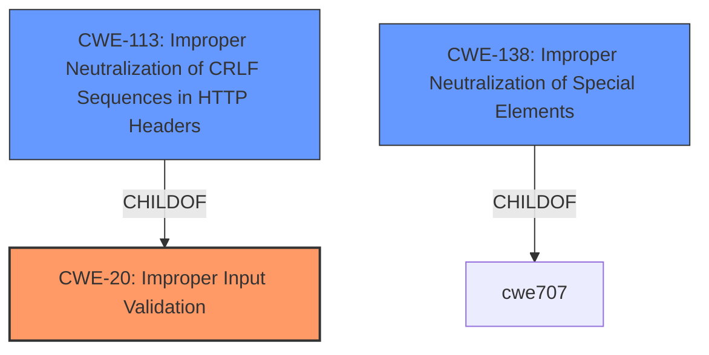

# Raw Analyzer Response for CVE-2021-20101

# Summary
| CWE ID | CWE Name | Confidence | CWE Abstraction Level | CWE Vulnerability Mapping Label | CWE-Vulnerability Mapping Notes |
|---|---|---|---|---|---|
| CWE-20 | Improper Input Validation | 0.7 | Class | Primary | Allowed |
| CWE-138 | Improper Neutralization of Special Elements | 0.6 | Class | Secondary | Discouraged |
| CWE-113 | Improper Neutralization of CRLF Sequences in HTTP Headers ('HTTP Request/Response Splitting') | 0.5 | Variant | Secondary | Allowed |

## Evidence and Confidence

*   **Confidence Score:** 0.7
*   **Evidence Strength:** MEDIUM

## Relationship Analysis
The primary relationship to consider is that of parent and child. CWE-20 is a parent Class of CWE-113, which is a more specific Variant. CWE-138 is a Class level of abstraction.
Also to note is the ChildOf relationship of CWE-113 to CWE-93, and the CanPrecede relationship of CWE-113 to CWE-79.

## Vulnerability Chain
The chain of weaknesses begins with the **improperly validated host headers**, leading to a **HTTP host header injection**, ultimately resulting in a victim receiving malformed content.

## Summary of Analysis
The initial analysis focused on the **improperly validated host headers**, which directly points to a failure in input validation. This is supported by the vulnerability description, which explicitly mentions this **weakness**. The **impact** is the reception of malformed content, which is a direct consequence of the injection.

The vulnerability description states "Machform prior to version 16 is vulnerable to **HTTP host header injection** due to **improperly validated host headers**. This could cause a victim to receive malformed content."

Based on the evidence, CWE-20 [CWE-20: Improper Input Validation] is the most appropriate primary CWE because the root cause is the **improper validation of the host headers**. The host header is a form of input and the application fails to validate it.

CWE-138 [CWE-138: Improper Neutralization of Special Elements] was considered because host headers can contain special elements, and the application's failure to neutralize them could lead to the injection. However, since the root cause is the **lack of validation** rather than the improper neutralization of special elements, CWE-20 is a better fit.

CWE-113 [CWE-113: Improper Neutralization of CRLF Sequences in HTTP Headers ('HTTP Request/Response Splitting')] was considered due to the potential for CRLF injection in HTTP headers. However, the vulnerability description does not specifically mention CRLF sequences, so it's less directly supported by the evidence, although it is a possibility.