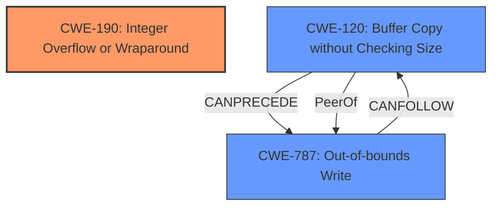

# Analysis for CVE-2021-20110

# Summary
| CWE ID | CWE Name | Confidence | CWE Abstraction Level | CWE Vulnerability Mapping Label | CWE-Vulnerability Mapping Notes |
|---|---|---|---|---|---|
| CWE-190 | Integer Overflow or Wraparound | 1.0 | Base | Primary | Allowed |
| CWE-120 | Buffer Copy without Checking Size ('Classic Buffer Overflow') | 1.0 | Base | Secondary | Allowed |
| CWE-787 | Out-of-bounds Write | 1.0 | Base | Secondary | Allowed |

## Evidence and Confidence

*   **Confidence Score:** 1.0
*   **Evidence Strength:** HIGH

## Relationship Analysis
The primary weakness is CWE-190, **Integer Overflow or Wraparound**, which leads to a **heap overflow**. This can be further described as CWE-787, **Out-of-bounds Write** or CWE-120, **Buffer Copy without Checking Size ('Classic Buffer Overflow')**, as the **integer overflow** results in allocating insufficient memory, and the subsequent write operation overflows the buffer.

## Vulnerability Chain
The vulnerability chain starts with:
1.  **Integer Overflow**: CWE-190, **Integer Overflow or Wraparound**, in the calculation of the buffer size.
2.  **Heap Overflow**: The undersized buffer is then overflowed. This can be represented as:
    *   CWE-787, **Out-of-bounds Write**, due to writing beyond the allocated buffer.
    *   CWE-120, **Buffer Copy without Checking Size ('Classic Buffer Overflow')**, because the data is copied into the buffer without checking the size.
3. **Remote Code Execution**: Due to the ability to write to arbitrary memory locations.

## Summary of Analysis
The primary weakness is the **integer overflow** (CWE-190) when calculating the buffer size. This then leads to a **heap overflow** because the allocated buffer is too small. The **heap overflow** can be classified as CWE-787, **Out-of-bounds Write**, because the write operation goes beyond the buffer's boundaries, or CWE-120, **Buffer Copy without Checking Size ('Classic Buffer Overflow')**. Both CWE-787 and CWE-120 are appropriate depending on the specific mechanism. The description indicates a classic buffer overflow scenario where data is copied into the undersized buffer without proper bounds checking.

The vulnerability description states: "The Integer Overflow occurs when receiving POST response from the Manage Engine server, and the agent calling HttpQueryInfoW in order to get the Content-Length size from the incoming POST request. This size is taken, but multiplied to a larger amount. If an attacker specifies a Content-Length size of 1073741823 or larger, this integer arithmetic will wrap the value back around to smaller integer, then calls calloc with this size to allocate memory. The following API InternetReadFile will copy the POST data into this buffer, which will be too small for the contents, and cause **heap overflow**."

Therefore, the primary CWE is CWE-190 because that's the root cause of the vulnerability. The **heap overflow** that results can be described with either CWE-787 or CWE-120. Because the vulnerability description explicitly mentions that `InternetReadFile` copies POST data into the buffer which is too small, CWE-120 is slightly more accurate.

CWE-295, **Improper Certificate Validation**, was considered but not selected as the primary CWE. Although the vulnerability description mentions that the agent doesn't validate HTTPS certificates, this is a separate vulnerability that allows an attacker to send a NEWSCAN request. The **integer overflow** and subsequent **heap overflow** is a different issue.

CWE-789, **Memory Allocation with Excessive Size Value** was also considered. However, it is less appropriate because the **integer overflow** results in a smaller than expected buffer being allocated, not an excessively large one.

Relevant CWE Information:

# Enhanced Query for CVE-2021-20110

# Vulnerability Description

    Due to Manage Engine Asset Explorer Agent 1.0.34 not validating HTTPS certificates, an attacker on the network can statically configure their IP address to match the Asset Explorers Server IP address. This will allow an attacker to send a NEWSCAN request to a listening agent on the network as well as receive the agents HTTP request verifying its authtoken. In httphandler.cpp, the agent reaching out over HTTP is vulnerable to an Integer Overflow, which can be turned into a Heap Overflow allowing for remote code execution as NT AUTHORITY/SYSTEM on the agent machine. The Integer Overflow occurs when receiving POST response from the Manage Engine server, and the agent calling HttpQueryInfoW in order to get the Content-Length size from the incoming POST request. This size is taken, but multiplied to a larger amount. If an attacker specifies a Content-Length size of 1073741823 or larger, this integer arithmetic will wrap the value back around to smaller integer, then calls calloc with this size to allocate memory. The following API InternetReadFile will copy the POST data into this buffer, which will be too small for the contents, and cause **heap overflow**.

    # Keyphrase-Specific CWE Analysis
    This vulnerability contains multiple keyphrases that may map to different CWEs. 
    Please analyze each keyphrase separately and determine the most appropriate CWE(s) for each.

    ## WEAKNESS: 'integer overflow'

Relevant CWEs for this WEAKNESS:

### 1. CWE-295: Improper Certificate Validation (Score: 1663.90)

The product does not validate, or incorrectly validates, a certificate....

### 2. CWE-190: Integer Overflow or Wraparound (Score: 1194.93)

The product performs a calculation that can
         produce an integer overflow or wraparound when the logic
         assumes that the resulting value will always be larger than
         the original value. This occurs when an integer value is
         incremented to a value that is too large to st...

### 3. CWE-1284: Improper Validation of Specified Quantity in Input (Score: 1128.33)

The product receives input that is expected to specify a quantity (such as size or length), but it does not validate or incorrectly validates that the quantity has the required properties....

### 4. CWE-681: Incorrect Conversion between Numeric Types (Score: 1046.78)

When converting from one data type to another, such as long to integer, data can be omitted or translated in a way that produces unexpected values. If the resulting values are used in a sensitive context, then dangerous behaviors may occur....

### 5. CWE-195: Signed to Unsigned Conversion Error (Score: 1039.29)

The product uses a signed primitive and performs a cast to an unsigned primitive, which can produce an unexpected value if the value of the signed primitive can not be represented using an unsigned primitive....

## WEAKNESS: 'heap overflow'

Relevant CWEs for this WEAKNESS:

### 1. CWE-295: Improper Certificate Validation (Score: 1663.90)

The product does not validate, or incorrectly validates, a certificate....

### 2. CWE-190: Integer Overflow or Wraparound (Score: 1194.93)

The product performs a calculation that can
         produce an integer overflow or wraparound when the logic
         assumes that the resulting value will always be larger than
         the original value. This occurs when an integer value is
         incremented to a value that is too large to st...

### 3. CWE-1284: Improper Validation of Specified Quantity in Input (Score: 1128.33)

The product receives input that is expected to specify a quantity (such as size or length), but it does not validate or incorrectly validates that the quantity has the required properties....

### 4. CWE-681: Incorrect Conversion between Numeric Types (Score: 1046.78)

When converting from one data type to another, such as long to integer, data can be omitted or translated in a way that produces unexpected values. If the resulting values are used in a sensitive context, then dangerous behaviors may occur....

### 5. CWE-195: Signed to Unsigned Conversion Error (Score: 1039.29)

The product uses a signed primitive and performs a cast to an unsigned primitive, which can produce an unexpected value if the value of the signed primitive can not be represented using an unsigned primitive....

## IMPACT: 'remote code execution'

Relevant CWEs for this IMPACT:

### 1. CWE-295: Improper Certificate Validation (Score: 1663.90)

The product does not validate, or incorrectly validates, a certificate....

### 2. CWE-190: Integer Overflow or Wraparound (Score: 1194.93)

The product performs a calculation that can
         produce an integer overflow or wraparound when the logic
         assumes that the resulting value will always be larger than
         the original value. This occurs when an integer value is
         incremented to a value that is too large to st...

### 3. CWE-1284: Improper Validation of Specified Quantity in Input (Score: 1128.33)

The product receives input that is expected to specify a quantity (such as size or length), but it does not validate or incorrectly validates that the quantity has the required properties....

### 4. CWE-681: Incorrect Conversion between Numeric Types (Score: 1046.78)

When converting from one data type to another, such as long to integer, data can be omitted or translated in a way that produces unexpected values. If the resulting values are used in a sensitive context, then dangerous behaviors may occur....

### 5. CWE-789: Memory Allocation with Excessive Size Value (Score: 351.76)

The product allocates memory based on an untrusted, large size value, but it does not ensure that the size is within expected limits, allowing arbitrary amounts of memory to be allocated....

## PRODUCT: 'Manage Engine Asset Explorer Agent'

Relevant CWEs for this PRODUCT:

### 1. CWE-295: Improper Certificate Validation (Score: 1663.90)

The product does not validate, or incorrectly validates, a certificate....

### 2. CWE-190: Integer Overflow or Wraparound (Score: 1194.93)

The product performs a calculation that can
         produce an integer overflow or wraparound when the logic
         assumes that the resulting value will always be larger than
         the original value. This occurs when an integer value is
         incremented to a value that is too large to st...

### 3. CWE-1284: Improper Validation of Specified Quantity in Input (Score: 1128.33)

The product receives input that is expected to specify a quantity (such as size or length), but it does not validate or incorrectly validates that the quantity has the required properties....

### 4. CWE-770: Allocation of Resources Without Limits or Throttling (Score: 351.82)

The product allocates a reusable resource or group of resources on behalf of an actor without imposing any restrictions on the size or number of resources that can be allocated, in violation of the intended security policy for that actor....

### 5. CWE-789: Memory Allocation with Excessive Size Value (Score: 351.76)

The product allocates memory based on an untrusted, large size value, but it does not ensure that the size is within expected limits, allowing arbitrary amounts of memory to be allocated....

## VERSION: '1.0.34'

Relevant CWEs for this VERSION:

### 1. CWE-295: Improper Certificate Validation (Score: 1663.90)

The product does not validate, or incorrectly validates, a certificate....

### 2. CWE-190: Integer Overflow or Wraparound (Score: 1194.93)

The product performs a calculation that can
         produce an integer overflow or wraparound when the logic
         assumes that the resulting value will always be larger than
         the original value. This occurs when an integer value is
         incremented to a value that is too large to st...

### 3. CWE-1284: Improper Validation of Specified Quantity in Input (Score: 1128.33)

The product receives input that is expected to specify a quantity (such as size or length), but it does not validate or incorrectly validates that the quantity has the required properties....

### 4. CWE-681: Incorrect Conversion between Numeric Types (Score: 1046.78)

When converting from one data type to another, such as long to integer, data can be omitted or translated in a way that produces unexpected values. If the resulting values are used in a sensitive context, then dangerous behaviors may occur....

### 5. CWE-789: Memory Allocation with Excessive Size Value (Score: 351.76)

The product allocates memory based on an untrusted, large size value, but it does not ensure that the size is within expected limits, allowing arbitrary amounts of memory to be allocated....

    # Analysis Instructions
    1. For each keyphrase, identify the most appropriate CWE(s) that represent the weakness.
    2. Consider how the different keyphrases might relate to each other in the vulnerability chain.
    3. Provide a final determination of primary CWE(s) and any secondary CWEs.
    4. Format your response using the standard analysis template.

    Please analyze how these different weaknesses interact and provide a comprehensive CWE classification.
    