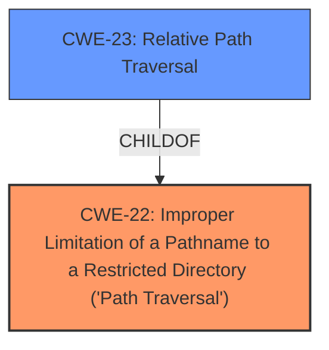

# Raw Analyzer Response for CVE-2021-20123

# Summary
| CWE ID | CWE Name | Confidence | CWE Abstraction Level | CWE Vulnerability Mapping Label | CWE-Vulnerability Mapping Notes |
|---|---|---|---|---|---|
| CWE-22 | Improper Limitation of a Pathname to a Restricted Directory ('Path Traversal') | 1.0 | Base | Allowed | Primary CWE |

## Evidence and Confidence

*   **Confidence Score:** 1.0
*   **Evidence Strength:** HIGH

## Relationship Analysis
The primary relationship that influenced the selection of CWE-22 is its direct relevance to the **local file inclusion** vulnerability, which allows attackers to access files outside of the intended restricted directory. While CWE-23 (Relative Path Traversal) is a child of CWE-22, the description provided doesn't explicitly limit the attack to relative path traversal using ".." sequences; thus, CWE-22, covering both relative and absolute path traversal, is a more appropriate fit.

## Vulnerability Chain
The vulnerability chain starts with the lack of proper input validation, allowing an unauthenticated attacker to manipulate the `show_file_name` parameter in the `DownloadFileServlet` endpoint. This leads to the **local file inclusion** vulnerability, enabling the attacker to download arbitrary files with root privileges.

## Summary of Analysis
The analysis strongly supports the selection of CWE-22 as the primary weakness. The vulnerability description explicitly states a **local file inclusion** vulnerability in the `DownloadFileServlet` endpoint, allowing an unauthenticated attacker to download arbitrary files from the underlying operating system. The "CVE Reference Links Content Summary" further confirms that the `show_file_name` parameter is vulnerable to directory traversal, enabling access to arbitrary file paths.

The "Retriever Results" list CWE-22 and CWE-23 as highly relevant, with CWE-22 being the more general case of path traversal. The description does not limit the traversal to relative paths only.

The final decision to select CWE-22 is based on:
- Direct evidence from the vulnerability description: "**local file inclusion** vulnerability... download arbitrary files from the underlying operating system"
- Confirmation from the CVE Reference Links Content Summary: "The `show_file_name` parameter in the `DownloadFileServlet` endpoint is vulnerable to directory traversal, allowing an attacker to specify arbitrary file paths."
- The complete CWE specifications: CWE-22 covers both relative and absolute path traversals, making it a more accurate fit than CWE-23.

CWE-98 (Improper Control of Filename for Include/Require Statement in PHP Program ('PHP Remote File Inclusion')) was considered but rejected because the vulnerability involves downloading arbitrary files rather than including or requiring them in a PHP program. CWE-78 (Improper Neutralization of Special Elements used in an OS Command ('OS Command Injection')) was also considered but rejected because the vulnerability does not involve injecting commands into an OS command. Instead, it revolves around accessing unintended files due to improper path validation, which is more accurately represented by CWE-22. The selection of CWE-22 provides the optimal level of specificity, accurately capturing the root cause of the vulnerability.