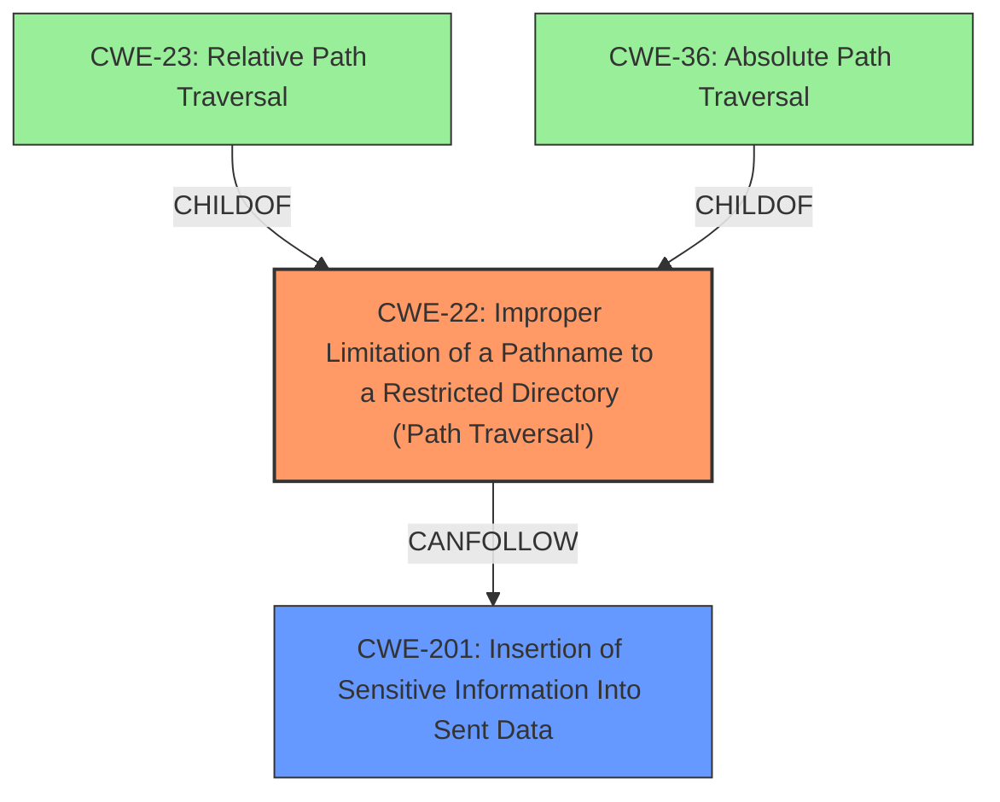

# Analysis for CVE-2021-20133

# Summary
| CWE ID | CWE Name | Confidence | CWE Abstraction Level | CWE Vulnerability Mapping Label | CWE-Vulnerability Mapping Notes |
|---|---|---|---|---|---|
| CWE-22 | Improper Limitation of a Pathname to a Restricted Directory ('Path Traversal') | 1.0 | Base | Allowed | Primary CWE |
| CWE-201 | Insertion of Sensitive Information Into Sent Data | 0.7 | Base | Allowed | Secondary Candidate |

## Evidence and Confidence

*   **Confidence Score:** 0.9
*   **Evidence Strength:** HIGH

## Relationship Analysis
The primary CWE selected is CWE-22, which is a Base level CWE, providing a specific description of the path traversal vulnerability. CWE-22 has child CWEs such as CWE-23 (Relative Path Traversal) and CWE-36 (Absolute Path Traversal). The vulnerability description specifically mentions an **absolute path traversal** vulnerability, but CWE-22 encompasses both relative and absolute path traversal, making it the more appropriate choice at the base level. CWE-201 is a related weakness as the path traversal allows the insertion of sensitive information into sent data (the message of the day banner).

## Vulnerability Chain
The vulnerability chain starts with the **improper limitation of a pathname** (CWE-22), which enables an attacker to read arbitrary files. This leads to the **insertion of sensitive information into sent data** (CWE-201), as the contents of those files (which might include credentials, configuration files, or private keys) are displayed in the message of the day banner.

## Summary of Analysis
The initial assessment identified CWE-22 as the primary weakness due to the **absolute path traversal** vulnerability. The selection is strongly based on the provided evidence. The vulnerability description states "Quagga Services on D-Link DIR-2640 less than or equal to version 1.11B02 are affected by an **absolute path traversal** vulnerability". The "CVE Reference Links Content Summary" section also confirms "Absolute path traversal vulnerability in Quagga Services on D-Link DIR-2640 routers". This makes CWE-22 the most appropriate and specific choice. CWE-201 is included as a secondary weakness.

Relevant CWE Information:

# Enhanced Context (25 CWEs)

## CWE-22: Improper Limitation of a Pathname to a Restricted Directory ('Path Traversal')
**Abstraction Level**: Base
**Similarity Score**: 7528.82
**Source**: sparse

**Description**:
The product uses external input to construct a pathname that is intended to identify a file or directory that is located underneath a restricted parent directory, but the product does not properly neutralize special elements within the pathname that can cause the pathname to resolve to a location that is outside of the restricted directory.

**Mapping Guidance**:
- Usage: Allowed
- Rationale: This CWE entry is at the Base level of abstraction, which is a preferred level of abstraction for mapping to the root causes of vulnerabilities.

## CWE-201: Insertion of Sensitive Information Into Sent Data
**Abstraction Level**: base
**Similarity Score**: 5.03
**Source**: graph

**Description**:
CWE-201: Insertion of Sensitive Information Into Sent Data

**Mapping Guidance**:
- Usage: Allowed
- Rationale: This CWE entry is at the Base level of abstraction, which is a preferred level of abstraction for mapping to the root causes of vulnerabilities.

### Other CWEs Considered but Not Used:

*   **CWE-36: Absolute Path Traversal**: While the vulnerability description mentions **absolute path traversal**, CWE-22 encompasses both relative and absolute path traversal, making it a better fit.
*   **CWE-59: Improper Link Resolution Before File Access ('Link Following')**: The vulnerability description doesn't suggest any involvement of symbolic links. The focus is on path traversal, not link following.
*   **CWE-78: Improper Neutralization of Special Elements used in an OS Command ('OS Command Injection')**: The vulnerability involves reading arbitrary files, not executing OS commands.
*   **CWE-259: Use of Hard-coded Password, CWE-522: Insufficiently Protected Credentials, CWE-798: Use of Hard-coded Credentials**: Although the vulnerability description mentions that sensitive information such as hashed credentials and hardcoded plaintext passwords can be disclosed, the root cause is the path traversal vulnerability that allows access to these files, not the existence of hardcoded credentials themselves.