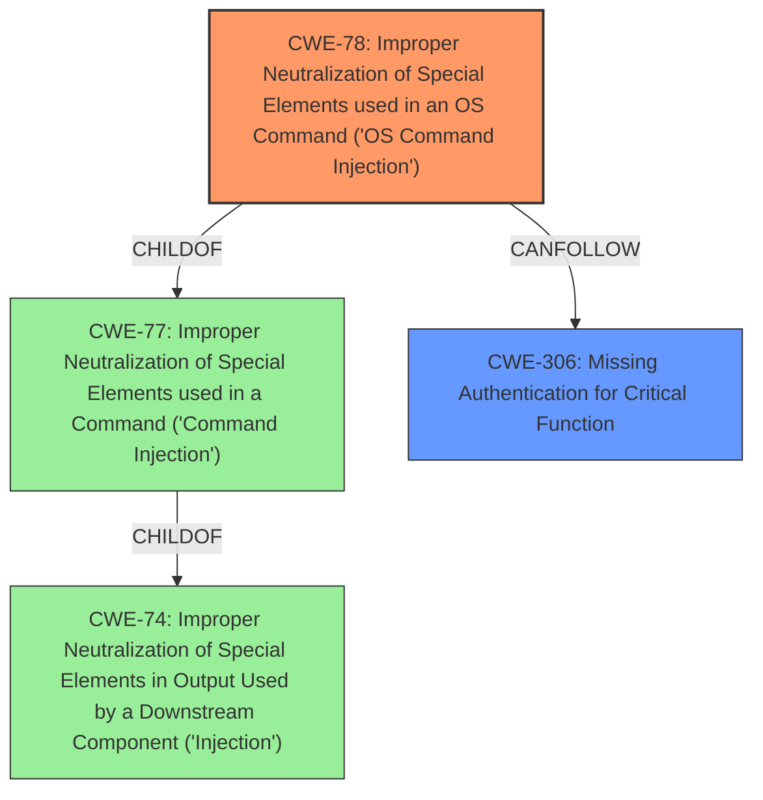

# Analysis Report for CVE-2021-20138

# Vulnerability Analysis Report: CVE-2021-20138

## Description


## Analysis (with Relationship Data)

# Summary
| CWE ID | CWE Name | Confidence | CWE Abstraction Level | CWE Vulnerability Mapping Label | CWE-Vulnerability Mapping Notes |
|---|---|---|---|---|---|
| CWE-78 | Improper Neutralization of Special Elements used in an OS Command ('OS Command Injection') | 1.0 | Base | Allowed | Primary CWE |
| CWE-306 | Missing Authentication for Critical Function | 0.7 | Base | Allowed | Secondary Candidate |

## Evidence and Confidence

*   **Confidence Score:** 0.9
*   **Evidence Strength:** HIGH

## Relationship Analysis
The primary relationship that influenced the CWE selection was the parent-child relationship between CWE-77 (Improper Neutralization of Special Elements used in a Command) and CWE-78 (Improper Neutralization of Special Elements used in an OS Command). Since the command injection occurs at the OS level, CWE-78 is a more specific and accurate classification than its parent. CWE-306 is related because the vulnerability is unauthenticated.



## Vulnerability Chain
The vulnerability chain starts with the **lack of authentication**, which allows an unauthenticated attacker to access the vulnerable endpoint. The next link is the **improper neutralization of special elements** in the OS command, which allows the attacker to inject arbitrary commands. The final impact is the **execution of commands as root** on the device.

## Summary of Analysis
The initial analysis identified **command injection** as the primary weakness. The retriever results and the vulnerability description strongly support CWE-78 (Improper Neutralization of Special Elements used in an OS Command). The CVE description specifically mentions that the parameters are concatenated without proper sanitization and then executed using `os.execute()`. This aligns perfectly with the definition of CWE-78, where externally influenced input is used to construct an OS command without proper neutralization. The vulnerability is also unauthenticated, which is why CWE-306 may be a secondary issue.

The graph relationships confirm that CWE-78 is a more specific case of CWE-77 (Improper Neutralization of Special Elements used in a Command), which is a child of CWE-74 (Improper Neutralization of Special Elements in Output Used by a Downstream Component ('Injection')). Given the evidence, CWE-78 is the most accurate and specific CWE for this vulnerability.

The selection of CWE-78 is based on the clear evidence of **improper neutralization** of special elements used in an OS command, as highlighted in the CVE Reference Links Content Summary: "The application fails to sanitize input, allowing an attacker to inject arbitrary commands into the string being executed by the `os.execute()` function." This directly corresponds to the description of CWE-78.

Relevant CWE Information:

# Enhanced Context (25 CWEs)

## CWE-78: Improper Neutralization of Special Elements used in an OS Command ('OS Command Injection')
**Abstraction:** Base
**Similarity Score**: 0.700 (Retriever Results)
**Source**: alternate_terms (Retriever Results), graph

### Description
The product constructs all or part of an OS command using externally-influenced input from an upstream component, but it does not neutralize or incorrectly neutralizes special elements that could modify the intended OS command when it is sent to a downstream component.

### Mapping Guidance
**Usage:** Allowed
**Rationale:** This CWE entry is at the Base level of abstraction, which is a preferred level of abstraction for mapping to the root causes of vulnerabilities.

**Explanation:**
The vulnerability description clearly states that a crafted HTTP POST request to the `/cgi-bin/luci/rc` endpoint, due to the **lack of sanitization** of user-provided input, allows an attacker to inject arbitrary commands into the string being executed by the `os.execute()` function. This aligns directly with the definition of CWE-78. The use of `os.execute()` confirms that this is an OS command injection vulnerability.
- **Security Implications:** This vulnerability allows an attacker to execute arbitrary commands as root on the device, leading to a complete compromise of the system.
- **Relationship:** CWE-78 is a child of CWE-77 (Improper Neutralization of Special Elements used in a Command), which is a more general class of command injection vulnerabilities. CWE-78 is the base level weakness, making it the more appropriate choice.
- **Mapping Guidance Influence:** The MITRE mapping guidance allows the usage of CWE-78, as it is at the base level of abstraction.

## CWE-306: Missing Authentication for Critical Function
**Abstraction:** Base
**Similarity Score**: 0.288 (Retriever Results)
**Source**: sparse

### Description
The product does not perform any authentication for functionality that requires a provable user identity or consumes a significant amount of resources.

### Mapping Guidance
**Usage:** Allowed
**Rationale:** This CWE entry is at the Base level of abstraction, which is a preferred level of abstraction for mapping to the root causes of vulnerabilities.

**Explanation:**
The vulnerability description indicates that the **command injection** vulnerability is unauthenticated. This means that an attacker does not need to provide any credentials to exploit the vulnerability, which suggests a **missing authentication** issue. The "unauthenticated remote attacker" detail supports classifying this issue as CWE-306
- **Security Implications:** The lack of authentication exacerbates the **command injection** vulnerability, as it allows anyone on the network to exploit it without needing valid credentials.
- **Relationship:** CWE-306 is related to CWE-287 (Improper Authentication), which is a more general class of authentication vulnerabilities.
- **Mapping Guidance Influence:** The MITRE mapping guidance allows the usage of CWE-306, as it is at the base level of abstraction.

## Rejected Considerations

*   **CWE-77 (Improper Neutralization of Special Elements used in a Command ('Command Injection'))**: While this is a parent of CWE-78, it is less specific. The vulnerability specifically involves OS commands, making CWE-78 a better fit.
*   **CWE-20 (Improper Input Validation)**: This is a very broad class. While input validation is missing, the more specific issue is that the lack of sanitization leads to command injection, making CWE-78 a better choice.
*   **CWE-138 (Improper Neutralization of Special Elements)**: This is a class-level CWE and less specific than CWE-78, which directly addresses OS command injection.
*   **CWE-790 (Improper Filtering of Special Elements)**: Similar to CWE-138, this is a more general class, and CWE-78 is a better fit due to its specificity to OS commands.
*   **CWE-73 (External Control of File Name or Path)**: This CWE is not applicable because the vulnerability involves **command injection**, not file path manipulation.
*   **CWE-89 (Improper Neutralization of Special Elements used in an SQL Command ('SQL Injection'))**: This CWE is not applicable because the vulnerability involves **command injection**, not SQL injection.
*   **CWE-94 (Improper Control of Generation of Code ('Code Injection'))**: This CWE is not applicable because the vulnerability involves **command injection**, not code injection. Code Injection is used when the product's functionality intentionally constructs all or part of a code segment.
*   **CWE-134 (Use of Externally-Controlled Format String)**: This CWE is not applicable because the vulnerability involves **command injection**, not format string issues.


## CWE Relationship Analysis

Current CWEs represent these abstraction levels: .


### Vulnerability Chain Analysis

**Chain starting from CWE-306:**
- 306 (Missing Authentication for Critical Function) - ROOT


**Chain starting from CWE-73:**
- 73 (External Control of File Name or Path) - ROOT


### CWE Relationship Diagram

```mermaid
graph TD
    classDef primary fill:#f96,stroke:#333,stroke-width:2px
    classDef secondary fill:#69f,stroke:#333
    classDef tertiary fill:#9e9,stroke:#333
```


*Report generated on 2025-04-02 01:13:28*
