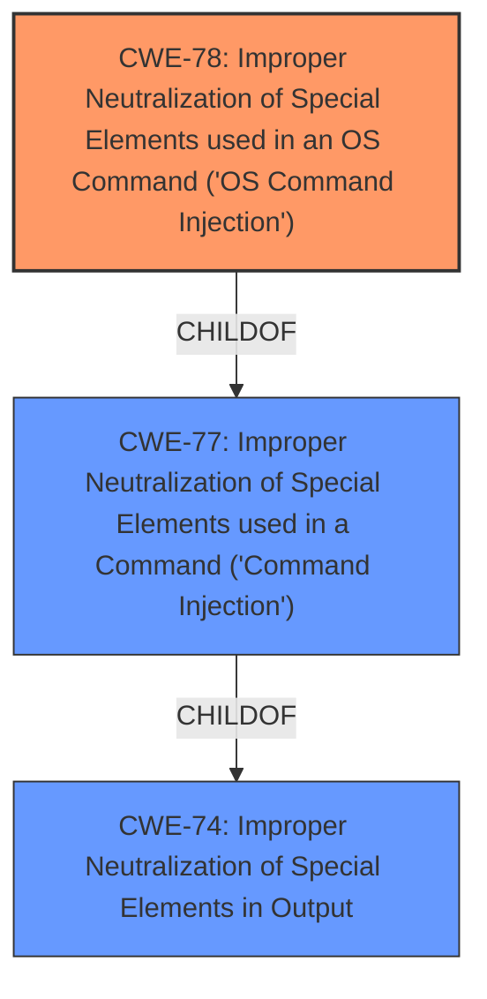

# Analysis Report for CVE-2021-20139

# Vulnerability Analysis Report: CVE-2021-20139

## Description


## Analysis (with Relationship Data)

# Summary
| CWE ID | CWE Name | Confidence | CWE Abstraction Level | CWE Vulnerability Mapping Label | CWE-Vulnerability Mapping Notes |
|---|---|---|---|---|---|
| CWE-78 | Improper Neutralization of Special Elements used in an OS Command ('OS Command Injection') | 1.0 | Base | Allowed | Primary CWE |

## Evidence and Confidence

*   **Confidence Score:** 1.0
*   **Evidence Strength:** HIGH

## Relationship Analysis
The primary relationship that influenced the selection of CWE-78 was its direct association with **command injection**, as indicated in both the vulnerability description and the CVE Reference Links Content Summary. CWE-78 is a child of CWE-77, which is a more general class encompassing command injection vulnerabilities. Since the vulnerability specifically involves OS commands, the more specific CWE-78 was chosen.



## Vulnerability Chain
The vulnerability chain starts with the Gryphon Tower router service failing to sanitize user-supplied input. This leads to the ability to inject OS commands, which results in arbitrary command execution with root privileges.
  - **Root Cause:** Improper sanitization of input.
  - **Weakness:** **Command injection** (CWE-78).
  - **Impact:** Arbitrary command execution with root privileges.

## Summary of Analysis
The analysis is based on the provided evidence, which clearly indicates a **command injection** vulnerability. The vulnerability description states, "An unauthenticated **command injection** vulnerability exists." The CVE Reference Links Content Summary confirms that "The `controller_server` service running on port 9999 of the Gryphon router has an operation (specifically operation 3) that passes user-supplied input unsanitized to a string, which is then executed via a call to `system()`." This directly maps to CWE-78, which describes a scenario where "The product constructs all or part of an OS command using externally-influenced input from an upstream component, but it does not neutralize or incorrectly neutralizes special elements that could modify the intended OS command when it is sent to a downstream component."

The choice of CWE-78 is further supported by the "CWE for similar CVE Descriptions" section, which lists CWE-78 as the primary match. The Retriever Results also rank CWE-78 as a strong candidate.

CWE-77 was considered but not selected because CWE-78 provides more specificity by explicitly mentioning OS commands, which aligns directly with the vulnerability description. CWE-20 was also considered but deemed less appropriate because it is a high-level class that doesn't capture the specific nature of the command injection. CWE-119 and its children were not selected because the vulnerability isn't related to memory operations or buffer overflows directly.

The selected CWE is at the optimal level of specificity, as it accurately reflects the root cause of the vulnerability (improper neutralization of special elements in an OS command) and its resulting impact (arbitrary command execution).

Relevant CWE Information:

# Enhanced Context (25 CWEs)
The following CWEs were identified as potentially relevant to this vulnerability:

## CWE-77: Improper Neutralization of Special Elements used in a Command ('Command Injection')

## CWE-78: Improper Neutralization of Special Elements used in an OS Command ('OS Command Injection')

## CWE-20: Improper Input Validation

## CWE-120: Buffer Copy without Checking Size of Input ('Classic Buffer Overflow')

## CWE-94: Improper Control of Generation of Code ('Code Injection')

## CWE-250: Execution with Unnecessary Privileges

## CWE-170: Improper Null Termination

## CWE-306: Missing Authentication for Critical Function

## CWE-138: Improper Neutralization of Special Elements

## CWE-119: Improper Restriction of Operations within the Bounds of a Memory Buffer


## CWE Relationship Analysis

Current CWEs represent these abstraction levels: .


### Vulnerability Chain Analysis

**Chain starting from CWE-306:**
- 306 (Missing Authentication for Critical Function) - ROOT


**Chain starting from CWE-170:**
- 170 (Improper Null Termination) - ROOT


### CWE Relationship Diagram

```mermaid
graph TD
    classDef primary fill:#f96,stroke:#333,stroke-width:2px
    classDef secondary fill:#69f,stroke:#333
    classDef tertiary fill:#9e9,stroke:#333
```


*Report generated on 2025-04-01 21:40:52*
