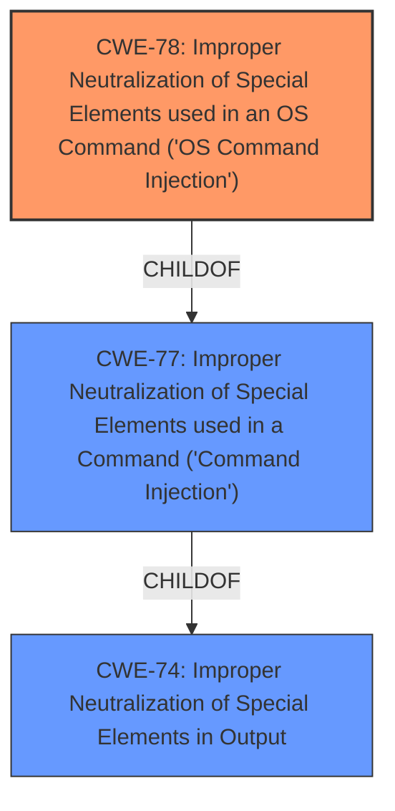

# Raw Analyzer Response for CVE-2021-20144

# Summary
| CWE ID | CWE Name | Confidence | CWE Abstraction Level | CWE Vulnerability Mapping Label | CWE-Vulnerability Mapping Notes |
|---|---|---|---|---|---|
| CWE-78 | Improper Neutralization of Special Elements used in an OS Command ('OS Command Injection') | 1.0 | Base | Allowed | Primary CWE |

## Evidence and Confidence

*   **Confidence Score:** 1.0
*   **Evidence Strength:** HIGH

## Relationship Analysis
The primary relationship influencing the selection is the hierarchical relationship where CWE-78 is a child of CWE-77. Since the vulnerability clearly involves an OS command injection, the more specific CWE-78 is chosen over the more general CWE-77. CWE-78 is a Base level CWE, which is the preferred level of abstraction.

## Vulnerability Chain
The chain of events is as follows:
1.  The product receives externally-influenced input.
2.  The product **does not neutralize or incorrectly neutralizes special elements** in the input.
3.  The input is used to construct an OS command.
4.  The OS command is executed, leading to arbitrary command execution.

The root cause is the **improper neutralization of special elements** (CWE-78), and the impact is arbitrary command execution.

## Summary of Analysis
The initial analysis identified CWE-78 as the primary candidate based on the vulnerability description and the provided CVE reference links. The description explicitly states the presence of a **command injection** vulnerability, and the CVE reference confirms that user-supplied input is passed unsanitized to a `system()` call.

The **Vulnerability Description Key Phrases** also indicates a **weakness** of **command injection**.

The evidence from the CVE reference links is as follows: "The `controller_server` service on Gryphon Tower routers, specifically operation 49, passes user-supplied input unsanitized to a string that is then executed via `system()` call, leading to command injection."

This confirms that the vulnerability involves the construction of an OS command using externally-influenced input without proper neutralization of special elements.

The Retriever Results also lists CWE-78 and CWE-77 as the top candidates.

The final selection of CWE-78 is based on the following:
*   Direct evidence from the vulnerability description and CVE reference links.
*   The hierarchical relationship between CWE-77 and CWE-78, with CWE-78 being the more specific choice for OS command injection.
*   The "Allowed" mapping guidance for CWE-78.
*   CWE-78 is a Base level CWE, which is the preferred level of abstraction.

CWE-77 was considered but not used because CWE-78 is a more specific case of command injection, specifically related to OS commands. The mapping guidance for CWE-77 also suggests using CWE-78 when OS command injection is the case.

CWE-20 was considered but not used because while improper input validation might be a contributing factor, the core issue is the lack of neutralization of special elements in the OS command.

CWE-94 was considered but not used as the vulnerability is related to OS command injection and not code injection.