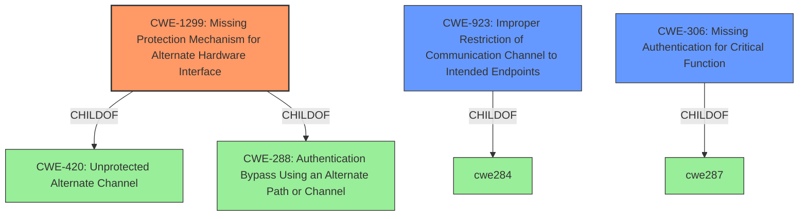

# Enhanced Analysis for CVE-2021-20149

# Summary
| CWE ID | CWE Name | Confidence | CWE Abstraction Level | CWE Vulnerability Mapping Label | CWE-Vulnerability Mapping Notes |
|---|---|---|---|---|---|
| CWE-1299 | Missing Protection Mechanism for Alternate Hardware Interface | 0.9 | Base | Allowed | Primary CWE |
| CWE-923 | Improper Restriction of Communication Channel to Intended Endpoints | 0.7 | Class | Allowed-with-Review | Secondary Candidate |
| CWE-306 | Missing Authentication for Critical Function | 0.6 | Base | Allowed | Secondary Candidate |

## Evidence and Confidence

*   **Confidence Score:** 0.8
*   **Evidence Strength:** HIGH

## Relationship Analysis
The primary CWE, CWE-1299, is a base-level CWE that specifically addresses the **missing protection mechanism** for an alternate hardware interface, which in this case is the IPv6 traffic on the WAN interface. This is a child of CWE-420 (Unprotected Alternate Channel) and CWE-288 (Authentication Bypass Using an Alternate Path or Channel). The secondary CWEs, CWE-923 and CWE-306, are related but represent higher-level or different aspects of the vulnerability. CWE-923 is a class-level CWE focusing on the **improper restriction of the communication channel**, while CWE-306 is a base-level CWE about **missing authentication** but isn't the main issue here.



## Vulnerability Chain
The vulnerability chain starts with the **insufficient access controls** on the WAN interface, specifically the lack of IPv6 filtering (CWE-1299). This leads to the **bypass of intended IPv4-based firewall restrictions**, allowing attackers to access all services running on the device through the WAN interface using IPv6. The impact is the potential compromise of the device due to the exposure of sensitive information and functionality.

## Summary of Analysis
The primary assessment is based on the provided evidence, which clearly indicates that the root cause is the **missing protection mechanism** for IPv6 traffic on the WAN interface. The vulnerability description states that "Trendnet AC2600 TEW-827DRU version 2.08B01 does not have **sufficient access controls** for the WAN interface...All services running on the devices are accessible via the WAN interface via IPv6 by default." The CVE Reference Links Content Summary further clarifies that the **inadequate IPv6 filtering** is the primary weakness.

The graph relationships influenced the selection by highlighting the connection between CWE-1299 and its parent CWEs, CWE-420 and CWE-288. This provided a broader context for understanding the vulnerability and confirmed that CWE-1299 is the most specific and accurate representation of the weakness.

CWE-1299 is selected because it directly addresses the **lack of protections on alternate paths** to access control-protected assets, which aligns with the vulnerability's description of **missing IPv6 filtering on the WAN interface**. This CWE is at the optimal level of specificity, as it is a base-level CWE that accurately captures the root cause of the vulnerability.

**CWEs Considered But Not Used:**

*   **CWE-923 (Improper Restriction of Communication Channel to Intended Endpoints):** While relevant, this CWE is a class-level CWE and not as specific as CWE-1299. It describes a broader issue of not properly ensuring communication with the correct endpoint, which is not the primary concern in this case.
*   **CWE-306 (Missing Authentication for Critical Function):** Although authentication might be a related concern, the core vulnerability lies in the **missing protection mechanism** for IPv6 traffic, rather than the absence of authentication itself.
*   **CWE-78 (Improper Neutralization of Special Elements used in an OS Command ('OS Command Injection'))**: This CWE is not applicable because the vulnerability is not related to the injection of special elements into an OS command.
*   **CWE-284 (Improper Access Control):** This is a pillar-level CWE and is too general. The vulnerability is better described by a more specific CWE.
*   **CWE-285 (Improper Authorization):** This is a class-level CWE and is too general. The vulnerability is better described by a more specific CWE.
*   **CWE-863 (Incorrect Authorization):** This is a class-level CWE and is too general. The vulnerability is better described by a more specific CWE.
*   **CWE-269 (Improper Privilege Management):** This CWE is not applicable because the vulnerability is not directly related to privilege management.
*   **CWE-522 (Insufficiently Protected Credentials):** This CWE is not applicable because the vulnerability is not related to credentials.
*   **CWE-1392 (Use of Default Credentials):** This CWE is not applicable because the vulnerability is not related to default credentials.


## CWE Relationship Analysis

Current CWEs represent these abstraction levels: .


### Vulnerability Chain Analysis

**Chain starting from CWE-288:**
- 288 (Authentication Bypass Using an Alternate Path or Channel) - ROOT


**Chain starting from CWE-420:**
- 420 (Unprotected Alternate Channel) - ROOT


### CWE Relationship Diagram

```mermaid
graph TD
    classDef primary fill:#f96,stroke:#333,stroke-width:2px
    classDef secondary fill:#69f,stroke:#333
    classDef tertiary fill:#9e9,stroke:#333
```