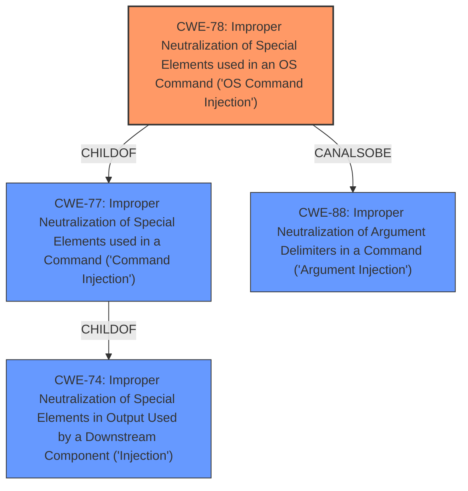

# Analysis for CVE-2021-20160

# Summary
| CWE ID | CWE Name | Confidence | CWE Abstraction Level | CWE Vulnerability Mapping Label | CWE-Vulnerability Mapping Notes |
|---|---|---|---|---|---|
| CWE-78 | Improper Neutralization of Special Elements used in an OS Command ('OS Command Injection') | 1.0 | Base | Allowed | Primary CWE |

## Evidence and Confidence

*   **Confidence Score:** 1.0
*   **Evidence Strength:** HIGH

## Relationship Analysis
The primary relationship influencing the choice of CWE-78 is its direct connection to **command injection** vulnerabilities, especially those involving OS commands. CWE-78 is a `Base` level CWE, making it more specific than its parent `Class` CWE-77. There is also a `CanAlsoBe` relationship to CWE-88, which could be a secondary weakness.

## Vulnerability Chain
The vulnerability chain starts with **insufficient input sanitization**, leading to the **command injection** and ultimately resulting in arbitrary command execution as root.

## Summary of Analysis
The initial analysis identified **command injection** as the primary weakness. The CVE Reference Links Content Summary confirmed that the "system() call used in the SMB functionality is vulnerable to command injection due to insufficient sanitization of user-supplied input in the 'smb_admin_name' parameter." The description also clearly stated that the impact is "Arbitrary command execution as root on the device."

The graph relationships, particularly the parent-child relationship between CWE-77 and CWE-78, influenced the selection, favoring the more specific CWE-78.

The selected CWE is at the optimal level of specificity, as it accurately represents the weakness involving OS commands.

Relevant CWE Information:

# Enhanced Context (25 CWEs)

## CWE-74: Improper Neutralization of Special Elements in Output Used by a Downstream Component ('Injection')
**Abstraction Level**: Class
**Similarity Score**: 0.77
**Source**: dense

**Description**:
The product constructs all or part of a command, data structure, or record using externally-influenced input from an upstream component, but it does not neutralize or incorrectly neutralizes special elements that could modify how it is parsed or interpreted when it is sent to a downstream component.

**Mapping Guidance**:
- Usage: Discouraged
- Rationale: CWE-74 is high-level and often misused when lower-level weaknesses are more appropriate.

## CWE-78: Improper Neutralization of Special Elements used in an OS Command ('OS Command Injection')
**Abstraction Level:** Base
**Status:** Stable

### Description
The product constructs all or part of an OS command using externally-influenced input from an upstream component, but it does not neutralize or incorrectly neutralizes special elements that could modify the intended OS command when it is sent to a downstream component.

### Extended Description
This weakness can lead to a vulnerability in environments in which the attacker does not have direct access to the operating system, such as in web applications. Alternately, if the weakness occurs in a privileged program, it could allow the attacker to specify commands that normally would not be accessible, or to call alternate commands with privileges that the attacker does not have. The problem is exacerbated if the compromised process does not follow the principle of least privilege, because the attacker-controlled commands may run with special system privileges that increases the amount of damage.

### Mapping Guidance
**Usage:** Allowed
**Rationale:** This CWE entry is at the Base level of abstraction, which is a preferred level of abstraction for mapping to the root causes of vulnerabilities.

CWE-78 is the most appropriate because the vulnerability involves the construction of an OS command using external input without proper neutralization. The vulnerability allows for arbitrary command execution as root, which aligns with the description and impact of CWE-78. The key phrase "**command injection**" strongly suggests this CWE. The evidence from the CVE description and summary of reference links support this classification.

CWE-77 was considered but not selected because it is a more general class of **command injection**. Since the vulnerability specifically involves OS commands, CWE-78 is a better fit. The mapping guidance for CWE-77 also suggests considering CWE-78 as an alternative.

CWE-88 was considered because it is a `CanAlsoBe` of CWE-78, but not selected because the root cause is not directly related to argument delimiters. Instead, the primary issue is the lack of sanitization of the entire command string.

CWE-184 was considered but not selected, though the "Root cause" from the CVE reference links included "Insufficient Input Sanitization". CWE-184 focuses on an incomplete list of disallowed inputs. While input sanitization is related, the core weakness is the **command injection** itself, making CWE-78 more appropriate.