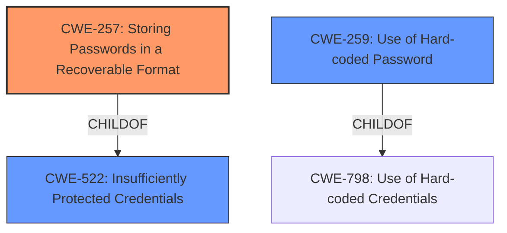

# Raw Analyzer Response for CVE-2021-20163

# Summary
| CWE ID | CWE Name | Confidence | CWE Abstraction Level | CWE Vulnerability Mapping Label | CWE-Vulnerability Mapping Notes |
|---|---|---|---|---|---|
| CWE-257 | Storing Passwords in a Recoverable Format | 0.9 | Base | Allowed | Primary CWE |
| CWE-259 | Use of Hard-coded Password | 0.6 | Variant | Allowed | Secondary Candidate |
| CWE-522 | Insufficiently Protected Credentials | 0.5 | Class | Allowed-with-Review | Secondary Candidate |

## Evidence and Confidence

*   **Confidence Score:** 0.8
*   **Evidence Strength:** HIGH

## Relationship Analysis
The primary CWE is CWE-257 which is the **root cause** of the vulnerability, indicating that the passwords are not stored securely. CWE-257 is a base level CWE. CWE-259 and CWE-522 are related to credentials, but CWE-257 is a better fit because it focuses on the storage aspect, which is the core issue in this vulnerability.

## Vulnerability Chain
The vulnerability chain starts with the **Storing Passwords in a Recoverable Format** (CWE-257), leading to the impact of information disclosure. An attacker can access the `ftpserver.asp` page and view the plaintext passwords.

## Summary of Analysis
The vulnerability is an information leak where FTP usernames and passwords are revealed in plaintext on the `ftpserver.asp` page of a Trendnet AC2600 TEW-827DRU router.

The primary CWE is CWE-257, **Storing Passwords in a Recoverable Format**. This accurately reflects the **root cause** of the vulnerability, where passwords are not stored securely, leading to their exposure. The evidence from the CVE Reference Links Content Summary states: "Plaintext storage of FTP credentials".

CWE-259, Use of Hard-coded Password, was considered because the passwords could potentially be hard-coded. However, the description focuses more on the storage aspect rather than how the password was created or used. The evidence doesn't indicate that the passwords are hardcoded, only that they are stored in plaintext.

CWE-522, Insufficiently Protected Credentials, was also considered, but it's a class-level CWE. Since there's a more specific base-level CWE (CWE-257), it's a better fit. The definition of CWE-522 is "The product transmits or stores authentication credentials, but it uses an insecure method that is susceptible to unauthorized interception and/or retrieval."

The selection of CWE-257 is at the optimal level of specificity because it directly addresses the **weakness** of storing passwords in a recoverable format, which is the **root cause** of the information leak.

Relevant CWE Information:

# Enhanced Context (25 CWEs)

## CWE-204: Observable Response Discrepancy
**Abstraction Level**: Base
**Similarity Score**: 0.80
**Source**: dense

**Description**:
The product provides different responses to incoming requests in a way that reveals internal state information to an unauthorized actor outside of the intended control sphere.
**Rationale:** This is not related to different responses based on observation.

## CWE-208: Observable Timing Discrepancy
**Abstraction Level**: Base
**Similarity Score**: 0.78
**Source**: dense

**Description**:
Two separate operations in a product require different amounts of time to complete, in a way that is observable to an actor and reveals security-relevant information about the state of the product, such as whether a particular operation was successful or not.
**Rationale:** This is not related to timing discrepancies.

## CWE-668: Exposure of Resource to Wrong Sphere
**Abstraction Level**: Class
**Similarity Score**: 0.78
**Source**: dense

**Description**:
The product exposes a resource to the wrong control sphere, providing unintended actors with inappropriate access to the resource.
**Rationale:** This is too high level.

## CWE-203: Observable Discrepancy
**Abstraction Level**: Base
**Similarity Score**: 0.78
**Source**: dense

**Description**:
The product behaves differently or sends different responses under different circumstances in a way that is observable to an unauthorized actor, which exposes security-relevant information about the state of the product, such as whether a particular operation was successful or not.
**Rationale:** This is not related to observable discrepancies in behavior.

## CWE-1391: Use of Weak Credentials
**Abstraction Level**: Class
**Similarity Score**: 0.78
**Source**: dense

**Description**:
The product uses weak credentials (such as a default key or hard-coded password) that can be calculated, derived, reused, or guessed by an attacker.
**Rationale:** While the credentials could be weak, the primary issue is that they are stored in plaintext.

## CWE-209: Generation of Error Message Containing Sensitive Information
**Abstraction Level**: Base
**Similarity Score**: 0.77
**Source**: dense

**Description**:
The product generates an error message that includes sensitive information about its environment, users, or associated data.
**Rationale:** The information is not in an error message.

## CWE-319: Cleartext Transmission of Sensitive Information
**Abstraction Level**: Base
**Similarity Score**: 0.77
**Source**: dense

**Description**:
The product transmits sensitive or security-critical data in cleartext in a communication channel that can be sniffed by unauthorized actors.
**Rationale:** This is related to transmission, not storage.

## CWE-41: Improper Resolution of Path Equivalence
**Abstraction Level**: Base
**Similarity Score**: 0.77
**Source**: dense

**Description**:
The product is vulnerable to file system contents disclosure through path equivalence. Path equivalence involves the use of special characters in file and directory names. The associated manipulations are intended to generate multiple names for the same object.
**Rationale**: This is not related to path equivalence.

## CWE-538: Insertion of Sensitive Information into Externally-Accessible File or Directory
**Abstraction Level**: Base
**Similarity Score**: 0.77
**Source**: dense

**Description**:
The product places sensitive information into files or directories that are accessible to actors who are allowed to have access to the files, but not to the sensitive information.
**Rationale**: This is related, but not as specific as storing passwords in a recoverable format.

## CWE-807: Reliance on Untrusted Inputs in a Security Decision
**Abstraction Level**: Base
**Similarity Score**: 0.77
**Source**: dense

**Description**:
The product uses a protection mechanism that relies on the existence or values of an input, but the input can be modified by an untrusted actor in a way that bypasses the protection mechanism.
**Rationale**: This is not related to reliance on untrusted inputs.

## CWE-203: Observable Discrepancy
**Abstraction Level**: Base
**Similarity Score**: 5185.29
**Source**: sparse

**Description**:
The product behaves differently or sends different responses under different circumstances in a way that is observable to an unauthorized actor, which exposes security-relevant information about the state of the product, such as whether a particular operation was successful or not.
**Rationale**: This is not related to observable discrepancies in behavior.

## CWE-259: Use of Hard-coded Password
**Abstraction Level**: Variant
**Similarity Score**: 4956.16
**Source**: sparse

**Description**:
The product contains a hard-coded password, which it uses for its own inbound authentication or for outbound communication to external components.
**Rationale**: While possible, there is no evidence the passwords are hardcoded.

## CWE-1299: Missing Protection Mechanism for Alternate Hardware Interface
**Abstraction Level**: Base
**Similarity Score**: 4951.24
**Source**: sparse

**Description**:
The lack of protections on alternate paths to access control-protected assets (such as unprotected shadow registers and other external facing unguarded interfaces) allows an attacker to bypass existing protections to the asset that are only performed against the primary path.
**Rationale**: This is not related to hardware interfaces.

## CWE-208: Observable Timing Discrepancy
**Abstraction Level**: Base
**Similarity Score**: 4910.34
**Source**: