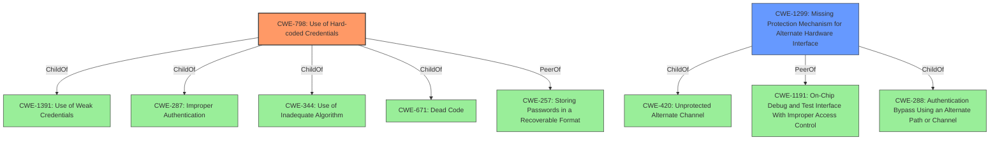

# Enhanced Analysis for CVE-2021-20168

# Summary
| CWE ID    | CWE Name                                                            | Confidence | CWE Abstraction Level | CWE Vulnerability Mapping Label | CWE-Vulnerability Mapping Notes |
| :--------- | :------------------------------------------------------------------ | :--------- | :---------------------- | :------------------------------ | :------------------------------ |
| CWE-798    | Use of Hard-coded Credentials                                       | 1          | Base                    | Primary                         | Allowed                       |
| CWE-1299   | Missing Protection Mechanism for Alternate Hardware Interface       | 0.9        | Base                    | Secondary                       | Allowed                       |

## Evidence and Confidence

*   **Confidence Score:** 0.95
*   **Evidence Strength:** HIGH

## Relationship Analysis
The primary CWE is CWE-798, which indicates the use of hardcoded credentials. CWE-259, a variant of CWE-798, focuses specifically on hardcoded passwords, but CWE-798 is more appropriate as it covers any hardcoded credentials. CWE-1299 is a peer of CWE-1191 and a child of CWE-420 which is a base CWE for missing protection on alternate channel.



## Vulnerability Chain
The vulnerability chain starts with **insufficient protections** on the UART interface, coupled with the **use of default credentials**. This allows an attacker with physical access to gain root-level command execution.

## Summary of Analysis
The analysis indicates that the Netgear RAX43 router is vulnerable due to the **lack of sufficient protection** on the UART interface and the **use of default credentials**. An attacker with physical access can exploit this by connecting to the UART port, logging in with the default credentials, and executing commands as the root user.

The primary weakness is CWE-798 (**Use of Hard-coded Credentials**) because the vulnerability description explicitly mentions the use of default credentials ("admin:admin"), which allows unauthorized access. The "CVE Reference Links Content Summary" also supports this, stating "Usage of default credentials (admin:admin) for the UART interface."

The secondary weakness is CWE-1299 (**Missing Protection Mechanism for Alternate Hardware Interface**), as the UART interface lacks sufficient protection, allowing physical access to bypass existing protections. The vulnerability description states that the product "does not have sufficient protections to the UART interface." The "CVE Reference Links Content Summary" also identifies "Insufficient protection mechanisms for the UART interface."

CWE-259 (**Use of Hard-coded Password**) was considered but not chosen because CWE-798 is a broader category that includes any hard-coded credentials, not just passwords. The vulnerability involves both a username and password, making CWE-798 a better fit.

CWE-1393 (**Use of Default Password**) was considered, but CWE-798 is a more precise description because it explicitly covers hard-coded credentials, while CWE-1393 is more general.

CWE-306 (**Missing Authentication for Critical Function**) was also considered, but it is not as accurate as CWE-798 because the vulnerability involves the use of credentials, albeit default ones, rather than a complete absence of authentication.

CWE-1263 (**Improper Physical Access Control**) was considered, but CWE-1299 is a better fit because it focuses on the **lack of protection** on the UART interface, which is the root cause of the vulnerability, rather than just the physical access aspect.


## CWE Relationship Analysis

Current CWEs represent these abstraction levels: .


### Vulnerability Chain Analysis

**Chain starting from CWE-288:**
- 288 (Authentication Bypass Using an Alternate Path or Channel) - ROOT


**Chain starting from CWE-420:**
- 420 (Unprotected Alternate Channel) - ROOT


### CWE Relationship Diagram

```mermaid
graph TD
    classDef primary fill:#f96,stroke:#333,stroke-width:2px
    classDef secondary fill:#69f,stroke:#333
    classDef tertiary fill:#9e9,stroke:#333
```