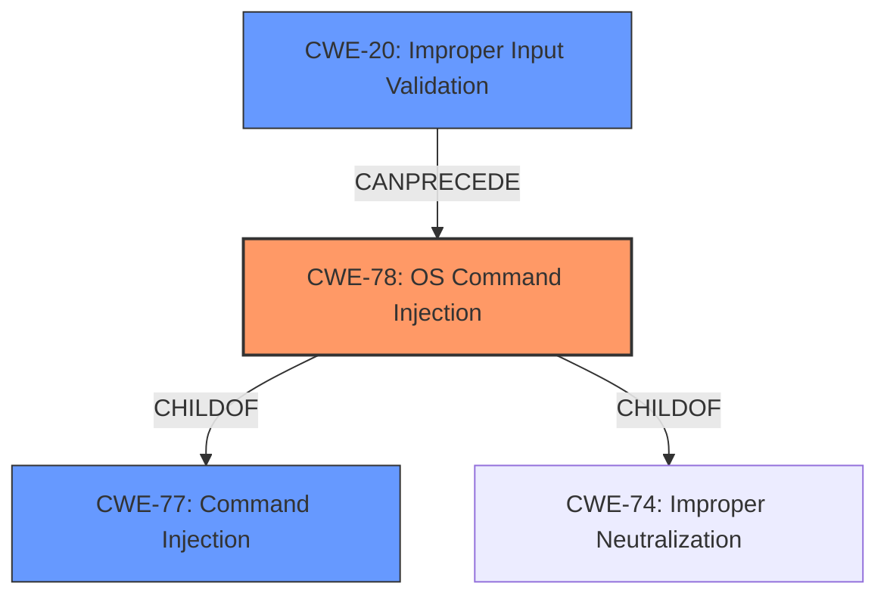

# Raw Analyzer Response for CVE-2021-20173

# Summary
| CWE ID | CWE Name | Confidence | CWE Abstraction Level | CWE Vulnerability Mapping Label | CWE-Vulnerability Mapping Notes |
|---|---|---|---|---|---|
| CWE-78 | Improper Neutralization of Special Elements used in an OS Command ('OS Command Injection') | 1.0 | Base | Allowed | Primary CWE |
| CWE-77 | Improper Neutralization of Special Elements used in a Command ('Command Injection') | 0.7 | Class | Allowed-with-Review | Secondary Candidate |
| CWE-20 | Improper Input Validation | 0.6 | Class | Discouraged | Secondary Candidate |

## Evidence and Confidence

*   **Confidence Score:** 0.9
*   **Evidence Strength:** HIGH

## Relationship Analysis
The primary CWE, CWE-78, is a base-level CWE that is a child of the class-level CWE-77. CWE-77 is a more general form of command injection, while CWE-78 specifically refers to OS command injection. CWE-78 is also a child of CWE-74, Improper Neutralization, which is a more general class of injection vulnerabilities. CWE-20, Improper Input Validation, can precede CWE-78, as the **lack of input validation** is often the root cause of command injection vulnerabilities.

## Vulnerability Chain
The vulnerability chain starts with the **lack of input validation** (CWE-20), which leads to **improper neutralization** of special elements in OS commands (CWE-78). This, in turn, allows for arbitrary command execution.

## Summary of Analysis
The initial analysis correctly identified **command injection** as the primary weakness. The `Retriever Results` also correctly identified CWE-77 and CWE-78 as the top candidates.

The vulnerability description states, "Netgear Nighthawk R6700 version 1.0.4.120 contains a **command injection** vulnerability in update functionality of the device... the device is susceptible to **command injection** via preconfigured values." The CVE Reference Links Content Summary elaborates on this, stating, "The vulnerability allows for arbitrary command execution by injecting malicious code into the device's configuration variables... that are later used in `system()` calls" and "Unsanitized input is passed to the `system()` function within the `upnpd` binary."

Given the evidence, CWE-78 is the most appropriate choice because the vulnerability involves injecting commands specifically into OS commands. CWE-77 is a more general class of command injection, but CWE-78 is more specific and accurate. CWE-20 is a contributing factor, but not the primary weakness.

The selected CWEs are at the optimal level of specificity because they accurately represent the root cause of the vulnerability, which is the **improper neutralization** of special elements in OS commands due to the **lack of input validation**.

Relevant CWE Information:

# Enhanced Context (25 CWEs)

## CWE-917: Improper Neutralization of Special Elements used in an Expression Language Statement ('Expression Language Injection')
**Abstraction Level**: Base
**Similarity Score**: 0.71
**Source**: dense

**Description**:
The product constructs all or part of an expression language (EL) statement in a framework such as a Java Server Page (JSP) using externally-influenced input from an upstream component, but it does not neutralize or incorrectly neutralizes special elements that could modify the intended EL statement before it is executed.

**Mapping Guidance**:
- Usage: Allowed
- Rationale: This CWE entry is at the Base level of abstraction, which is a preferred level of abstraction for mapping to the root causes of vulnerabilities.

**Why Not Used**: This CWE is not relevant as the vulnerability is related to OS commands, not expression language statements.

## CWE-74: Improper Neutralization of Special Elements in Output Used by a Downstream Component ('Injection')
**Abstraction Level**: Class
**Similarity Score**: 0.71
**Source**: dense

**Description**:
The product constructs all or part of a command, data structure, or record using externally-influenced input from an upstream component, but it does not neutralize or incorrectly neutralizes special elements that could modify how it is parsed or interpreted when it is sent to a downstream component.

**Mapping Guidance**:
- Usage: Discouraged
- Rationale: CWE-74 is high-level and often misused when lower-level weaknesses are more appropriate.

**Why Not Used**: While CWE-74 is a parent of CWE-78, it is too general. CWE-78 provides a more specific description of the vulnerability.

## CWE-1336: Improper Neutralization of Special Elements Used in a Template Engine
**Abstraction Level**: Base
**Similarity Score**: 0.71
**Source**: dense

**Description**:
The product uses a template engine to insert or process externally-influenced input, but it does not neutralize or incorrectly neutralizes special elements or syntax that can be interpreted as template expressions or other code directives when processed by the engine.

**Mapping Guidance**:
- Usage: Allowed
- Rationale: This CWE entry is at the Base level of abstraction, which is a preferred level of abstraction for mapping to the root causes of vulnerabilities.

**Why Not Used**: This CWE is not relevant because the vulnerability does not involve a template engine.

## CWE-80: Improper Neutralization of Script-Related HTML Tags in a Web Page (Basic XSS)
**Abstraction Level**: Variant
**Similarity Score**: 0.71
**Source**: dense

**Description**:
The product receives input from an upstream component, but it does not neutralize or incorrectly neutralizes special characters such as "<", ">", and "&" that could be interpreted as web-scripting elements when they are sent to a downstream component that processes web pages.

**Mapping Guidance**:
- Usage: Allowed
- Rationale: This CWE entry is at the Variant level of abstraction, which is a preferred level of abstraction for mapping to the root causes of vulnerabilities.

**Why Not Used**: This CWE is not relevant because the vulnerability is not related to cross-site scripting (XSS).

## CWE-150: Improper Neutralization of Escape, Meta, or Control Sequences
**Abstraction Level**: Variant
**Similarity Score**: 0.70
**Source**: dense

**Description**:
The product receives input from an upstream component, but it does not neutralize or incorrectly neutralizes special elements that could be interpreted as escape, meta, or control character sequences when they are sent to a downstream component.

**Mapping Guidance**:
- Usage: Allowed
- Rationale: This CWE entry is at the Variant level of abstraction, which is a preferred level of abstraction for mapping to the root causes of vulnerabilities.

**Why Not Used**: While this could potentially be a secondary weakness, the primary issue is OS command injection.

## CWE-707: Improper Neutralization
**Abstraction Level**: Pillar
**Similarity Score**: 0.70
**Source**: dense

**Description**:
The product does not ensure or incorrectly ensures that structured messages or data are well-formed and that certain security properties are met before being read from an upstream component or sent to a downstream component.

**Mapping Guidance**:
- Usage: Discouraged
- Rationale: This CWE entry is extremely high-level, a Pillar.

**Why Not Used**: This CWE is too general and does not provide specific information about the vulnerability.

## CWE-838: Inappropriate Encoding for Output Context
**Abstraction Level**: Base
**Similarity Score**: 0.69
**Source**: dense

**Description**:
The product uses or specifies an encoding when generating output to a downstream component, but the specified encoding is not the same as the encoding that is expected by the downstream component.

**Mapping Guidance**:
- Usage: Allowed
- Rationale: This CWE entry is at the Base level of abstraction, which is a preferred level of abstraction for mapping to the root causes of vulnerabilities.

**Why Not Used**: This CWE is not relevant because the vulnerability does not involve encoding issues.

## CWE-162: Improper Neutralization of Trailing Special Elements
**Abstraction Level**: Variant
**Similarity Score**: 0.69
**Source**: dense

**Description**:
The product receives input from an upstream component, but it does not neutralize or incorrectly neutralizes trailing special elements that could be interpreted in unexpected ways when they are sent to a downstream component.

**Mapping Guidance**:
- Usage: Allowed
- Rationale: This CWE entry is at the Variant level of abstraction, which is a preferred level of abstraction for mapping to the root causes of vulnerabilities.