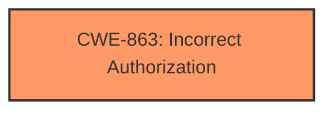

# Enhanced Analysis for CVE-2021-20179

# Summary
| CWE ID | CWE Name | Confidence | CWE Abstraction Level | CWE Vulnerability Mapping Label | CWE-Vulnerability Mapping Notes |
|---|---|---|---|---|---|
| CWE-863 | Incorrect Authorization | 1.0 | Class | Allowed-with-Review | Primary CWE |

## Evidence and Confidence

*   **Confidence Score:** 1.0
*   **Evidence Strength:** HIGH

## Relationship Analysis
The primary relationship influencing the CWE selection is the hierarchical relationship. CWE-863 (Incorrect Authorization) is a Class-level CWE, and the retriever suggested examining its children for a more specific fit. However, the provided information does not have enough details to select a more specific child CWE.



## Vulnerability Chain
The vulnerability chain starts with the **flaw** in the `RenewalProcessor` code. The **incorrect interpretation** of a non-null `authToken` leads to a bypass of proper authorization checks, resulting in unauthorized certificate renewals and a compromise of confidentiality and integrity.

## Summary of Analysis
The initial analysis identified CWE-863 (Incorrect Authorization) as the primary weakness based on the description in the CVE reference links content summary: "The `RenewalProcessor` code incorrectly interpreted a non-null `authToken` as evidence of authorization, leading to immediate certificate issuance without proper authentication or authorization checks."

The evidence provided in the CVE Reference Links Content Summary section explicitly states the root cause: "The `RenewalProcessor` code **incorrectly interpreted a non-null `authToken` as evidence of authorization**, leading to immediate certificate issuance without proper authentication or authorization checks." This directly aligns with the description of CWE-863: "The product performs an authorization check when an actor attempts to access a resource or perform an action, but it does not correctly perform the check."

The selection of CWE-863 is also supported by the "Weaknesses" listed in the CVE Reference Links Content Summary: "Improper authorization check" and "Lack of validation of authentication tokens." These further reinforce the conclusion that the vulnerability stems from an authorization flaw.

The retriever results also listed CWE-863 as the top candidate with a sparse score of 0.321.

The usage for CWE-863 is "Allowed-with-Review," which means we should examine the child CWEs to see if there is a better fit. However, without further details on the specifics of the authorization bypass, selecting a more specific CWE would be speculative. Therefore, CWE-863 remains the most appropriate choice based on the available evidence.

Other CWEs considered but not used:

*   CWE-295 (Improper Certificate Validation): While certificate renewal is involved, the core issue is the authorization bypass, not the validation of the certificate itself.
*   CWE-200 (Exposure of Sensitive Information to an Unauthorized Actor): This is the impact of the vulnerability, not the root cause. The root cause is the authorization bypass.
*   CWE-415 (Double Free), CWE-824 (Access of Uninitialized Pointer), CWE-125 (Out-of-bounds Read), CWE-296 (Improper Following of a Certificate's Chain of Trust), CWE-123 (Write-what-where Condition), CWE-201 (Insertion of Sensitive Information Into Sent Data), CWE-193 (Off-by-one Error) These are not directly related to the authorization **flaw** described in the summary.


## CWE Relationship Analysis

Current CWEs represent these abstraction levels: .


### Vulnerability Chain Analysis

**Chain starting from CWE-415:**
- 415 (Double Free) - ROOT


**Chain starting from CWE-123:**
- 123 (Write-what-where Condition) - ROOT


### CWE Relationship Diagram

```mermaid
graph TD
    classDef primary fill:#f96,stroke:#333,stroke-width:2px
    classDef secondary fill:#69f,stroke:#333
    classDef tertiary fill:#9e9,stroke:#333
```