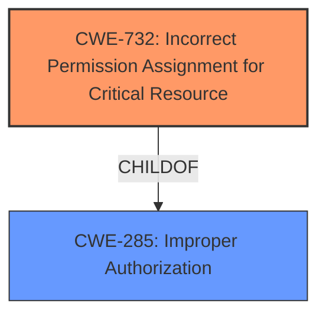

# Enhanced Analysis for CVE-2021-20188

# Summary
| CWE ID | CWE Name | Confidence | CWE Abstraction Level | CWE Vulnerability Mapping Label | CWE-Vulnerability Mapping Notes |
|---|---|---|---|---|---|
| CWE-732 | Incorrect Permission Assignment for Critical Resource | 0.9 | Class | Allowed-with-Review | Primary CWE |
| CWE-285 | Improper Authorization | 0.7 | Class | Discouraged | Secondary Candidate |

## Evidence and Confidence

*   **Confidence Score:** 0.8
*   **Evidence Strength:** HIGH

## Relationship Analysis
The primary relationship considered was that CWE-732 is a child of CWE-285. Given the specifics of the vulnerability, CWE-732 was chosen as the more specific and appropriate classification. Although CWE-732 is a Class, it is more descriptive of the **incorrect permission assignment** than its parent.



## Vulnerability Chain
The chain of events for this vulnerability starts with an **insufficient file permission check** for non-root users in privileged containers, leading to unauthorized file access within the container.

## Summary of Analysis
The initial assessment pointed towards CWE-732 due to the **incorrect permission assignment** described in the vulnerability. The key phrases "File permission checks are insufficient" and the description of non-root users gaining access to files owned by root directly support this classification. The CVE Reference Links Content Summary reinforces this, stating that "file permissions for non-root users in privileged containers are ignored."

CWE-285 was considered as a broader classification, but the evidence more strongly supports CWE-732, which specifically addresses the **incorrect assignment of permissions**. Although the mapping guidance for CWE-732 notes that it is often misused when permissions are not checked (which would be an authorization issue), the description here clearly indicates an **incorrect assignment**, not a complete absence of a check.

The selection of CWE-732 is at the optimal level of specificity because it directly reflects the technical details provided in the vulnerability description and CVE summary.

Relevant CWE Information:

# Enhanced Context (25 CWEs)

## CWE-732: Incorrect Permission Assignment for Critical Resource
**Abstraction:** Class
**Status:** Draft

### Description
The product specifies permissions for a security-critical resource in a way that allows that resource to be read or modified by unintended actors.

### Mapping Guidance
**Usage:** Allowed-with-Review
**Rationale:** While the name itself indicates an assignment of permissions for resources, this is often misused for vulnerabilities in which "permissions" are not checked, which is an "authorization" weakness (CWE-285 or descendants) within CWE's model [REF-1287].
**Comments:** Closely analyze the specific mistake that is allowing the resource to be exposed, and perform a CWE mapping for that mistake.

## CWE-285: Improper Authorization
**Abstraction:** Class
**Status:** Draft

### Description
The product does not perform or incorrectly performs an authorization check when an actor attempts to access a resource or perform an action.

### Mapping Guidance
**Usage:** Discouraged
**Rationale:** CWE-285 is high-level and lower-level CWEs can frequently be used instead. It is a level-1 Class (i.e., a child of a Pillar).
**Comments:** Look at CWE-285's children and consider mapping to CWEs such as CWE-862: Missing Authorization, CWE-863: Incorrect Authorization, CWE-732: Incorrect Permission Assignment for Critical Resource, or others.


## CWE Relationship Analysis

Current CWEs represent these abstraction levels: .


### Vulnerability Chain Analysis

**Chain starting from CWE-732:**
- 732 (Incorrect Permission Assignment for Critical Resource) - ROOT


**Chain starting from CWE-285:**
- 285 (Improper Authorization) - ROOT


### CWE Relationship Diagram

```mermaid
graph TD
    classDef primary fill:#f96,stroke:#333,stroke-width:2px
    classDef secondary fill:#69f,stroke:#333
    classDef tertiary fill:#9e9,stroke:#333
```