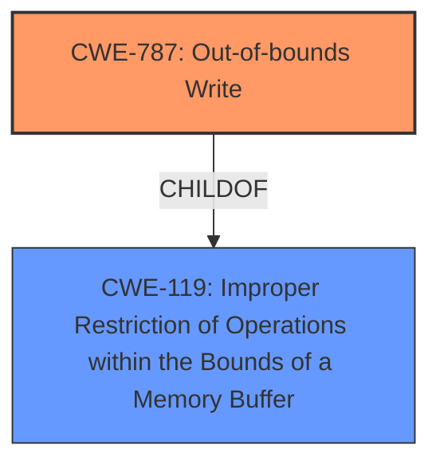

# Analysis for CVE-2021-20194

# Summary
| CWE ID | CWE Name | Confidence | CWE Abstraction Level | CWE Vulnerability Mapping Label | CWE-Vulnerability Mapping Notes |
|---|---|---|---|---|---|
| CWE-787 | Out-of-bounds Write | 0.9 | Base | Allowed | Primary CWE |
| CWE-119 | Improper Restriction of Operations within the Bounds of a Memory Buffer | 0.7 | Class | Allowed | Secondary CWE |

## Evidence and Confidence

*   **Confidence Score:** 0.8
*   **Evidence Strength:** HIGH

## Relationship Analysis
The primary CWE is CWE-787 **Out-of-bounds Write**, which is a base level CWE. It is a child of CWE-119 **Improper Restriction of Operations within the Bounds of a Memory Buffer**, a class-level CWE. The vulnerability description explicitly mentions a heap overflow, indicating a write beyond the intended buffer. This aligns well with the description of CWE-787.

## Vulnerability Chain
The vulnerability chain starts with **non-hardened usercopy**, which leads to a **heap overflow**, and results in denial of service or privilege escalation. The core weakness is the **heap overflow** caused by writing outside the intended memory bounds.

## Summary of Analysis
The initial assessment identified CWE-787 **Out-of-bounds Write** as the primary CWE due to the explicit mention of a **heap overflow** in the vulnerability description and the CVE reference links. The **rootcause** is the **non-hardened usercopy**.

The vulnerability description explicitly states: "As result of BPF execution, the local user can trigger bug in __cgroup_bpf_run_filter_getsockopt() function that can lead to **heap overflow** (because of **non-hardened usercopy**)." The CVE reference links also confirm that the **root cause** is related to the `__cgroup_bpf_run_filter_getsockopt()` function and **non-hardened usercopy**, resulting in a **heap overflow**.

CWE-787 is at the optimal level of specificity (Base) as it directly addresses the **out-of-bounds write** condition that results in the **heap overflow**.

Relevant CWE Information:

# Enhanced Context (25 CWEs)
The following CWEs were identified as potentially relevant to this vulnerability:

## CWE-191: Integer Underflow (Wrap or Wraparound)
**Abstraction Level**: Base
**Similarity Score**: 0.79

## CWE-131: Incorrect Calculation of Buffer Size
**Abstraction Level**: Base
**Similarity Score**: 0.78

## CWE-681: Incorrect Conversion between Numeric Types
**Abstraction Level**: Base
**Similarity Score**: 0.77

## CWE-805: Buffer Access with Incorrect Length Value
**Abstraction Level**: Base
**Similarity Score**: 0.76

## CWE-197: Numeric Truncation Error
**Abstraction Level**: Base
**Similarity Score**: 0.76

## CWE-125: Out-of-bounds Read
**Abstraction Level**: Base
**Similarity Score**: 0.76

## CWE-124: Buffer Underwrite ('Buffer Underflow')
**Abstraction Level**: Base
**Similarity Score**: 0.76

## CWE-193: Off-by-one Error
**Abstraction Level**: Base
**Similarity Score**: 0.76

## CWE-126: Buffer Over-read
**Abstraction Level**: Variant
**Similarity Score**: 0.75

## CWE-190: Integer Overflow or Wraparound
**Abstraction Level**: Base
**Similarity Score**: 0.75

## CWE-190: Integer Overflow or Wraparound
**Abstraction Level**: Base
**Similarity Score**: 6800.30

## CWE-125: Out-of-bounds Read
**Abstraction Level**: Base
**Similarity Score**: 6445.54

## CWE-193: Off-by-one Error
**Abstraction Level**: Base
**Similarity Score**: 6376.78

## CWE-1284: Improper Validation of Specified Quantity in Input
**Abstraction Level**: Base
**Similarity Score**: 6164.63

## CWE-131: Incorrect Calculation of Buffer Size
**Abstraction Level**: Base
**Similarity Score**: 6097.58

## CWE-128: Wrap-around Error
**Abstraction Level**: base
**Similarity Score**: 5.03

## CWE-123: Write-what-where Condition
**Abstraction Level**: base
**Similarity Score**: 5.03

## CWE-170: Improper Null Termination
**Abstraction Level**: base
**Similarity Score**: 5.03

## CWE-195: Signed to Unsigned Conversion Error
**Abstraction Level**: variant
**Similarity Score**: 4.53

## CWE-416: Use After Free
**Abstraction Level**: variant
**Similarity Score**: 4.53

## CWE-787: Out-of-bounds Write
**Abstraction Level**: base
**Similarity Score**: 4.33

## CWE-825: Expired Pointer Dereference
**Abstraction Level**: base
**Similarity Score**: 4.33

## CWE-1284: Improper Validation of Specified Quantity in Input
**Abstraction Level**: base
**Similarity Score**: 4.33

## CWE-617: Reachable Assertion
**Abstraction Level**: base
**Similarity Score**: 4.33

## CWE-1341: Multiple Releases of Same Resource or Handle
**Abstraction Level**: base
**Similarity Score**: 4.33

### CWE Selection Details:

*   **CWE-787 Out-of-bounds Write:** This is the primary CWE because the vulnerability description explicitly mentions a **heap overflow**. The reference links also confirm this. Confidence: 0.9
*   **CWE-119 Improper Restriction of Operations within the Bounds of a Memory Buffer:** This is a higher-level class that encompasses the more specific CWE-787. The **heap overflow** results from not properly restricting memory buffer operations, making this a relevant secondary consideration. Confidence: 0.7

### CWEs Considered but Not Used:

*   **CWE-190 Integer Overflow or Wraparound:** While integer overflows can sometimes lead to buffer overflows, there's no direct evidence in the description to support this.
*   **CWE-131 Incorrect Calculation of Buffer Size:** Although this could potentially contribute to a **heap overflow**, the primary **rootcause** described is **non-hardened usercopy**, which is a more direct cause of the **out-of-bounds write**.
*   **CWE-125 Out-of-bounds Read:** This CWE describes reading outside of buffer bounds and isn't relevant because the vulnerability is about writing outside of buffer bounds.
*   **CWE-122 Heap-based Buffer Overflow:** This is nearly identical to CWE-787, as it describes a buffer overflow on the heap. However, CWE-787 is preferred because its description more generally describes the issue, whereas CWE-122 is specifically focused on the heap.