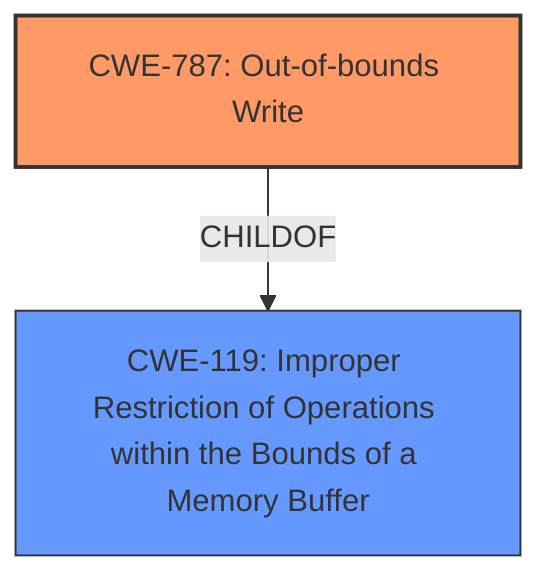

# Analysis for CVE-2021-20194

# Summary
| CWE ID | CWE Name | Confidence | CWE Abstraction Level | CWE Vulnerability Mapping Label | CWE-Vulnerability Mapping Notes |
|---|---|---|---|---|---|
| CWE-787 | Out-of-bounds Write | 0.9 | Base | Allowed | Primary CWE |
| CWE-119 | Improper Restriction of Operations within the Bounds of a Memory Buffer | 0.7 | Class | Allowed | Secondary CWE |

## Evidence and Confidence

*   **Confidence Score:** 0.8
*   **Evidence Strength:** HIGH

## Relationship Analysis
The primary CWE is CWE-787 **Out-of-bounds Write**, which is a base level CWE. It is a child of CWE-119 **Improper Restriction of Operations within the Bounds of a Memory Buffer**, a class-level CWE. The vulnerability description explicitly mentions a heap overflow, indicating a write beyond the intended buffer. This aligns well with the description of CWE-787.



## Vulnerability Chain
The vulnerability chain starts with **non-hardened usercopy**, which leads to a **heap overflow**, and results in denial of service or privilege escalation. The core weakness is the **heap overflow** caused by writing outside the intended memory bounds.

## Summary of Analysis
The initial assessment identified CWE-787 **Out-of-bounds Write** as the primary CWE due to the explicit mention of a **heap overflow** in the vulnerability description and the CVE reference links. The **rootcause** is the **non-hardened usercopy**.

The vulnerability description explicitly states: "As result of BPF execution, the local user can trigger bug in __cgroup_bpf_run_filter_getsockopt() function that can lead to **heap overflow** (because of **non-hardened usercopy**)." The CVE reference links also confirm that the **root cause** is related to the `__cgroup_bpf_run_filter_getsockopt()` function and **non-hardened usercopy**, resulting in a **heap overflow**.

CWE-787 is at the optimal level of specificity (Base) as it directly addresses the **out-of-bounds write** condition that results in the **heap overflow**.

Relevant CWE Information:

# Enhanced Context (25 CWEs)
The following CWEs were identified as potentially relevant to this vulnerability:

## CWE-191: Integer Underflow (Wrap or Wraparound)
**Abstraction Level**: Base
**Similarity Score**: 0.79

## CWE-131: Incorrect Calculation of Buffer Size
**Abstraction Level**: Base
**Similarity Score**: 0.78

## CWE-681: Incorrect Conversion between Numeric Types
**Abstraction Level**: Base
**Similarity Score**: 0.77

## CWE-805: Buffer Access with Incorrect Length Value
**Abstraction Level**: Base
**Similarity Score**: 0.76

## CWE-197: Numeric Truncation Error
**Abstraction Level**: Base
**Similarity Score**: 0.76

## CWE-125: Out-of-bounds Read
**Abstraction Level**: Base
**Similarity Score**: 0.76

## CWE-124: Buffer Underwrite ('Buffer Underflow')
**Abstraction Level**: Base
**Similarity Score**: 0.76

## CWE-193: Off-by-one Error
**Abstraction Level**: Base
**Similarity Score**: 0.76

## CWE-126: Buffer Over-read
**Abstraction Level**: Variant
**Similarity Score**: 0.75

## CWE-190: Integer Overflow or Wraparound
**Abstraction Level**: Base
**Similarity Score**: 0.75

## CWE-190: Integer Overflow or Wraparound
**Abstraction Level**: Base
**Similarity Score**: 6800.30

## CWE-125: Out-of-bounds Read
**Abstraction Level**: Base
**Similarity Score**: 6445.54

## CWE-193: Off-by-one Error
**Abstraction Level**: Base
**Similarity Score**: 6376.78

## CWE-1284: Improper Validation of Specified Quantity in Input
**Abstraction Level**: Base
**Similarity Score**: 6164.63

## CWE-131: Incorrect Calculation of Buffer Size
**Abstraction Level**: Base
**Similarity Score**: 6097.58

## CWE-128: Wrap-around Error
**Abstraction Level**: base
**Similarity Score**: 5.03

## CWE-123: Write-what-where Condition
**Abstraction Level**: base
**Similarity Score**: 5.03

## CWE-170: Improper Null Termination
**Abstraction Level**: base
**Similarity Score**: 5.03

## CWE-195: Signed to Unsigned Conversion Error
**Abstraction Level**: variant
**Similarity Score**: 4.53

## CWE-416: Use After Free
**Abstraction Level**: variant
**Similarity Score**: 4.53

## CWE-787: Out-of-bounds Write
**Abstraction Level**: base
**Similarity Score**: 4.33

## CWE-825: Expired Pointer Dereference
**Abstraction Level**: base
**Similarity Score**: 4.33

## CWE-1284: Improper Validation of Specified Quantity in Input
**Abstraction Level**: base
**Similarity Score**: 4.33

## CWE-617: Reachable Assertion
**Abstraction Level**: base
**Similarity Score**: 4.33

## CWE-1341: Multiple Releases of Same Resource or Handle
**Abstraction Level**: base
**Similarity Score**: 4.33

### CWE Selection Details:

*   **CWE-787 Out-of-bounds Write:** This is the primary CWE because the vulnerability description explicitly mentions a **heap overflow**. The reference links also confirm this. Confidence: 0.9
*   **CWE-119 Improper Restriction of Operations within the Bounds of a Memory Buffer:** This is a higher-level class that encompasses the more specific CWE-787. The **heap overflow** results from not properly restricting memory buffer operations, making this a relevant secondary consideration. Confidence: 0.7

### CWEs Considered but Not Used:

*   **CWE-190 Integer Overflow or Wraparound:** While integer overflows can sometimes lead to buffer overflows, there's no direct evidence in the description to support this.
*   **CWE-131 Incorrect Calculation of Buffer Size:** Although this could potentially contribute to a **heap overflow**, the primary **rootcause** described is **non-hardened usercopy**, which is a more direct cause of the **out-of-bounds write**.
*   **CWE-125 Out-of-bounds Read:** This CWE describes reading outside of buffer bounds and isn't relevant because the vulnerability is about writing outside of buffer bounds.
*   **CWE-122 Heap-based Buffer Overflow:** This is nearly identical to CWE-787, as it describes a buffer overflow on the heap. However, CWE-787 is preferred because its description more generally describes the issue, whereas CWE-122 is specifically focused on the heap.

# Enhanced Query for CVE-2021-20194

## Vulnerability Description
There is a vulnerability in the linux kernel versions higher than 5.2 (if kernel compiled with config params CONFIG_BPF_SYSCALL=y , CONFIG_BPF=y , CONFIG_CGROUPS=y , CONFIG_CGROUP_BPF=y , CONFIG_HARDENED_USERCOPY not set, and BPF hook to getsockopt is registered). As result of BPF execution, the local user can trigger bug in __cgroup_bpf_run_filter_getsockopt() function that can lead to **heap overflow** (because of **non-hardened usercopy**). The impact of attack could be deny of service or possibly privileges escalation.

### Vulnerability Description Key Phrases
- **rootcause:** **non-hardened usercopy**
- **weakness:** **heap overflow**
- **impact:** denial of service or possibly privilege escalation
- **attacker:** local user with BPF hook to getsockopt
- **product:** linux kernel
- **version:** higher than 5.2
- **component:** __cgroup_bpf_run_filter_getsockopt() function

## CVE Reference Links Content Summary
```
{
  "CVE-2021-20194": {
    "Metadata": {
      "Cve ID": "CVE-2021-20194",
      "Description": "PLACEHOLDER - Implement CVE description retrieval"
    },
    "access.redhat.com_58edf261_20250115_122952.html": "UNRELATED",
    "access.redhat.com_4fa16201_20250115_122951.html": "UNRELATED",
    "security.netapp.com_5534d76c_20250114_214503.html": {
      "Root cause": "A heap overflow vulnerability exists in Linux kernel versions higher than 5.2 due to a flaw in the `__cgroup_bpf_run_filter_getsockopt()` function, which is part of the eBPF subsystem.",
      "Weaknesses": [
        "Heap overflow",
         "Improper input validation",
         "Insufficient access control"
      ],
      "Impact": "Successful exploitation could lead to disclosure of sensitive information, addition or modification of data, or Denial of Service (DoS).",
      "Attack vectors": "Local exploitation.",
       "Required attacker capabilities/position": "A local attacker with low privileges is required."
    },
    "www.redhat.com_f9a0b237_20250115_192027.html": "UNRELATED",
    "www.redhat.com_2cbad41c_20250115_192051.html": "UNRELATED",
    "security.netapp.com_0c87839b_20250115_192039.html": {
       "Root cause": "A heap overflow vulnerability exists in Linux kernel versions higher than 5.2 due to a flaw in the `__cgroup_bpf_run_filter_getsockopt()` function, which is part of the eBPF subsystem.",
      "Weaknesses": [
        "Heap overflow",
         "Improper input validation",
         "Insufficient access control"
      ],
      "Impact": "Successful exploitation could lead to disclosure of sensitive information, addition or modification of data, or Denial of Service (DoS).",
      "Attack vectors": "Local exploitation.",
       "Required attacker capabilities/position": "A local attacker with low privileges is required."
    },
    "www.redhat.com_13d1bb0f_20250115_192052.html": "UNRELATED",
    "www.redhat.com_82c05e30_20250115_192051.html": "UNRELATED",
     "www.redhat.com_fc1f94b7_20250115_192048.html": "UNRELATED",
    "security.netapp.com_eaf46361_20250115_192044.html": "UNRELATED",
      "www.redhat.com_f48331a2_20250115_192047.html": {
      "Root cause": "Heap overflow vulnerability in the `__cgroup_bpf_run_filter_getsockopt()` function within the Linux kernel's eBPF subsystem.",
        "Weaknesses": [
          "Heap overflow",
          "Improper input validation",
          "Insufficient access control"
         ],
        "Impact": "A local user could use this flaw to crash the system or possibly escalate their privileges on the system.",
         "Attack vectors": "Local exploitation",
        "Required attacker capabilities/position": "A local attacker with low privileges is required."
    },
     "access.redhat.com_ea7775f2_20250115_122952.html": "UNRELATED",
     "bugzilla.redhat.com_8837c791_20250115_192049.html": {
       "Root cause": "The vulnerability is located in the `__cgroup_bpf_run_filter_getsockopt()` function within the Linux kernel's BPF subsystem, and is triggered due to non-hardened usercopy.",
        "Weaknesses": [
          "Heap overflow"
        ],
        "Impact": "A local user can trigger the vulnerability, potentially leading to a denial of service or privilege escalation.",
        "Attack vectors": "Local exploitation. Attackers require the ability to execute BPF scripts with specific configurations.",
         "Required attacker capabilities/position": "A local attacker with elevated privileges or a non-standard BPF configuration is required."
     },
     "bugzilla.redhat.com_f800d74c_20250115_192050.html": {
        "Root cause": "A buffer overflow occurs within the `mwifiex_cmd_802_11_ad_hoc_start` function in the Linux kernel's Marvell Wi-Fi driver due to a long SSID value.",
       "Weaknesses": [
          "Buffer overflow"
        ],
        "Impact": "The vulnerability could allow a local attacker to execute arbitrary code.",
        "Attack vectors": "Local exploitation. A privileged user needs to initiate ad-hoc Wi-Fi network creation with a long SSID value.",
        "Required attacker capabilities/position": "Local attacker with privileges to initiate ad-hoc wifi networks."
     },
     "security.netapp.com_3c97cd24_20250115_192038.html": "UNRELATED"
  }
}
```

## Retriever Results

### Top Combined Results

| Rank | CWE ID | Name | Abstraction | Usage  | Retrievers | Individual Scores |
|------|--------|------|-------------|-------|------------|-------------------|
| 1 | 190 | Integer Overflow or Wraparound | Base | Allowed | alternate_terms | 0.800 |
| 2 | 131 | Incorrect Calculation of Buffer Size | Base | Allowed | sparse | 0.449 |
| 3 | 122 | Heap-based Buffer Overflow | Variant | Allowed | sparse | 0.432 |
| 4 | 193 | Off-by-one Error | Base | Allowed | sparse | 0.398 |
| 5 | 125 | Out-of-bounds Read | Base | Allowed | sparse | 0.379 |
| 6 | 126 | Buffer Over-read | Variant | Allowed | dense | 0.574 |
| 7 | 128 | Wrap-around Error | Base | Allowed | graph | 0.002 |
| 8 | 843 | Access of Resource Using Incompatible Type ('Type Confusion') | Base | Allowed | sparse | 0.379 |
| 9 | 415 | Double Free | Variant | Allowed | sparse | 0.373 |
| 10 | 1284 | Improper Validation of Specified Quantity in Input | Base | Allowed | sparse | 0.370 |


# Complete CWE Specifications


## CWE-190: Integer Overflow or Wraparound
**Abstraction:** Base
**Status:** Stable

### Description
The product performs a calculation that can
         produce an integer overflow or wraparound when the logic
         assumes that the resulting value will always be larger than
         the original value. This occurs when an integer value is
         incremented to a value that is too large to store in the
         associated representation. When this occurs, the value may
         become a very small or negative number.

### Extended Description
Not provided

### Alternative Terms
Overflow: The terms "overflow" and "wraparound" are used interchangeably by some people, but they can have more precise distinctions by others. See Terminology Notes.
Wraparound: The terms "overflow" and "wraparound" are used interchangeably by some people, but they can have more precise distinctions by others. See Terminology Notes.
wrap, wrap-around, wrap around: Alternate spellings of "wraparound"

### Relationships
ChildOf -> CWE-682
ChildOf -> CWE-682
ChildOf -> CWE-20
CanPrecede -> CWE-119

### Mapping Guidance
**Usage:** Allowed
**Rationale:** This CWE entry is at the Base level of abstraction, which is a preferred level of abstraction for mapping to the root causes of vulnerabilities.
**Comments:** Be careful of terminology problems with "overflow," "underflow," and "wraparound" - see Terminology Notes. Carefully read both the name and description to ensure that this mapping is an appropriate fit. Do not try to 'force' a mapping to a lower-level Base/Variant simply to comply with this preferred level of abstraction.
**Reasons:**
- Acceptable-Use
**Suggested Alternatives:**
- CWE-191: Integer Underflow (Wrap or Wraparound). Consider CWE-191 when the result is less than the minimum value that can be represented (sometimes called "underflows").


### Additional Notes
**[Relationship]** Integer overflows can be primary to buffer overflows when they cause less memory to be allocated than expected.

**[Terminology]** 

"Integer overflow" is sometimes used to cover several types of errors, including signedness errors, or buffer overflows that involve manipulation of integer data types instead of characters. Part of the confusion results from the fact that 0xffffffff is -1 in a signed context. Other confusion also arises because of the role that integer overflows have in chains.


A "wraparound" is a well-defined, standard behavior that follows specific rules for how to handle situations when the intended numeric value is too large or too small to be represented, as specified in standards such as C11.


"Overflow" is sometimes conflated with "wraparound" but typically indicates a non-standard or undefined behavior.


The "overflow" term is sometimes used to indicate cases where either the maximum or the minimum is exceeded, but others might only use "overflow" to indicate exceeding the maximum while using "underflow" for exceeding the minimum.


Some people use "overflow" to mean any value outside the representable range - whether greater than the maximum, or less than the minimum - but CWE uses "underflow" for cases in which the intended result is less than the minimum.


See [REF-1440] for additional explanation of the ambiguity of terminology.


**[Other]** While there may be circumstances in which the logic intentionally relies on wrapping - such as with modular arithmetic in timers or counters - it can have security consequences if the wrap is unexpected. This is especially the case if the integer overflow can be triggered using user-supplied inputs.


### Observed Examples
- **CVE-2021-43537:** Chain: in a web browser, an unsigned 64-bit integer is forcibly cast to a 32-bit integer (CWE-681) and potentially leading to an integer overflow (CWE-190). If an integer overflow occurs, this can cause heap memory corruption (CWE-122)
- **CVE-2022-21668:** Chain: Python library does not limit the resources used to process images that specify a very large number of bands (CWE-1284), leading to excessive memory consumption (CWE-789) or an integer overflow (CWE-190).
- **CVE-2022-0545:** Chain: 3D renderer has an integer overflow (CWE-190) leading to write-what-where condition (CWE-123) using a crafted image.


## CWE-131: Incorrect Calculation of Buffer Size
**Abstraction:** Base
**Status:** Draft

### Description
The product does not correctly calculate the size to be used when allocating a buffer, which could lead to a buffer overflow.

### Extended Description
Not provided

### Alternative Terms
None

### Relationships
ChildOf -> CWE-682
ChildOf -> CWE-682
ChildOf -> CWE-682
ChildOf -> CWE-682
CanPrecede -> CWE-119

### Mapping Guidance
**Usage:** Allowed
**Rationale:** This CWE entry is at the Base level of abstraction, which is a preferred level of abstraction for mapping to the root causes of vulnerabilities.
**Comments:** Carefully read both the name and description to ensure that this mapping is an appropriate fit. Do not try to 'force' a mapping to a lower-level Base/Variant simply to comply with this preferred level of abstraction.
**Reasons:**
- Acceptable-Use


### Additional Notes
**[Maintenance]** 

This is a broad category. Some examples include:


  - simple math errors,

  - incorrectly updating parallel counters,

  - not accounting for size differences when "transforming" one input to another format (e.g. URL canonicalization or other transformation that can generate a result that's larger than the original input, i.e. "expansion").

This level of detail is rarely available in public reports, so it is difficult to find good examples.

**[Maintenance]** 

This weakness may be a composite or a chain. It also may contain layering or perspective differences.


This issue may be associated with many different types of incorrect calculations (CWE-682), although the integer overflow (CWE-190) is probably the most prevalent. This can be primary to resource consumption problems (CWE-400), including uncontrolled memory allocation (CWE-789). However, its relationship with out-of-bounds buffer access (CWE-119) must also be considered.


### Observed Examples
- **CVE-2020-17087:** Chain: integer truncation (CWE-197) causes small buffer allocation (CWE-131) leading to out-of-bounds write (CWE-787) in kernel pool, as exploited in the wild per CISA KEV.
- **CVE-2004-1363:** substitution overflow: buffer overflow using environment variables that are expanded after the length check is performed
- **CVE-2004-0747:** substitution overflow: buffer overflow using expansion of environment variables


## CWE-122: Heap-based Buffer Overflow
**Abstraction:** Variant
**Status:** Draft

### Description
A heap overflow condition is a buffer overflow, where the buffer that can be overwritten is allocated in the heap portion of memory, generally meaning that the buffer was allocated using a routine such as malloc().

### Extended Description
Not provided

### Alternative Terms
None

### Relationships
ChildOf -> CWE-788
ChildOf -> CWE-787

### Mapping Guidance
**Usage:** Allowed
**Rationale:** This CWE entry is at the Variant level of abstraction, which is a preferred level of abstraction for mapping to the root causes of vulnerabilities.
**Comments:** Carefully read both the name and description to ensure that this mapping is an appropriate fit. Do not try to 'force' a mapping to a lower-level Base/Variant simply to comply with this preferred level of abstraction.
**Reasons:**
- Acceptable-Use


### Additional Notes
**[Relationship]** Heap-based buffer overflows are usually just as dangerous as stack-based buffer overflows.


### Observed Examples
- **CVE-2021-43537:** Chain: in a web browser, an unsigned 64-bit integer is forcibly cast to a 32-bit integer (CWE-681) and potentially leading to an integer overflow (CWE-190). If an integer overflow occurs, this can cause heap memory corruption (CWE-122)
- **CVE-2007-4268:** Chain: integer signedness error (CWE-195) passes signed comparison, leading to heap overflow (CWE-122)
- **CVE-2009-2523:** Chain: product does not handle when an input string is not NULL terminated (CWE-170), leading to buffer over-read (CWE-125) or heap-based buffer overflow (CWE-122).


## CWE-193: Off-by-one Error
**Abstraction:** Base
**Status:** Draft

### Description
A product calculates or uses an incorrect maximum or minimum value that is 1 more, or 1 less, than the correct value.

### Extended Description
Not provided

### Alternative Terms
off-by-five: An "off-by-five" error was reported for sudo in 2002 (CVE-2002-0184), but that is more like a "length calculation" error.

### Relationships
ChildOf -> CWE-682
ChildOf -> CWE-682
CanPrecede -> CWE-617
CanPrecede -> CWE-170
CanPrecede -> CWE-119

### Mapping Guidance
**Usage:** Allowed
**Rationale:** This CWE entry is at the Base level of abstraction, which is a preferred level of abstraction for mapping to the root causes of vulnerabilities.
**Comments:** Carefully read both the name and description to ensure that this mapping is an appropriate fit. Do not try to 'force' a mapping to a lower-level Base/Variant simply to comply with this preferred level of abstraction.
**Reasons:**
- Acceptable-Use


### Additional Notes
**[Relationship]** This is not always a buffer overflow. For example, an off-by-one error could be a factor in a partial comparison, a read from the wrong memory location, an incorrect conditional, etc.


### Observed Examples
- **CVE-2003-0252:** Off-by-one error allows remote attackers to cause a denial of service and possibly execute arbitrary code via requests that do not contain newlines.
- **CVE-2001-1391:** Off-by-one vulnerability in driver allows users to modify kernel memory.
- **CVE-2002-0083:** Off-by-one error allows local users or remote malicious servers to gain privileges.


## CWE-125: Out-of-bounds Read
**Abstraction:** Base
**Status:** Draft

### Description
The product reads data past the end, or before the beginning, of the intended buffer.

### Extended Description
Not provided

### Alternative Terms
OOB read: Shorthand for "Out of bounds" read

### Relationships
ChildOf -> CWE-119
ChildOf -> CWE-119
ChildOf -> CWE-119
ChildOf -> CWE-119

### Mapping Guidance
**Usage:** Allowed
**Rationale:** This CWE entry is at the Base level of abstraction, which is a preferred level of abstraction for mapping to the root causes of vulnerabilities.
**Comments:** Carefully read both the name and description to ensure that this mapping is an appropriate fit. Do not try to 'force' a mapping to a lower-level Base/Variant simply to comply with this preferred level of abstraction.
**Reasons:**
- Acceptable-Use


### Observed Examples
- **CVE-2023-1018:** The reference implementation code for a Trusted Platform Module does not implement length checks on data, allowing for an attacker to read 2 bytes past the end of a buffer.
- **CVE-2020-11899:** Out-of-bounds read in IP stack used in embedded systems, as exploited in the wild per CISA KEV.
- **CVE-2014-0160:** Chain: "Heartbleed" bug receives an inconsistent length parameter (CWE-130) enabling an out-of-bounds read (CWE-126), returning memory that could include private cryptographic keys and other sensitive data.


## CWE-126: Buffer Over-read
**Abstraction:** Variant
**Status:** Draft

### Description
The product reads from a buffer using buffer access mechanisms such as indexes or pointers that reference memory locations after the targeted buffer.

### Extended Description
This typically occurs when the pointer or its index is incremented to a position beyond the bounds of the buffer or when pointer arithmetic results in a position outside of the valid memory location to name a few. This may result in exposure of sensitive information or possibly a crash.

### Alternative Terms
None

### Relationships
ChildOf -> CWE-125
ChildOf -> CWE-788

### Mapping Guidance
**Usage:** Allowed
**Rationale:** This CWE entry is at the Variant level of abstraction, which is a preferred level of abstraction for mapping to the root causes of vulnerabilities.
**Comments:** Carefully read both the name and description to ensure that this mapping is an appropriate fit. Do not try to 'force' a mapping to a lower-level Base/Variant simply to comply with this preferred level of abstraction.
**Reasons:**
- Acceptable-Use


### Additional Notes
**[Relationship]** These problems may be resultant from missing sentinel values (CWE-463) or trusting a user-influenced input length variable.


### Observed Examples
- **CVE-2022-1733:** Text editor has out-of-bounds read past end of line while indenting C code
- **CVE-2014-0160:** Chain: "Heartbleed" bug receives an inconsistent length parameter (CWE-130) enabling an out-of-bounds read (CWE-126), returning memory that could include private cryptographic keys and other sensitive data.
- **CVE-2009-2523:** Chain: product does not handle when an input string is not NULL terminated, leading to buffer over-read or heap-based buffer overflow.


## CWE-128: Wrap-around Error
**Abstraction:** Base
**Status:** Incomplete

### Description
Wrap around errors occur whenever a value is incremented past the maximum value for its type and therefore "wraps around" to a very small, negative, or undefined value.

### Extended Description
Not provided

### Alternative Terms
None

### Relationships
ChildOf -> CWE-682
CanPrecede -> CWE-119
PeerOf -> CWE-190

### Mapping Guidance
**Usage:** Allowed
**Rationale:** This CWE entry is at the Base level of abstraction, which is a preferred level of abstraction for mapping to the root causes of vulnerabilities.
**Comments:** Carefully read both the name and description to ensure that this mapping is an appropriate fit. Do not try to 'force' a mapping to a lower-level Base/Variant simply to comply with this preferred level of abstraction.
**Reasons:**
- Acceptable-Use


### Additional Notes
**[Relationship]** The relationship between overflow and wrap-around needs to be examined more closely, since several entries (including CWE-190) are closely related.


## CWE-843: Access of Resource Using Incompatible Type ('Type Confusion')
**Abstraction:** Base
**Status:** Incomplete

### Description
The product allocates or initializes a resource such as a pointer, object, or variable using one type, but it later accesses that resource using a type that is incompatible with the original type.

### Extended Description


When the product accesses the resource using an incompatible type, this could trigger logical errors because the resource does not have expected properties. In languages without memory safety, such as C and C++, type confusion can lead to out-of-bounds memory access.


While this weakness is frequently associated with unions when parsing data with many different embedded object types in C, it can be present in any application that can interpret the same variable or memory location in multiple ways.


This weakness is not unique to C and C++. For example, errors in PHP applications can be triggered by providing array parameters when scalars are expected, or vice versa. Languages such as Perl, which perform automatic conversion of a variable of one type when it is accessed as if it were another type, can also contain these issues.


### Alternative Terms
Object Type Confusion

### Relationships
ChildOf -> CWE-704
ChildOf -> CWE-704
CanPrecede -> CWE-119

### Mapping Guidance
**Usage:** Allowed
**Rationale:** This CWE entry is at the Base level of abstraction, which is a preferred level of abstraction for mapping to the root causes of vulnerabilities.
**Comments:** Carefully read both the name and description to ensure that this mapping is an appropriate fit. Do not try to 'force' a mapping to a lower-level Base/Variant simply to comply with this preferred level of abstraction.
**Reasons:**
- Acceptable-Use


### Additional Notes
**[Applicable Platform]** 

This weakness is possible in any type-unsafe programming language.


**[Research Gap]** 

Type confusion weaknesses have received some attention by applied researchers and major software vendors for C and C++ code. Some publicly-reported vulnerabilities probably have type confusion as a root-cause weakness, but these may be described as "memory corruption" instead.


For other languages, there are very few public reports of type confusion weaknesses. These are probably under-studied. Since many programs rely directly or indirectly on loose typing, a potential "type confusion" behavior might be intentional, possibly requiring more manual analysis.


### Observed Examples
- **CVE-2010-4577:** Type confusion in CSS sequence leads to out-of-bounds read.
- **CVE-2011-0611:** Size inconsistency allows code execution, first discovered when it was actively exploited in-the-wild.
- **CVE-2010-0258:** Improperly-parsed file containing records of different types leads to code execution when a memory location is interpreted as a different object than intended.


## CWE-415: Double Free
**Abstraction:** Variant
**Status:** Draft

### Description
The product calls free() twice on the same memory address, potentially leading to modification of unexpected memory locations.

### Extended Description
When a program calls free() twice with the same argument, the program's memory management data structures become corrupted. This corruption can cause the program to crash or, in some circumstances, cause two later calls to malloc() to return the same pointer. If malloc() returns the same value twice and the program later gives the attacker control over the data that is written into this doubly-allocated memory, the program becomes vulnerable to a buffer overflow attack.

### Alternative Terms
Double-free

### Relationships
ChildOf -> CWE-825
ChildOf -> CWE-1341
ChildOf -> CWE-672
ChildOf -> CWE-672
ChildOf -> CWE-672
ChildOf -> CWE-666
PeerOf -> CWE-416
PeerOf -> CWE-123

### Mapping Guidance
**Usage:** Allowed
**Rationale:** This CWE entry is at the Variant level of abstraction, which is a preferred level of abstraction for mapping to the root causes of vulnerabilities.
**Comments:** Carefully read both the name and description to ensure that this mapping is an appropriate fit. Do not try to 'force' a mapping to a lower-level Base/Variant simply to comply with this preferred level of abstraction.
**Reasons:**
- Acceptable-Use


### Additional Notes
**[Relationship]** This is usually resultant from another weakness, such as an unhandled error or race condition between threads. It could also be primary to weaknesses such as buffer overflows.

**[Theoretical]** It could be argued that Double Free would be most appropriately located as a child of "Use after Free", but "Use" and "Release" are considered to be distinct operations within vulnerability theory, therefore this is more accurately "Release of a Resource after Expiration or Release", which doesn't exist yet.


### Observed Examples
- **CVE-2006-5051:** Chain: Signal handler contains too much functionality (CWE-828), introducing a race condition (CWE-362) that leads to a double free (CWE-415).
- **CVE-2004-0642:** Double free resultant from certain error conditions.
- **CVE-2004-0772:** Double free resultant from certain error conditions.


## CWE-1284: Improper Validation of Specified Quantity in Input
**Abstraction:** Base
**Status:** Incomplete

### Description
The product receives input that is expected to specify a quantity (such as size or length), but it does not validate or incorrectly validates that the quantity has the required properties.

### Extended Description


Specified quantities include size, length, frequency, price, rate, number of operations, time, and others. Code may rely on specified quantities to allocate resources, perform calculations, control iteration, etc. When the quantity is not properly validated, then attackers can specify malicious quantities to cause excessive resource allocation, trigger unexpected failures, enable buffer overflows, etc.


### Alternative Terms
None

### Relationships
ChildOf -> CWE-20
ChildOf -> CWE-20
CanPrecede -> CWE-789

### Mapping Guidance
**Usage:** Allowed
**Rationale:** This CWE entry is at the Base level of abstraction, which is a preferred level of abstraction for mapping to the root causes of vulnerabilities.
**Comments:** Carefully read both the name and description to ensure that this mapping is an appropriate fit. Do not try to 'force' a mapping to a lower-level Base/Variant simply to comply with this preferred level of abstraction.
**Reasons:**
- Acceptable-Use


### Additional Notes
**[Maintenance]** This entry is still under development and will continue to see updates and content improvements.


### Observed Examples
- **CVE-2022-21668:** Chain: Python library does not limit the resources used to process images that specify a very large number of bands (CWE-1284), leading to excessive memory consumption (CWE-789) or an integer overflow (CWE-190).
- **CVE-2008-1440:** lack of validation of length field leads to infinite loop
- **CVE-2008-2374:** lack of validation of string length fields allows memory consumption or buffer over-read

