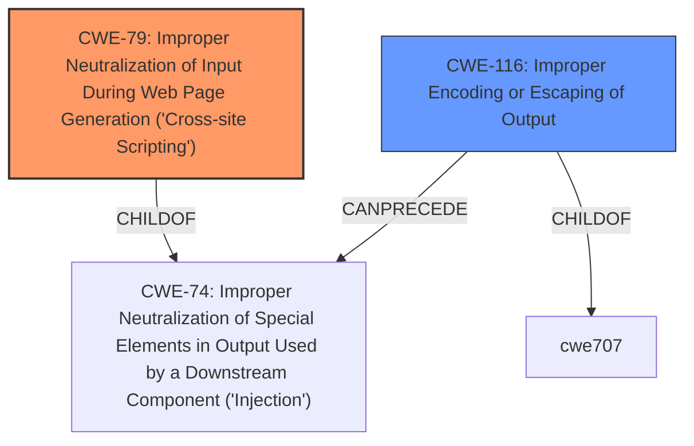

# Enhanced Analysis for CVE-2021-20195

# Summary
| CWE ID | CWE Name | Confidence | CWE Abstraction Level | CWE Vulnerability Mapping Label | CWE-Vulnerability Mapping Notes |
|---|---|---|---|---|---|
| CWE-79 | Improper Neutralization of Input During Web Page Generation ('Cross-site Scripting') | 1.0 | Base | Allowed | Primary CWE: The vulnerability description explicitly states that the user-supplied data fields are not properly encoded, leading to a cross-site scripting vulnerability. |
| CWE-116 | Improper Encoding or Escaping of Output | 0.8 | Class | Allowed-with-Review | Secondary Candidate: This CWE is closely related to XSS as it involves the lack of proper encoding of output, which is the root cause of the XSS vulnerability. |

## Evidence and Confidence

*   **Confidence Score:** 1.0
*   **Evidence Strength:** HIGH

## Relationship Analysis
The primary relationship influencing the selection is the hierarchical link between CWE-79 and CWE-116. CWE-79 (Improper Neutralization of Input During Web Page Generation ('Cross-site Scripting')) is a base-level CWE that directly describes the vulnerability. CWE-116 (Improper Encoding or Escaping of Output) is a class-level CWE that represents the broader issue of improper output handling, which leads to XSS. The choice of CWE-79 as the primary mapping reflects the specific XSS nature of the vulnerability.



## Vulnerability Chain
The vulnerability chain starts with the **user-supplied data fields not being properly encoded**. This leads directly to **cross-site scripting**, which can be escalated to a complete **account takeover**.

## Summary of Analysis
The analysis is strongly based on the evidence provided in the vulnerability description and the CVE Reference Links Content Summary. The vulnerability description clearly states that "**user-supplied data fields not being properly encoded**" is the root cause, leading to a "**cross-site scripting**" vulnerability. The CVE Reference Links Content Summary further confirms this by stating that "The Keycloak Account console does not properly HTML-encode user-supplied data" and that this allows an attacker to inject malicious HTML and JavaScript code.

The graph relationships support the selection of CWE-79 as the primary CWE because it is a base-level CWE specifically designed for cross-site scripting vulnerabilities. The relationship with CWE-116 indicates that the improper encoding of output is a contributing factor.

The selected CWEs are at the optimal level of specificity. CWE-79 directly addresses the XSS vulnerability, while CWE-116 provides a broader context of improper output handling.

Relevant CWE Information:

# Enhanced Context (25 CWEs)
The following CWEs were identified as potentially relevant to this vulnerability:

## CWE-639: Authorization Bypass Through User-Controlled Key
**Abstraction Level**: Base
**Similarity Score**: 0.78
**Source**: dense

**Description**:
The system's authorization functionality does not prevent one user from gaining access to another user's data or record by modifying the key value identifying the data.
**NOT USED:** This is not relevant as the vulnerability is about XSS, not authorization bypass.

## CWE-807: Reliance on Untrusted Inputs in a Security Decision
**Abstraction Level**: Base
**Similarity Score**: 0.77
**Source**: dense

**Description**:
The product uses a protection mechanism that relies on the existence or values of an input, but the input can be modified by an untrusted actor in a way that bypasses the protection mechanism.
**NOT USED:** This is not relevant as the vulnerability is about XSS, not a protection mechanism bypass.

## CWE-668: Exposure of Resource to Wrong Sphere
**Abstraction Level**: Class
**Similarity Score**: 0.77
**Source**: dense

**Description**:
The product exposes a resource to the wrong control sphere, providing unintended actors with inappropriate access to the resource.
**NOT USED:** This is too high level and not specific to the XSS vulnerability.

## CWE-472: External Control of Assumed-Immutable Web Parameter
**Abstraction Level**: Base
**Similarity Score**: 0.76
**Source**: dense

**Description**:
The web application does not sufficiently verify inputs that are assumed to be immutable but are actually externally controllable, such as hidden form fields.
**NOT USED:** This is not relevant because the vulnerable fields are not hidden or assumed immutable.

## CWE-1289: Improper Validation of Unsafe Equivalence in Input
**Abstraction Level**: Base
**Similarity Score**: 0.76
**Source**: dense

**Description**:
The product receives an input value that is used as a resource identifier or other type of reference, but it does not validate or incorrectly validates that the input is equivalent to a potentially-unsafe value.
**NOT USED:** This is not relevant because the input is not a resource identifier.

## CWE-74: Improper Neutralization of Special Elements in Output Used by a Downstream Component ('Injection')
**Abstraction Level**: Class
**Similarity Score**: 0.76
**Source**: dense

**Description**:
The product constructs all or part of a command, data structure, or record using externally-influenced input from an upstream component, but it does not neutralize or incorrectly neutralizes special elements that could modify how it is parsed or interpreted when it is sent to a downstream component.
**NOT USED:** While XSS is a type of injection, CWE-79 is a more specific and appropriate classification.

## CWE-41: Improper Resolution of Path Equivalence
**Abstraction Level**: Base
**Similarity Score**: 0.76
**Source**: dense

**Description**:
The product is vulnerable to file system contents disclosure through path equivalence. Path equivalence involves the use of special characters in file and directory names. The associated manipulations are intended to generate multiple names for the same object.
**NOT USED:** This is not relevant as the vulnerability is about XSS, not file system path manipulation.

## CWE-1390: Weak Authentication
**Abstraction Level**: Class
**Similarity Score**: 0.76
**Source**: dense

**Description**:
The product uses an authentication mechanism to restrict access to specific users or identities, but the mechanism does not sufficiently prove that the claimed identity is correct.
**NOT USED:** This is not relevant as the vulnerability is about XSS, not authentication.

## CWE-204: Observable Response Discrepancy
**Abstraction Level**: Base
**Similarity Score**: 0.76
**Source**: dense

**Description**:
The product provides different responses to incoming requests in a way that reveals internal state information to an unauthorized actor outside of the intended control sphere.
**NOT USED:** This is not relevant as the vulnerability is about XSS, not information disclosure via response discrepancies.

## CWE-653: Improper Isolation or Compartmentalization
**Abstraction Level**: Class
**Similarity Score**: 0.76
**Source**: dense

**Description**:
The product does not properly compartmentalize or isolate functionality, processes, or resources that require different privilege levels, rights, or permissions.
**NOT USED:** This is not relevant as the vulnerability is about XSS, not isolation or compartmentalization.

## CWE-79: Improper Neutralization of Input During Web Page Generation ('Cross-site Scripting')
**Abstraction Level**: Base
**Similarity Score**: 8026.83
**Source**: sparse

**Description**:
The product does not neutralize or incorrectly neutralizes user-controllable input before it is placed in output that is used as a web page that is served to other users.
**USED:** Primary CWE. The vulnerability involves user-supplied data not being properly encoded, leading to a cross-site scripting vulnerability.

## CWE-116: Improper Encoding or Escaping of Output
**Abstraction Level**: Class
**Similarity Score**: 8003.74
**Source**: sparse

**Description**:
The product prepares a structured message for communication with another component, but encoding or escaping of the data is either missing or done incorrectly. As a result, the intended structure of the message is not preserved.
**USED:** Secondary CWE. Closely related to XSS as it involves the lack of proper encoding of output, which is the root cause of the XSS vulnerability.

## CWE-444: Inconsistent Interpretation of HTTP Requests ('HTTP Request/Response Smuggling')
**Abstraction Level**: Base
**Similarity Score**: 7646.83
**Source**: sparse

**Description**:
The product acts as an intermediary HTTP agent
         (such as a proxy or firewall) in the data


## CWE Relationship Analysis

Current CWEs represent these abstraction levels: .


### Vulnerability Chain Analysis

**Chain starting from CWE-79:**
- 79 (Improper Neutralization of Input During Web Page Generation ('Cross-site Scripting')) - ROOT


**Chain starting from CWE-41:**
- 41 (Improper Resolution of Path Equivalence) - ROOT


### CWE Relationship Diagram

```mermaid
graph TD
    classDef primary fill:#f96,stroke:#333,stroke-width:2px
    classDef secondary fill:#69f,stroke:#333
    classDef tertiary fill:#9e9,stroke:#333
```