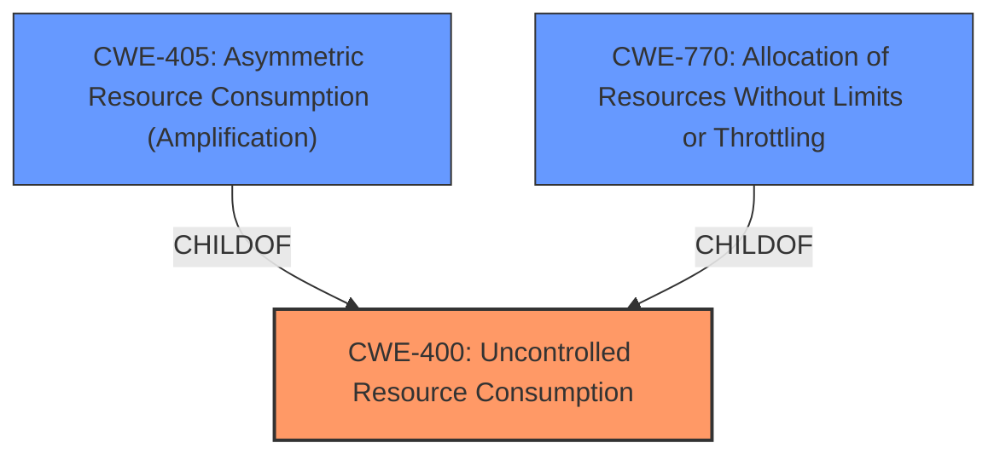

# Analysis Report for CVE-2021-20201

# Vulnerability Analysis Report: CVE-2021-20201

## Description


## Analysis (with Relationship Data)

# Summary
| CWE ID | CWE Name | Confidence | CWE Abstraction Level | CWE Vulnerability Mapping Label | CWE-Vulnerability Mapping Notes |
|---|---|---|---|---|---|
| CWE-400 | Uncontrolled Resource Consumption | 0.9 | Class | Primary | Discouraged |
| CWE-405 | Asymmetric Resource Consumption (Amplification) | 0.8 | Class | Secondary | Allowed-with-Review |
| CWE-770 | Allocation of Resources Without Limits or Throttling | 0.7 | Base | Secondary | Allowed |

## Evidence and Confidence

*   **Confidence Score:** 0.9
*   **Evidence Strength:** HIGH

## Relationship Analysis
The primary CWE selected is CWE-400, which is a Class-level CWE. While it's generally discouraged to map to Class-level CWEs, in this case, it serves as a good starting point due to the nature of the vulnerability which is about the lack of control over resources. CWE-405 (Asymmetric Resource Consumption (Amplification)) is a child of CWE-400, representing a more specific case where the attacker's influence is asymmetric. CWE-770 (Allocation of Resources Without Limits or Throttling) is also a child of CWE-400 and represents the allocation of resources without proper limits.



## Vulnerability Chain
The vulnerability chain starts with the SPICE server's **lack of proper restrictions** on client-initiated renegotiation. This allows remote attackers to repeatedly trigger TLS renegotiation, leading to excessive CPU consumption and ultimately a denial of service.
  - **Root Cause:** **Lack of proper restrictions** on client-initiated renegotiation
  - **Weakness:** Excessive CPU consumption
  - **Impact:** Denial of service

## Summary of Analysis
The initial assessment considered the vulnerability description and the "CVE Reference Links Content Summary." The vulnerability involves a denial-of-service (DoS) condition caused by remote attackers exploiting the **lack of proper restrictions** on client-initiated renegotiation in the SPICE server. This leads to excessive CPU consumption.

The primary CWE selected is CWE-400 (Uncontrolled Resource Consumption) because the vulnerability is fundamentally about **uncontrolled consumption of CPU resources**. The "CVE Reference Links Content Summary" provides evidence: "The vulnerability stems from the improper handling of client-initiated renegotiation in the SPICE (Simple Protocol for Independent Computing Environments) server when using TLS. The SPICE server was allowing clients to initiate TLS renegotiation which is a resource intensive process for the server and can cause a denial of service."

CWE-405 (Asymmetric Resource Consumption (Amplification)) was considered because the vulnerability involves an amplification effect, where a small action by the attacker (initiating renegotiation) leads to a large consumption of resources by the server. The description of CWE-405 mentions "the adversary's influence is 'asymmetric.'"

CWE-770 (Allocation of Resources Without Limits or Throttling) was also considered because it addresses the **lack of limits** on resource allocation. The vulnerability allows attackers to allocate excessive CPU resources without any throttling mechanism. The "CVE Reference Links Content Summary" indicates that the **lack of restrictions** on client-initiated renegotiation is the **root cause**, directly relating to the allocation of resources without limits.

While CWE-400 is discouraged, the lack of a more specific Base-level CWE that directly addresses the **uncontrolled consumption of CPU resources** related to TLS renegotiation makes it a suitable primary mapping. Both CWE-405 and CWE-770 provide additional context but are secondary to CWE-400.

The selection of CWEs is based on the evidence that the **root cause** is the **lack of proper restrictions** on client-initiated renegotiation, which leads to **uncontrolled resource consumption** and a denial-of-service condition. The chosen CWEs are at an appropriate level of specificity, capturing the essence of the vulnerability.

Relevant CWE Information:

# Enhanced Context (25 CWEs)
The following CWEs were identified as potentially relevant to this vulnerability:

## CWE-405: Asymmetric Resource Consumption (Amplification)
**Abstraction Level**: Class
**Similarity Score**: 0.78
**Source**: dense

**Description**:
The product does not properly control situations in which an adversary can cause the product to consume or produce excessive resources without requiring the adversary to invest equivalent work or otherwise prove authorization, i.e., the adversary's influence is "asymmetric."

**Mapping Guidance**:
- Usage: Allowed-with-Review
- Rationale: This CWE entry is a Class and might have Base-level children that would be more appropriate

## CWE-789: Memory Allocation with Excessive Size Value
**Abstraction Level**: Variant
**Similarity Score**: 0.78
**Source**: dense

**Description**:
The product allocates memory based on an untrusted, large size value, but it does not ensure that the size is within expected limits, allowing arbitrary amounts of memory to be allocated.

**Mapping Guidance**:
- Usage: Allowed
- Rationale: This CWE entry is at the Variant level of abstraction, which is a preferred level of abstraction for mapping to the root causes of vulnerabilities.

## CWE-1325: Improperly Controlled Sequential Memory Allocation
**Abstraction Level**: Base
**Similarity Score**: 0.77
**Source**: dense

**Description**:
The product manages a group of objects or resources and performs a separate memory allocation for each object, but it does not properly limit the total amount of memory that is consumed by all of the combined objects.

**Mapping Guidance**:
- Usage: Allowed
- Rationale: This CWE entry is at the Base level of abstraction, which is a preferred level of abstraction for mapping to the root causes of vulnerabilities.

## CWE-407: Inefficient Algorithmic Complexity
**Abstraction Level**: Class
**Similarity Score**: 0.76
**Source**: dense

**Description**:
An algorithm in a product has an inefficient worst-case computational complexity that may be detrimental to system performance and can be triggered by an attacker, typically using crafted manipulations that ensure that the worst case is being reached.

**Mapping Guidance**:
- Usage: Allowed-with-Review
- Rationale: This CWE entry is a Class and might have Base-level children that would be more appropriate

## CWE-404: Improper Resource Shutdown or Release
**Abstraction Level**: Class
**Similarity Score**: 0.75
**Source**: dense

**Description**:
The product does not release or incorrectly releases a resource before it is made available for re-use.

**Mapping Guidance**:
- Usage: Allowed-with-Review
- Rationale: This CWE entry is a Class and might have Base-level children that would be more appropriate

## CWE-226: Sensitive Information in Resource Not Removed Before Reuse
**Abstraction Level**: Base
**Similarity Score**: 0.75
**Source**: dense

**Description**:
The product releases a resource such as memory or a file so that it can be made available for reuse, but it does not clear or "zeroize" the information contained in the resource before the product performs a critical state transition or makes the resource available for reuse by other entities.

**Mapping Guidance**:
- Usage: Allowed
- Rationale: This CWE entry is at the Base level of abstraction, which is a preferred level of abstraction for mapping to the root causes of vulnerabilities.

## CWE-131: Incorrect Calculation of Buffer Size
**Abstraction Level**: Base
**Similarity Score**: 0.75
**Source**: dense

**Description**:
The product does not correctly calculate the size to be used when allocating a buffer, which could lead to a buffer overflow.

**Mapping Guidance**:
- Usage: Allowed
- Rationale: This CWE entry is at the Base level of abstraction, which is a preferred level of abstraction for mapping to the root causes of vulnerabilities.

## CWE-1176: Inefficient CPU Computation
**Abstraction Level**: Class
**Similarity Score**: 0.75
**Source**: dense

**Description**:
The product performs CPU computations using
         algorithms that are not as efficient as they could be for the
         needs of the developer, i.e., the computations can be
         optimized further.

**Mapping Guidance**:
- Usage: Allowed-with-Review
- Rationale: This CWE entry is a Class and might have Base-level children that would be more appropriate

## CWE-191: Integer Underflow (Wrap or Wraparound)
**Abstraction Level**: Base
**Similarity Score**: 0.74
**Source


## CWE Relationship Analysis

Current CWEs represent these abstraction levels: .


### Vulnerability Chain Analysis

**Chain starting from CWE-404:**
- 404 (Improper Resource Shutdown or Release) - ROOT


**Chain starting from CWE-191:**
- 191 (Integer Underflow (Wrap or Wraparound)) - ROOT


### CWE Relationship Diagram

```mermaid
graph TD
    classDef primary fill:#f96,stroke:#333,stroke-width:2px
    classDef secondary fill:#69f,stroke:#333
    classDef tertiary fill:#9e9,stroke:#333
```


*Report generated on 2025-04-02 00:52:41*
