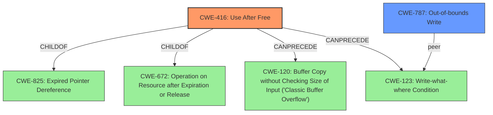

# Enhanced Analysis for CVE-2021-20204

# Summary
| CWE ID | CWE Name | Confidence | CWE Abstraction Level | CWE Vulnerability Mapping Label | CWE-Vulnerability Mapping Notes |
|---|---|---|---|---|---|
| CWE-416 | Use After Free | 1.0 | Variant | Allowed | Primary CWE |
| CWE-787 | Out-of-bounds Write | 0.6 | Base | Allowed | Secondary Candidate |

## Evidence and Confidence

*   **Confidence Score:** 0.8
*   **Evidence Strength:** HIGH

## Relationship Analysis
The primary weakness is **CWE-416 (Use After Free)**, a Variant-level CWE. It exists because memory is accessed after it has been freed. **CWE-416** is a child of **CWE-825 (Expired Pointer Dereference)** and **CWE-672 (Operation on Resource after Expiration or Release)**. **CWE-416** can precede **CWE-120 (Buffer Copy without Checking Size of Input ('Classic Buffer Overflow'))** and **CWE-123 (Write-what-where Condition)**.

Although the Retriever Results suggested **CWE-787 (Out-of-bounds Write)**, it is a consequence of the **use after free** so it is a secondary candidate.



## Vulnerability Chain
The vulnerability chain starts with a **maliciously crafted dirfile database**, leading to a **use-after-free** condition (**CWE-416**). This **use-after-free** can then cause **heap memory corruption**, which could lead to **arbitrary code execution or privilege escalation**.

## Summary of Analysis
The analysis is based on the provided evidence, which clearly identifies a **use-after-free** vulnerability in `libgetdata`.

> A **heap memory corruption** problem (**use after free**) can be triggered in libgetdata v0.10.0 when processing maliciously crafted dirfile databases.

The content summary further confirms this:

> **Root Cause:**
>
> -   A use-after-free vulnerability exists in the `_GD_Supports()` function within the `encoding.c` file of the `getdata` library. This occurs when processing maliciously crafted dirfile databases.
>
> **Weaknesses/Vulnerabilities:**
>
> -   **Use-After-Free:** The core issue is that memory is accessed after it has been freed. This can lead to unpredictable behavior and potential security issues.
> -   **Heap Memory Corruption:** The use-after-free can lead to corruption of heap memory.

Based on this evidence, **CWE-416 (Use After Free)** is the most appropriate primary CWE. It is at the Variant level, which is a preferred level of abstraction. Other CWEs, like **CWE-787 (Out-of-bounds Write)**, are potential consequences of the **use-after-free** but not the root cause itself. The relationship graph helped visualize the potential chains and impacts, further solidifying the decision to prioritize **CWE-416**.

Relevant CWE Information:

# Enhanced Context (25 CWEs)
## CWE-667: Improper Locking
**Abstraction Level**: Class
**Similarity Score**: 0.79
**Source**: dense

**Description**:
The product does not properly acquire or release a lock on a resource, leading to unexpected resource state changes and behaviors.

**Mapping Guidance**:
- Usage: Allowed-with-Review
- Rationale: This CWE entry is a Class and might have Base-level children that would be more appropriate

*Not selected:* This CWE is not relevant because the vulnerability description does not mention any locking issues.*

## CWE-366: Race Condition within a Thread
**Abstraction Level**: Base
**Similarity Score**: 0.77
**Source**: dense

**Description**:
If two threads of execution use a resource simultaneously, there exists the possibility that resources may be used while invalid, in turn making the state of execution undefined.

**Mapping Guidance**:
- Usage: Allowed
- Rationale: This CWE entry is at the Base level of abstraction, which is a preferred level of abstraction for mapping to the root causes of vulnerabilities.

*Not selected:* This CWE is not relevant because the vulnerability description does not mention any race condition issues.*

## CWE-404: Improper Resource Shutdown or Release
**Abstraction Level**: Class
**Similarity Score**: 0.77
**Source**: dense

**Description**:
The product does not release or incorrectly releases a resource before it is made available for re-use.

**Mapping Guidance**:
- Usage: Allowed-with-Review
- Rationale: This CWE entry is a Class and might have Base-level children that would be more appropriate

*Not selected:* Although this CWE is related to resource release, the core issue is the use of memory *after* it has been released, making **CWE-416** a more precise match.*

## CWE-662: Improper Synchronization
**Abstraction Level**: Class
**Similarity Score**: 0.77
**Source**: dense

**Description**:
The product utilizes multiple threads or processes to allow temporary access to a shared resource that can only be exclusive to one process at a time, but it does not properly synchronize these actions, which might cause simultaneous accesses of this resource by multiple threads or processes.

**Mapping Guidance**:
- Usage: Discouraged
- Rationale: This CWE entry is a level-1 Class (i.e., a child of a Pillar). It might have lower-level children that would be more appropriate

*Not selected:* The vulnerability description does not mention any synchronization issues.*

## CWE-226: Sensitive Information in Resource Not Removed Before Reuse
**Abstraction Level**: Base
**Similarity Score**: 0.76
**Source**: dense

**Description**:
The product releases a resource such as memory or a file so that it can be made available for reuse, but it does not clear or "zeroize" the information contained in the resource before the product performs a critical state transition or makes the resource available for reuse by other entities.

**Mapping Guidance**:
- Usage: Allowed
- Rationale: This CWE entry is at the Base level of abstraction, which is a preferred level of abstraction for mapping to the root causes of vulnerabilities.

*Not selected:* While related to resource reuse, the core issue is accessing the memory *after* it's been freed, not the presence of sensitive information.*

## CWE-362: Concurrent Execution using Shared Resource with Improper Synchronization ('Race Condition')
**Abstraction Level**: Class
**Similarity Score**: 0.76
**Source**: dense

**Description**:
The product contains a concurrent code sequence that requires temporary, exclusive access to a shared resource, but a timing window exists in which the shared resource can be modified by another code sequence operating concurrently.

**Mapping Guidance**:
- Usage: Allowed-with-Review
- Rationale: This CWE entry is a Class and might have Base-level children that would be more appropriate

*Not selected:* The vulnerability description does not mention any concurrency or race condition issues.*

## CWE-131: Incorrect Calculation of Buffer Size
**Abstraction Level**: Base
**Similarity Score**: 0.75
**Source**: dense

**Description**:
The product does not correctly calculate the size to be used when allocating a buffer, which could lead to a buffer overflow.

**Mapping Guidance**:
- Usage: Allowed
- Rationale: This CWE entry is at the Base level of abstraction, which is a preferred level of abstraction for mapping to the root causes of vulnerabilities.

*Not selected:* The vulnerability description does not mention any buffer size calculation issues.*

## CWE-125: Out-of-bounds Read
**Abstraction Level**: Base
**Similarity Score**: 0.75
**Source**: dense

**Description**:
The product reads data past the end, or before the beginning, of the


## CWE Relationship Analysis

Current CWEs represent these abstraction levels: .


### Vulnerability Chain Analysis

**Chain starting from CWE-667:**
- 667 (Improper Locking) - ROOT


**Chain starting from CWE-787:**
- 787 (Out-of-bounds Write) - ROOT


### CWE Relationship Diagram

```mermaid
graph TD
    classDef primary fill:#f96,stroke:#333,stroke-width:2px
    classDef secondary fill:#69f,stroke:#333
    classDef tertiary fill:#9e9,stroke:#333
```