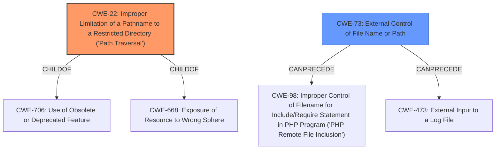

# Analysis Report for CVE-2021-20206

# Vulnerability Analysis Report: CVE-2021-20206

## Description


## Analysis (with Relationship Data)

# Summary
| CWE ID | CWE Name | Confidence | CWE Abstraction Level | CWE Vulnerability Mapping Label | CWE-Vulnerability Mapping Notes |
|---|---|---|---|---|---|
| CWE-22 | Improper Limitation of a Pathname to a Restricted Directory ('Path Traversal') | 1.0 | Base | Primary | Allowed |
| CWE-73 | External Control of File Name or Path | 0.8 | Base | Secondary | Allowed |

## Evidence and Confidence

*   **Confidence Score:** 0.9
*   **Evidence Strength:** HIGH

## Relationship Analysis
The primary CWE selected is CWE-22, which represents the **improper limitation of a pathname**. This is a base-level CWE, offering a specific description of the vulnerability. CWE-22 is **childof** CWE-706 (Use of Obsolete or Deprecated Feature) and CWE-668 (Exposure of Resource to Wrong Sphere).
CWE-73, External Control of File Name or Path, is considered a secondary CWE, as it describes how user input can influence file paths, contributing to the exploitation of the directory traversal vulnerability. CWE-73 can **precede** CWE-98 (Improper Control of Filename for Include/Require Statement in PHP Program ('PHP Remote File Inclusion')) and CWE-473 (External Input to a Log File).



## Vulnerability Chain
The vulnerability chain starts with the **improper limitation of a pathname** (CWE-22), where the product fails to adequately restrict pathnames to a designated directory. This is influenced by **external control of a file name or path** (CWE-73). An attacker leverages this by using special elements like "../" to traverse directories. Ultimately, this leads to arbitrary code execution by running unintended binaries.

## Summary of Analysis
The initial assessment correctly identifies the core issue as an **improper limitation of a pathname**, leading to a directory traversal vulnerability. The vulnerability description clearly states: "An **improper limitation of path name** flaw was found... When specifying the plugin to load in the type field in the network configuration, it is possible to use special elements such as ../ separators to reference binaries elsewhere on the system." The CVE Reference Links Content Summary supports this, stating: "The primary vulnerability is a directory traversal flaw. An attacker can use path manipulation sequences within the `type` field to access and execute files outside the intended CNI plugin directory."

CWE-22 is at the base level, which is appropriate because it is a specific description of the vulnerability.
CWE-73 provides more context as to how the path is being manipulated using external means.

Other CWEs considered but not used:

*   **CWE-863 (Incorrect Authorization):** While the vulnerability allows execution of unintended binaries, the root cause is path traversal, not an authorization failure. Authorization might be a contributing factor, but the primary weakness is the **improper path validation**.
*   **CWE-201 (Insertion of Sensitive Information Into Sent Data):** This CWE is not relevant as the vulnerability doesn't involve the insertion of sensitive data into sent data.
*   **CWE-1336 (Improper Neutralization of Special Elements Used in a Template Engine):** This CWE is irrelevant because it is not related to template injection.
*   **CWE-732 (Incorrect Permission Assignment for Critical Resource):** While permissions might play a role in the impact of the vulnerability, the root cause is the **improper handling of pathnames**, not the assignment of permissions.
*   **CWE-641 (Improper Restriction of Names for Files and Other Resources):** This CWE is close, but CWE-22 more accurately pinpoints the directory traversal aspect of the vulnerability.
*   **CWE-98 (Improper Control of Filename for Include/Require Statement in PHP Program ('PHP Remote File Inclusion')):** This is not a PHP specific vulnerability.
*   **CWE-285 (Improper Authorization):** This is not the primary issue, as the main concern is that the path is improperly validated.
*   **CWE-94 (Improper Control of Generation of Code ('Code Injection')):** The code is not generated it is executed from another location.
*   **CWE-367 (Time-of-check Time-of-use (TOCTOU) Race Condition):** This is not a race condition.


## CWE Relationship Analysis

Current CWEs represent these abstraction levels: .


### Vulnerability Chain Analysis

**Chain starting from CWE-732:**
- 732 (Incorrect Permission Assignment for Critical Resource) - ROOT


**Chain starting from CWE-1336:**
- 1336 (Improper Neutralization of Special Elements Used in a Template Engine) - ROOT


### CWE Relationship Diagram

```mermaid
graph TD
    classDef primary fill:#f96,stroke:#333,stroke-width:2px
    classDef secondary fill:#69f,stroke:#333
    classDef tertiary fill:#9e9,stroke:#333
```


*Report generated on 2025-04-02 05:54:25*
