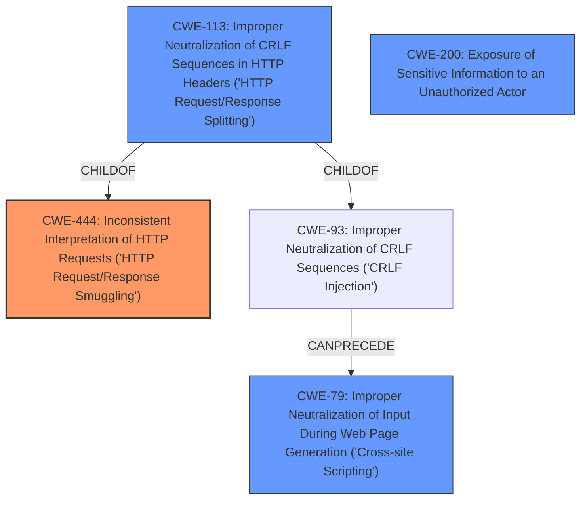

# Raw Analyzer Response for CVE-2021-20220

# Summary
| CWE ID | CWE Name | Confidence | CWE Abstraction Level | CWE Vulnerability Mapping Label | CWE-Vulnerability Mapping Notes |
|---|---|---|---|---|---|
| CWE-444 | Inconsistent Interpretation of HTTP Requests ('HTTP Request/Response Smuggling') | 0.9 | Base | Allowed | Primary CWE. The vulnerability allows HTTP request smuggling due to inconsistent interpretation of HTTP requests by the server. |
| CWE-113 | Improper Neutralization of CRLF Sequences in HTTP Headers ('HTTP Request/Response Splitting') | 0.7 | Variant | Allowed | Secondary CWE. The vulnerability involves improper handling of CRLF sequences in HTTP headers, enabling HTTP request/response splitting. |
| CWE-79 | Improper Neutralization of Input During Web Page Generation ('Cross-site Scripting') | 0.5 | Base | Allowed | Secondary CWE. The vulnerability leads to XSS attacks, thus improper neutralization of input occurs. |
| CWE-200 | Exposure of Sensitive Information to an Unauthorized Actor | 0.5 | Class | Discouraged | Secondary CWE. The vulnerability results in sensitive information disclosure. |

## Evidence and Confidence

*   **Confidence Score:** 0.7
*   **Evidence Strength:** HIGH

## Relationship Analysis
The primary CWE is CWE-444, which directly addresses the root cause of HTTP request smuggling. CWE-113 is a variant that describes the specific issue of improper CRLF handling. CWE-79 is related to the XSS attack impact, and CWE-200 to the sensitive information disclosure. The relationships are as follows:

## Vulnerability Chain
The vulnerability chain starts with the **regression in the fix for CVE-2020-10687**, which leads to **permitting invalid characters in HTTP requests**. This further results in:
1.  **HTTP Request Smuggling (CWE-444)**
2.  **XSS attack (CWE-79)**
3.  **Sensitive Information Disclosure (CWE-200)**

## Summary of Analysis
The primary weakness is the potential for HTTP request smuggling (CWE-444) due to a **regression in the fix for CVE-2020-10687** and the **acceptance of invalid characters in HTTP requests.** This is supported by the vulnerability description and the CVE Reference Links Content Summary.

The selection is based on the evidence:

*   Vulnerability Description Key Phrases: "**regression in fix for CVE-2020-10687**", "**invalid characters in HTTP request**", "HTTP request smuggling, XSS attack"
*   CVE Reference Links Content Summary: "**HTTP Request Smuggling:** The core weakness is the possibility of HTTP request smuggling against HTTP/1.x and HTTP/2 due to the acceptance of invalid characters in HTTP requests."

The graph relationships show that CWE-444 is the primary issue, with CWE-113 being a related variant, and CWE-79 and CWE-200 being potential impacts of the vulnerability.

CWE-444 is at the base level, providing sufficient specificity for this vulnerability. The related CWEs (CWE-113, CWE-79, and CWE-200) represent other aspects and potential impacts.

CWEs considered but not used:

*   CWE-201: Insertion of Sensitive Information Into Sent Data - This is related to the sensitive information disclosure, but the root cause is not the insertion of sensitive data, but the ability to smuggle requests.
*   CWE-93: Improper Neutralization of CRLF Sequences ('CRLF Injection') - This is relevant, but CWE-113 is more specific to HTTP headers.
*   CWE-918: Server-Side Request Forgery (SSRF) - Not directly applicable, as the issue is not about making requests to unexpected destinations.
*   CWE-287: Improper Authentication and CWE-863: Incorrect Authorization and CWE-1390: Weak Authentication - These are not directly applicable as the vulnerability is not primarily about authentication or authorization.
*   CWE-226: Sensitive Information in Resource Not Removed Before Reuse - Not directly related to the root cause of request smuggling or information disclosure.
*   CWE-668: Exposure of Resource to Wrong Sphere, CWE-74: Improper Neutralization of Special Elements in Output Used by a Downstream Component ('Injection'), CWE-1289: Improper Validation of Unsafe Equivalence in Input, CWE-319: Cleartext Transmission of Sensitive Information, CWE-303: Incorrect Implementation of Authentication Algorithm, CWE-117: Improper Output Neutralization for Logs, CWE-178: Improper Handling of Case Sensitivity, CWE-611: Improper Restriction of XML External Entity Reference, CWE-202: Exposure of Sensitive Information Through Data Queries, CWE-209: Generation of Error Message Containing Sensitive Information, CWE-441: Unintended Proxy or Intermediary ('Confused Deputy'), CWE-807: Reliance on Untrusted Inputs in a Security Decision, CWE-204: Observable Response Discrepancy, CWE-212: Improper Removal of Sensitive Information Before Storage or Transfer were not selected as they don't align as closely with the root cause or impacts described in the vulnerability.