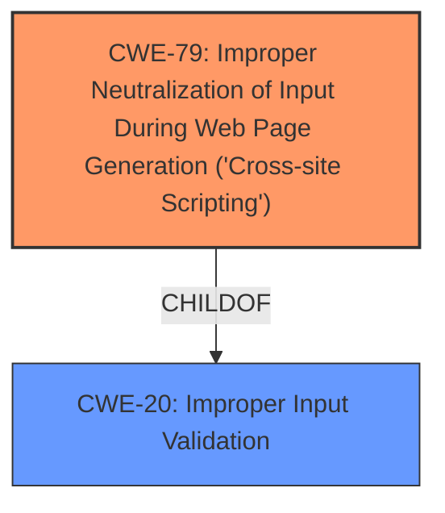

# Analysis Report for CVE-2021-20222

# Vulnerability Analysis Report: CVE-2021-20222

## Description


## Analysis (with Relationship Data)

# Summary
| CWE ID | CWE Name | Confidence | CWE Abstraction Level | CWE Vulnerability Mapping Label | CWE-Vulnerability Mapping Notes |
|---|---|---|---|---|---|
| CWE-79 | Improper Neutralization of Input During Web Page Generation ('Cross-site Scripting') | 1.0 | Base | Primary | Allowed |
| CWE-20 | Improper Input Validation | 0.7 | Class | Secondary | Allowed-with-Review |

## Evidence and Confidence

*   **Confidence Score:** 0.9
*   **Evidence Strength:** HIGH

## Relationship Analysis
The primary weakness is CWE-79, which is a **Base** level CWE describing improper neutralization of input during web page generation. This is a child of CWE-20, **Improper Input Validation**, which is a broader **Class** level CWE. The XSS attack occurs because the referrer URL isn't properly sanitized. The hierarchical relationship influenced the choice of CWE-79 as it is a more specific description of the vulnerability than CWE-20.



## Vulnerability Chain
The vulnerability chain starts with the lack of proper sanitization of the referrer URL, leading to the possibility of injecting malicious code and ultimately compromising data confidentiality, integrity, and system availability.

## Summary of Analysis
The initial analysis identified CWE-79 as the primary weakness due to the reflected XSS vulnerability. The analysis also considered CWE-20 as a broader classification, since the root cause is **improper input validation** of the referrer URL. The final decision was to classify the vulnerability as CWE-79, as it is a more specific and accurate representation of the vulnerability.

The evidence supporting this decision is:

*   **Vulnerability Description Key Phrases:** "execute malicious code", "referrer URL"
*   **CVE Reference Links Content Summary:** "The vulnerability stems from a reflected Cross-Site Scripting (XSS) flaw in the Keycloak new account console.", "The console was vulnerable to malicious code injection through the referrer URL.", "The application was not properly sanitizing the referrer URL before using it in the context of the new account console."

The hierarchical relationship of CWE-79 being a child of CWE-20 further supports the choice of CWE-79 as the more specific and appropriate classification.

The selected CWEs are at the optimal level of specificity because CWE-79 directly addresses the XSS vulnerability, while CWE-20 describes the broader issue of **improper input validation**, which is the root cause.

Relevant CWE Information:

# Enhanced Context (25 CWEs)

## CWE-639: Authorization Bypass Through User-Controlled Key
**Abstraction Level**: Base
**Similarity Score**: 0.77
**Source**: dense

**Description**:
The system's authorization functionality does not prevent one user from gaining access to another user's data or record by modifying the key value identifying the data.

**Mapping Guidance**:
- Usage: Allowed
- Rationale: This CWE entry is at the Base level of abstraction, which is a preferred level of abstraction for mapping to the root causes of vulnerabilities.

This CWE was considered, but the vulnerability is not related to authorization bypass, so it was rejected.

## CWE-20: Improper Input Validation
**Abstraction Level**: Class
**Similarity Score**: N/A
**Source**: N/A

**Description**: The product does not validate or incorrectly validates input.

**Mapping Guidance**:
- Usage: Allowed-with-Review
- Rationale: This CWE entry is a Class and might have Base-level children that would be more appropriate

This CWE was considered as a secondary CWE since the root cause is **improper input validation**, but CWE-79 is the more specific case of **improper input validation** leading to XSS.

## CWE-79: Improper Neutralization of Input During Web Page Generation ('Cross-site Scripting')
**Abstraction Level**: Base
**Similarity Score**: N/A
**Source**: N/A

**Description**: The product does not neutralize or incorrectly neutralizes input before releasing it for processing in a web page in a way that allows the attacker to supply input that specifies the behavior of the web page.

**Mapping Guidance**:
- Usage: Allowed
- Rationale: This CWE entry is at the Base level of abstraction, which is a preferred level of abstraction for mapping to the root causes of vulnerabilities.

This is the primary CWE because the vulnerability is a reflected XSS due to **improper sanitization** of the referrer URL.


## CWE Relationship Analysis

Current CWEs represent these abstraction levels: .


### Vulnerability Chain Analysis

**Chain starting from CWE-79:**
- 79 (Improper Neutralization of Input During Web Page Generation ('Cross-site Scripting')) - ROOT


**Chain starting from CWE-20:**
- 20 (Improper Input Validation) - ROOT


### CWE Relationship Diagram

```mermaid
graph TD
    classDef primary fill:#f96,stroke:#333,stroke-width:2px
    classDef secondary fill:#69f,stroke:#333
    classDef tertiary fill:#9e9,stroke:#333
```


*Report generated on 2025-04-02 08:58:18*
