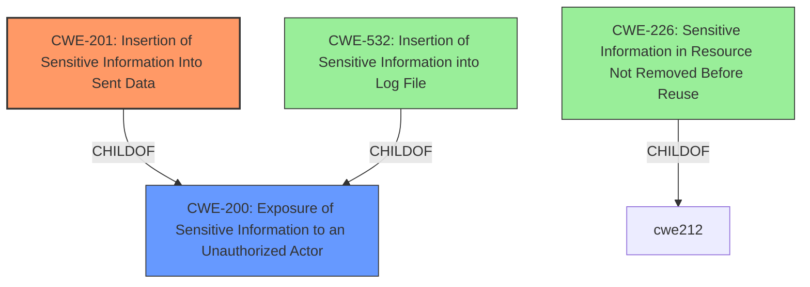

# Analysis for CVE-2021-20228

# Summary
| CWE ID | CWE Name | Confidence | CWE Abstraction Level | CWE Vulnerability Mapping Label | CWE-Vulnerability Mapping Notes |
|---|---|---|---|---|---|
| CWE-201 | Insertion of Sensitive Information Into Sent Data | 0.9 | Base | Allowed | Primary CWE.  The `no_log` feature failed to protect sensitive information in sub-options of the `basic.py` module in Ansible Engine 2.9.18, leading to the inclusion of sensitive information in the sent data. |
| CWE-532 | Insertion of Sensitive Information into Log File | 0.7 | Base | Allowed | Secondary CWE.  Although the primary issue is the transmission of sensitive data, the fact that the `no_log` feature failed suggests the sensitive information might also end up in logs. |
| CWE-226 | Sensitive Information in Resource Not Removed Before Reuse | 0.6 | Base | Allowed | Secondary CWE. The sensitive information was not properly cleared or masked after being used in the sub-options, potentially leading to it being exposed in other contexts or reused resources.|

## Evidence and Confidence

*   **Confidence Score:** 0.8
*   **Evidence Strength:** HIGH

## Relationship Analysis
The primary relationship influencing the selection is the hierarchical connection between CWE-200 (Exposure of Sensitive Information to an Unauthorized Actor) and its child CWE-201 (Insertion of Sensitive Information Into Sent Data). CWE-201 is more specific and accurately reflects the vulnerability where sensitive information is inserted into sent data due to the failure of the `no_log` feature.

## Vulnerability Chain
The vulnerability chain starts with the **improper** implementation of the `no_log` feature, leading to sensitive information not being masked by default. This results in the **insertion** of sensitive information into sent data, which can then lead to an attacker obtaining sensitive information, impacting confidentiality.

## Summary of Analysis
The primary CWE selected is CWE-201 because the core issue is the **insertion** of sensitive information into sent data due to the **failure** of the `no_log` feature. The supporting evidence is strong, as the CVE description and summary explicitly state that sensitive information is not masked and can be obtained by an attacker due to this **failure**.

The evidence from the "CVE Reference Links Content Summary" section:
"The `no_log` feature in Ansible's `basic.py` module did not mask sensitive information when using sub-options, particularly when fallback values or defaults were used."
"An attacker could obtain sensitive information that was not properly masked or protected, leading to a breach of confidentiality."

CWE-200 was considered but deemed too general. While the vulnerability does lead to exposure of sensitive information, the root cause is specifically the insertion of this information into sent data, making CWE-201 a more precise fit.

CWE-532 was considered because the `no_log` feature's failure could also result in sensitive information being logged, but this is a secondary concern and not the primary mode of exposure.

CWE-226 was considered since the issue involves the state after sensitive data is used, but it is not a primary factor.

The selection of CWE-201 at the Base level of abstraction is optimal because it accurately represents the specific weakness of sensitive information being inserted into sent data, providing a clear and actionable classification.

Relevant CWE Information:

# Enhanced Context (25 CWEs)
The following CWEs were identified as potentially relevant to this vulnerability:

## CWE-538: Insertion of Sensitive Information into Externally-Accessible File or Directory
**Abstraction Level**: Base
**Similarity Score**: 0.77
**Source**: dense

**Description**:
The product places sensitive information into files or directories that are accessible to actors who are allowed to have access to the files, but not to the sensitive information.

**Mapping Guidance**:
- Usage: Allowed
- Rationale: This CWE entry is at the Base level of abstraction, which is a preferred level of abstraction for mapping to the root causes of vulnerabilities.

## CWE-226: Sensitive Information in Resource Not Removed Before Reuse
**Abstraction Level**: Base
**Similarity Score**: 0.76
**Source**: dense

**Description**:
The product releases a resource such as memory or a file so that it can be made available for reuse, but it does not clear or "zeroize" the information contained in the resource before the product performs a critical state transition or makes the resource available for reuse by other entities.

**Mapping Guidance**:
- Usage: Allowed
- Rationale: This CWE entry is at the Base level of abstraction, which is a preferred level of abstraction for mapping to the root causes of vulnerabilities.

## CWE-212: Improper Removal of Sensitive Information Before Storage or Transfer
**Abstraction Level**: Base
**Similarity Score**: 0.75
**Source**: dense

**Description**:
The product stores, transfers, or shares a resource that contains sensitive information, but it does not properly remove that information before the product makes the resource available to unauthorized actors.

**Mapping Guidance**:
- Usage: Allowed
- Rationale: This CWE entry is at the Base level of abstraction, which is a preferred level of abstraction for mapping to the root causes of vulnerabilities.

## CWE-312: Cleartext Storage of Sensitive Information
**Abstraction Level**: Base
**Similarity Score**: 0.74
**Source**: dense

**Description**:
The product stores sensitive information in cleartext within a resource that might be accessible to another control sphere.

**Mapping Guidance**:
- Usage: Allowed
- Rationale: This CWE entry is at the Base level of abstraction, which is a preferred level of abstraction for mapping to the root causes of vulnerabilities.

## CWE-922: Insecure Storage of Sensitive Information
**Abstraction Level**: Class
**Similarity Score**: 0.74
**Source**: dense

**Description**:
The product stores sensitive information without properly limiting read or write access by unauthorized actors.

**Mapping Guidance**:
- Usage: Allowed-with-Review
- Rationale: This CWE entry is a Class and might have Base-level children that would be more appropriate

## CWE-319: Cleartext Transmission of Sensitive Information
**Abstraction Level**: Base
**Similarity Score**: 0.73
**Source**: dense

**Description**:
The product transmits sensitive or security-critical data in cleartext in a communication channel that can be sniffed by unauthorized actors.

**Mapping Guidance**:
- Usage: Allowed
- Rationale: This CWE entry is at the Base level of abstraction, which is a preferred level of abstraction for mapping to the root causes of vulnerabilities.

## CWE-497: Exposure of Sensitive System Information to an Unauthorized Control Sphere
**Abstraction Level**: Base
**Similarity Score**: 0.73
**Source**: dense

**Description**:
The product does not properly prevent sensitive system-level information from being accessed by unauthorized actors who do not have the same level of access to the underlying system as the product does.

**Mapping Guidance**:
- Usage: Allowed
- Rationale: This CWE entry is at the Base level of abstraction, which is a preferred level of abstraction for mapping to the root causes of vulnerabilities.

## CWE-213: Exposure of Sensitive Information Due to Incompatible Policies
**Abstraction Level**: Base
**Similarity Score**: 0.73
**Source**: dense

**Description**:
The product's intended functionality exposes information to certain actors in accordance with the developer's security policy, but this information is regarded as sensitive according to the intended security policies of other stakeholders such as the product's administrator, users, or others whose information is being processed.

**Mapping Guidance**:
- Usage: Allowed
- Rationale: This CWE entry is at the Base level of abstraction, which is a preferred level of abstraction for mapping to the root causes of vulnerabilities.

## CWE-639: Authorization Bypass Through User-Controlled Key
**Abstraction Level**: Base
**Similarity Score**: 0.73
**Source**: dense

**Description**:
The system's authorization functionality does not prevent one user from gaining access to another user's data or record by modifying the key value identifying the data.

**Mapping Guidance**:
- Usage: Allowed
- Rationale: This CWE entry is at the Base level of abstraction, which is a preferred level of abstraction for mapping to the