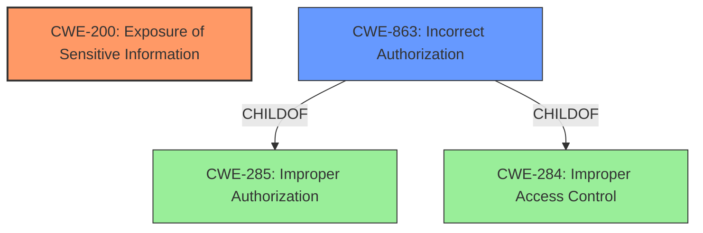

# Analysis Report for CVE-2021-20229

# Vulnerability Analysis Report: CVE-2021-20229

## Description


## Analysis (with Relationship Data)

# Summary
| CWE ID | CWE Name | Confidence | CWE Abstraction Level | CWE Vulnerability Mapping Label | CWE-Vulnerability Mapping Notes |
|---|---|---|---|---|---|
| CWE-200 | Exposure of Sensitive Information | 0.9 | Class | Primary | Allowed |
| CWE-863 | Incorrect Authorization | 0.7 | Class | Secondary Candidate | Allowed-with-Review |

## Evidence and Confidence

*   **Confidence Score:** 0.8
*   **Evidence Strength:** HIGH

## Relationship Analysis
The primary CWE is CWE-200, which represents the exposure of sensitive information. CWE-863, Incorrect Authorization, is a plausible secondary CWE because the root cause involves **improper handling of column-level SELECT privileges**, leading to unauthorized access to data. CWE-863 is a child of CWE-285 (Improper Authorization) and CWE-284 (Improper Access Control). Choosing CWE-200 directly addresses the impact, while CWE-863 reflects the underlying authorization flaw.



## Vulnerability Chain
The vulnerability chain starts with an **improper handling of column-level SELECT privileges**, leading to an **incomplete column-usage bitmap**. This results in the ability to craft a special query that retrieves all columns of a table, ultimately leading to **exposure of sensitive information**.
  - **Root Cause:** **Improper handling of column-level SELECT privileges**
  - **Weakness:** Incomplete column-usage bitmaps
  - **Impact:** Exposure of sensitive information (CWE-200)

## Summary of Analysis
Initially, the focus was on identifying the root cause of the vulnerability. The description highlights that a user with SELECT privilege on one column can retrieve all columns, suggesting an authorization issue. However, the primary impact is the disclosure of sensitive information. Therefore, CWE-200 (Exposure of Sensitive Information) is selected as the primary CWE because it directly reflects the vulnerability's impact. CWE-863 (Incorrect Authorization) is a secondary candidate because the root cause involves **improper handling of column-level SELECT privileges**.

The "CVE Reference Links Content Summary" provides strong evidence:

*   "The vulnerability stems from a flaw in how PostgreSQL handles column-level SELECT privileges for join aliases."
*   "They were passing the join RTE instead of the base table's RTE. This resulted in the base table's selectedCols bitmap not being filled correctly, leading to an understatement of the columns read by the query."
*   "Successful exploitation could lead to disclosure of sensitive information."

The graph relationships reinforce the connection between authorization and information exposure, but the final impact is the deciding factor in prioritizing CWE-200.

The selection of CWE-200 is at the optimal level of specificity because it directly describes the consequence of the vulnerability which is exposure of sensitive information.

Relevant CWE Information:

# Enhanced Context (25 CWEs)
The following CWEs were identified as potentially relevant to this vulnerability:

## CWE-538: Insertion of Sensitive Information into Externally-Accessible File or Directory
**Abstraction Level**: Base
**Similarity Score**: 0.77
**Source**: dense

**Description**:
The product places sensitive information into files or directories that are accessible to actors who are allowed to have access to the files, but not to the sensitive information.
- *Rationale for not selecting:* This CWE is about placing sensitive information into files/directories, not general information exposure through queries.

## CWE-226: Sensitive Information in Resource Not Removed Before Reuse
**Abstraction Level**: Base
**Similarity Score**: 0.76
**Source**: dense

**Description**:
The product releases a resource such as memory or a file so that it can be made available for reuse, but it does not clear or "zeroize" the information contained in the resource before the product performs a critical state transition or makes the resource available for reuse by other entities.
- *Rationale for not selecting:* This vulnerability isn't about resource reuse but about improper authorization during query execution.

## CWE-212: Improper Removal of Sensitive Information Before Storage or Transfer
**Abstraction Level**: Base
**Similarity Score**: 0.76
**Source**: dense

**Description**:
The product stores, transfers, or shares a resource that contains sensitive information, but it does not properly remove that information before the product makes the resource available to unauthorized actors.
- *Rationale for not selecting:* Similar to CWE-226, this is about storage or transfer, not real-time query execution and privilege handling.

## CWE-668: Exposure of Resource to Wrong Sphere
**Abstraction Level**: Class
**Similarity Score**: 0.76
**Source**: dense

**Description**:
The product exposes a resource to the wrong control sphere, providing unintended actors with inappropriate access to the resource.
- *Rationale for not selecting:* Too broad. The vulnerability involves a specific authorization flaw, making CWE-200 and potentially CWE-863 more appropriate.

## CWE-404: Improper Resource Shutdown or Release
**Abstraction Level**: Class
**Similarity Score**: 0.75
**Source**: dense

**Description**:
The product does not release or incorrectly releases a resource before it is made available for re-use.
- *Rationale for not selecting:* This is about resource management, not information exposure due to authorization issues.

## CWE-497: Exposure of Sensitive System Information to an Unauthorized Control Sphere
**Abstraction Level**: Base
**Similarity Score**: 0.74
**Source**: dense

**Description**:
The product does not properly prevent sensitive system-level information from being accessed by unauthorized actors who do not have the same level of access to the underlying system as the product does.
- *Rationale for not selecting:* Similar to CWE-668, but focused on system information. While relevant, CWE-200 is a better fit for the general information exposure.

## CWE-754: Improper Check for Unusual or Exceptional Conditions
**Abstraction Level**: Class
**Similarity Score**: 0.74
**Source**: dense

**Description**:
The product does not check or incorrectly checks for unusual or exceptional conditions that are not expected to occur frequently during day to day operation of the product.
- *Rationale for not selecting:* Too general. The vulnerability stems from a specific flaw in privilege handling.

## CWE-41: Improper Resolution of Path Equivalence
**Abstraction Level**: Base
**Similarity Score**: 0.74
**Source**: dense

**Description**:
The product is vulnerable to file system contents disclosure through path equivalence. Path equivalence involves the use of special characters in file and directory names. The associated manipulations are intended to generate multiple names for the same object.
- *Rationale for not selecting:* Not related to path equivalence issues.

## CWE-552: Files or Directories Accessible to External Parties
**Abstraction Level**: Base
**Similarity Score**: 0.74
**Source**: dense

**Description**:
The product makes files or directories accessible to unauthorized actors, even though they should not be.
- *Rationale for not selecting:* Not related to file or directory access.

## CWE-274: Improper Handling of Insufficient Privileges
**Abstraction Level**: Base
**Similarity Score**: 0.74
**Source**: dense

**Description**:
The product does not handle or incorrectly handles when it has insufficient privileges to perform an operation, leading to resultant weaknesses.
- *Rationale for not selecting:* This is related to insufficient privileges, whereas in this case an attacker with some privileges is able to escalate them to more privileges.

## CWE-125: Out-of-bounds Read
**Abstraction Level**: Base
**Similarity Score**: 5204.32
**Source**: sparse

**Description**:
The product reads data past the end, or before the beginning, of the intended buffer.
- *Rationale for not selecting:* Buffer overflows are not mentioned as part of this vulnerability.

## CWE-754: Improper Check for Unusual or Exceptional Conditions
**Abstraction Level**: Class
**Similarity Score**: 5185.48
**Source**: sparse

**Description**:
The product does not check or incorrectly checks for unusual or exceptional conditions that are not expected to occur frequently during day to day operation of the product.
- *Rationale for not selecting:* Too broad, the vulnerability stems from a specific flaw in privilege handling.

## CWE-119: Improper Restriction of Operations within the Bounds of a Memory Buffer
**Abstraction Level**: Class
**Similarity Score**: 5126.


## CWE Relationship Analysis

Current CWEs represent these abstraction levels: .


### Vulnerability Chain Analysis

**Chain starting from CWE-754:**
- 754 (Improper Check for Unusual or Exceptional Conditions) - ROOT


**Chain starting from CWE-404:**
- 404 (Improper Resource Shutdown or Release) - ROOT


### CWE Relationship Diagram

```mermaid
graph TD
    classDef primary fill:#f96,stroke:#333,stroke-width:2px
    classDef secondary fill:#69f,stroke:#333
    classDef tertiary fill:#9e9,stroke:#333
```


*Report generated on 2025-04-02 01:09:39*
