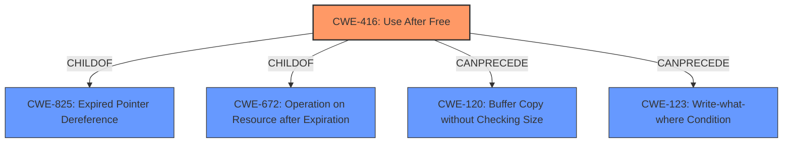

# Analysis for CVE-2021-20231

# Summary
| CWE ID | CWE Name | Confidence | CWE Abstraction Level | CWE Vulnerability Mapping Label | CWE-Vulnerability Mapping Notes |
|---|---|---|---|---|---|
| CWE-416 | Use After Free | 1.0 | Variant | Allowed | Primary CWE |

## Evidence and Confidence

*   **Confidence Score:** 1.0
*   **Evidence Strength:** HIGH

## Relationship Analysis
The primary relationship that influenced the decision was the hierarchical one, specifically the ChildOf relationship between CWE-416 and higher-level classes like CWE-825 (Expired Pointer Dereference) and CWE-672 (Operation on Resource after Expiration). While these parent classes represent broader categories, the vulnerability description and CVE details clearly point to a use-after-free scenario, making CWE-416 the most specific and accurate choice. The `CanPrecede` relationships with CWE-120 (Buffer Copy without Checking Size) and CWE-123 (Write-What-Where Condition) suggest potential exploitation paths, but the core issue remains the use of freed memory.

## Vulnerability Chain
The vulnerability chain starts with the **improper** memory management in gnutls, leading to a **use-after-free** condition. This can then be exploited to cause memory corruption and potentially a denial of service.

## Summary of Analysis
The initial analysis focused on identifying the root cause of the vulnerability. The description explicitly mentions a "**use after free**" issue. The CVE Reference Links Content Summary confirms this, stating that "The vulnerability is caused by a **use-after-free** error" and involves "pointer invalidation after realloc." This evidence strongly supports the selection of CWE-416.

The retriever results also highlighted CWE-416 as the top candidate. While other CWEs like CWE-415 (Double Free), CWE-908 (Use of Uninitialized Resource), and CWE-362 (Concurrent Execution using Shared Resource with Improper Synchronization) were considered, they do not accurately reflect the nature of the vulnerability as described. CWE-415 involves freeing the same memory twice, which is not mentioned in the description. CWE-908 deals with uninitialized resources, and CWE-362 focuses on race conditions, neither of which are the primary issue here.

Therefore, based on the available evidence and the CWE specifications, CWE-416 is the most appropriate and specific classification for this vulnerability.

Relevant CWE Information:

# Enhanced Context (25 CWEs)

## CWE-416: Use After Free
**Abstraction:** Variant
**Status:** Stable

### Description
The product reuses or references memory after it has been freed. At some point afterward, the memory may be allocated again and saved in another pointer, while the original pointer references a location somewhere within the new allocation. Any operations using the original pointer are no longer valid because the memory "belongs" to the code that operates on the new pointer.

### Extended Description
Not provided

### Alternative Terms
Dangling pointer: a pointer that no longer points to valid memory, often after it has been freed
UAF: commonly used acronym for Use After Free
Use-After-Free

### Relationships
ChildOf -> CWE-825
ChildOf -> CWE-672
ChildOf -> CWE-672
ChildOf -> CWE-672
CanPrecede -> CWE-120
CanPrecede -> CWE-123

### Mapping Guidance
**Usage:** Allowed
**Rationale:** This CWE entry is at the Variant level of abstraction, which is a preferred level of abstraction for mapping to the root causes of vulnerabilities.
**Comments:** Carefully read both the name and description to ensure that this mapping is an appropriate fit. Do not try to 'force' a mapping to a lower-level Base/Variant simply to comply with this preferred level of abstraction.
**Reasons:**
- Acceptable-Use