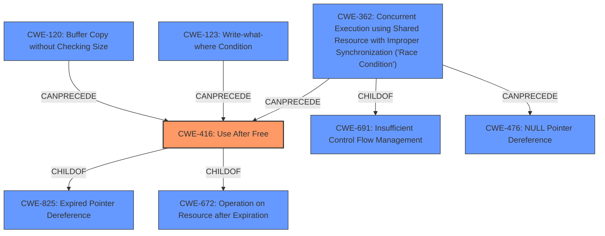

# Analysis Report for CVE-2021-20232

# Vulnerability Analysis Report: CVE-2021-20232

## Description


## Analysis (with Relationship Data)

# Summary
| CWE ID | CWE Name | Confidence | CWE Abstraction Level | CWE Vulnerability Mapping Label | CWE-Vulnerability Mapping Notes |
|---|---|---|---|---|---|
| CWE-416 | Use After Free | 1.0 | Variant | Allowed | Primary CWE |
| CWE-362 | Concurrent Execution using Shared Resource with Improper Synchronization ('Race Condition') | 0.5 | Class | Allowed-with-Review | Secondary Candidate |

## Evidence and Confidence

*   **Confidence Score:** 0.8
*   **Evidence Strength:** HIGH

## Relationship Analysis
The primary CWE is CWE-416 **Use After Free**, which is a Variant of CWE-825 **Expired Pointer Dereference** and CWE-672 **Operation on Resource after Expiration**. CWE-416 can be preceded by CWE-120 **Buffer Copy without Checking Size of Input ('Classic Buffer Overflow')** and CWE-123 **Write-what-where Condition**. A secondary CWE is CWE-362 **Concurrent Execution using Shared Resource with Improper Synchronization ('Race Condition')**, which is a Class with possible Base-level children that would be more appropriate. CWE-362 is a ChildOf CWE-691 **Insufficient Control Flow Management** and can precede CWE-416 **Use After Free** and CWE-476 **NULL Pointer Dereference**.



## Vulnerability Chain
The vulnerability chain starts with a **use after free** condition in the `client_send_params` function of the gnutls library, specifically when handling the `pre_shared_key` extension in TLS 1.3. The root cause is that the `extdata->data` buffer is reallocated, making the `client_hello.data` pointer invalid, which leads to a **use after free** when the reallocated buffer is accessed later. The impact of the vulnerability is memory corruption and denial of service.

## Summary of Analysis
The primary vulnerability is a **use-after-free** condition, which occurs when memory is accessed after it has been freed. This can lead to memory corruption and denial of service.

The vulnerability description states: "A flaw was found in gnutls. A **use after free** issue in client_send_params in lib/ext/pre_shared_key.c may lead to memory corruption and other potential consequences." The CVE Reference Links Content Summary confirms this by stating: "A use-after-free vulnerability exists in the `client_send_params` function of GnuTLS, specifically when handling the `pre_shared_key` extension in TLS 1.3. The vulnerability occurs because the `extdata->data` buffer is reallocated, making the `client_hello.data` pointer invalid, leading to a use-after-free when accessing the reallocated buffer later."

CWE-416 **Use After Free** is the best fit for this vulnerability because it describes the exact condition that is occurring. The vulnerability involves reusing or referencing memory after it has been freed, which aligns with the description of CWE-416.

CWE-362 **Concurrent Execution using Shared Resource with Improper Synchronization ('Race Condition')** is a possible secondary CWE because race conditions can sometimes lead to use-after-free vulnerabilities. However, the provided information does not explicitly state that this vulnerability involves a race condition. The re-allocation of the buffer is the root cause.

I am overriding the Retriever Results' listing of CWE-415 **Double Free** as the top combined result. While a double free can lead to memory corruption, the vulnerability description and CVE Reference Links Content Summary clearly indicate that the issue is a **use-after-free**, not a double free.

Therefore, CWE-416 **Use After Free** is the most appropriate CWE for this vulnerability, and it is at the optimal level of specificity (Variant). CWE-362 is a possible secondary CWE, but the evidence is not strong enough to support it definitively.


## CWE Relationship Analysis

Current CWEs represent these abstraction levels: .


### Vulnerability Chain Analysis

**Chain starting from CWE-691:**
- 691 (Insufficient Control Flow Management) - ROOT


**Chain starting from CWE-476:**
- 476 (NULL Pointer Dereference) - ROOT


### CWE Relationship Diagram

```mermaid
graph TD
    classDef primary fill:#f96,stroke:#333,stroke-width:2px
    classDef secondary fill:#69f,stroke:#333
    classDef tertiary fill:#9e9,stroke:#333
```


*Report generated on 2025-04-01 21:03:53*
