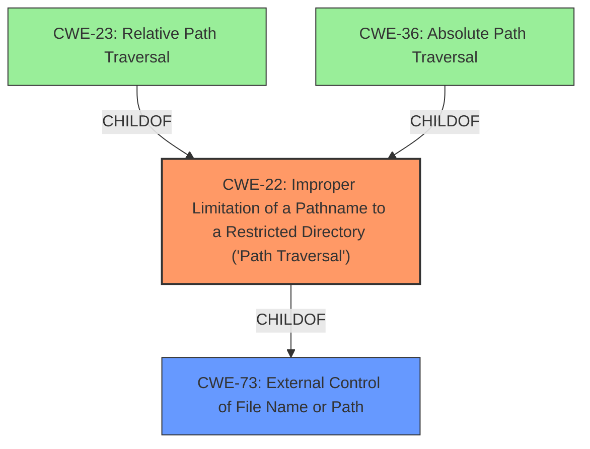

# Analysis Report for CVE-2021-20247

# Vulnerability Analysis Report: CVE-2021-20247

## Description


## Analysis (with Relationship Data)

# Summary
| CWE ID  | CWE Name | Confidence | CWE Abstraction Level | CWE Vulnerability Mapping Label | CWE-Vulnerability Mapping Notes |
|--------------|-------------------------------------------------------------------------------------------------|-------------|-----------------------|-----------------------------------|-----------------------------------|
| CWE-22 | Improper Limitation of a Pathname to a Restricted Directory ('Path Traversal') | 1.0 | Base | Allowed | Primary CWE |
| CWE-73 | External Control of File Name or Path | 0.7 | Base | Allowed | Secondary CWE |

## Evidence and Confidence

*   **Confidence Score:** 1.0
*   **Evidence Strength:** HIGH

## Relationship Analysis
The primary CWE is CWE-22, which describes path traversal vulnerabilities where external input isn't properly sanitized, allowing access to files outside the intended directory. Several related CWEs were considered. CWE-23 (Relative Path Traversal) and CWE-36 (Absolute Path Traversal) are children of CWE-22, representing specific types of path traversal. While the description mentions ".." path components, suggesting CWE-23, CWE-22 is a more general fit, encompassing both relative and absolute path traversal, and is thus selected as the primary CWE. CWE-73, representing external control of file names or paths, is a parent of CWE-22. It's considered a secondary CWE because the vulnerability specifically involves path traversal, making CWE-22 a more precise classification.



## Vulnerability Chain
The vulnerability chain starts with the **lack of validation** of mailbox names by mbsync. This **improper input handling** allows an attacker to inject `..` path components. This leads to **improper limitation of pathname to a restricted directory (CWE-22)**, ultimately resulting in unauthorized access to data outside the designated mailbox.

## Summary of Analysis
The initial assessment identified CWE-22 as the primary candidate due to the path traversal nature of the vulnerability. The retriever results supported this, listing CWE-22 with a high score. The final decision was strongly influenced by the **rootcause** and **weakness** descriptions, which clearly indicated path traversal as the core issue. The relationships between CWE-22 and its child CWE-23 were analyzed to determine the most specific fit. While CWE-23 is relevant, CWE-22 was chosen for its broader applicability. The evidence from the vulnerability description, specifically the mention of `..` path components and the potential for accessing data outside the designated mailbox, directly supports the selection of CWE-22. The selection of CWE-22 is at the optimal level of specificity, representing the core weakness without being overly specific to a particular type of path traversal.

Relevant CWE Information:

## CWE-22: Improper Limitation of a Pathname to a Restricted Directory ('Path Traversal')
**Abstraction Level**: Base
**Similarity Score**: 8127.13
**Source**: sparse

**Description**:
The product uses external input to construct a pathname that is intended to identify a file or directory that is located underneath a restricted parent directory, but the product does not properly neutralize special elements within the pathname that can cause the pathname to resolve to a location that is outside of the restricted directory.

**Mapping Guidance**:
- Usage: Allowed
- Rationale: This CWE entry is at the Base level of abstraction, which is a preferred level of abstraction for mapping to the root causes of vulnerabilities.

## CWE-73: External Control of File Name or Path
**Abstraction Level**: Base
**Similarity Score**: 0.76
**Source**: dense

**Description**:
The product allows user input to control or influence paths or file names that are used in filesystem operations.

**Mapping Guidance**:
- Usage: Allowed
- Rationale: This CWE entry is at the Base level of abstraction, which is a preferred level of abstraction for mapping to the root causes of vulnerabilities.


## CWE Relationship Analysis

Current CWEs represent these abstraction levels: .


### Vulnerability Chain Analysis

**Chain starting from CWE-36:**
- 36 (Absolute Path Traversal) - ROOT


**Chain starting from CWE-73:**
- 73 (External Control of File Name or Path) - ROOT


### CWE Relationship Diagram

```mermaid
graph TD
    classDef primary fill:#f96,stroke:#333,stroke-width:2px
    classDef secondary fill:#69f,stroke:#333
    classDef tertiary fill:#9e9,stroke:#333
```


*Report generated on 2025-04-02 11:17:37*
