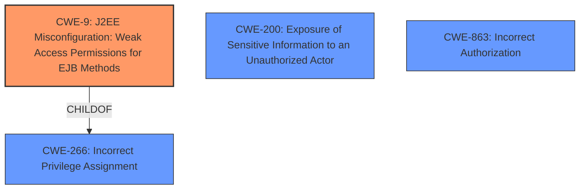

# Enhanced Analysis for CVE-2021-20250

# Summary
| CWE ID | CWE Name | Confidence | CWE Abstraction Level | CWE Vulnerability Mapping Label | CWE-Vulnerability Mapping Notes |
|---|---|---|---|---|---|
| CWE-9 | J2EE Misconfiguration: Weak Access Permissions for EJB Methods | 0.8 | Variant | Allowed | Primary CWE |
| CWE-200 | Exposure of Sensitive Information to an Unauthorized Actor | 0.5 | Class | Discouraged | Secondary Candidate |
| CWE-863 | Incorrect Authorization | 0.4 | Class | Allowed-with-Review | Secondary Candidate |

## Evidence and Confidence

*   **Confidence Score:** 0.8
*   **Evidence Strength:** MEDIUM

## Relationship Analysis
The primary CWE selected is CWE-9 (J2EE Misconfiguration: Weak Access Permissions for EJB Methods), which is a Variant of CWE-266 (Incorrect Privilege Assignment). The relationship between CWE-9 and CWE-266 suggests a hierarchical structure where CWE-9 is a more specific case of the general privilege assignment issue in the context of J2EE applications. Other considered CWEs like CWE-200 (Exposure of Sensitive Information to an Unauthorized Actor) and CWE-863 (Incorrect Authorization) represent different facets of the vulnerability, with the former describing the impact and the latter relating to a broader authorization issue.



## Vulnerability Chain
The vulnerability chain starts with the **weak access permissions** assigned to EJB methods (CWE-9). This **root cause** allows attackers to access privileged actions, leading to information disclosure (impact). The chain is: CWE-9 (Incorrect Access Permissions) -> Information Disclosure.

## Summary of Analysis
The initial assessment pointed to several potential CWEs, including CWE-200, CWE-732, and CWE-863. However, a closer examination of the vulnerability description and the provided context led to the selection of CWE-9 as the primary CWE.

The vulnerability description clearly states that the JBoss EJB client has **publicly accessible privileged actions**, indicating a misconfiguration in access permissions. This aligns directly with the description of CWE-9, which focuses on weak access permissions for EJB methods in J2EE applications. The "CVE Reference Links Content Summary" section also emphasizes the issue of **publicly accessible privileged actions**, reinforcing the relevance of CWE-9.

The choice of CWE-9 is further supported by its Variant level of abstraction, which provides a more specific classification compared to the Class-level CWEs like CWE-200 and CWE-863. While CWE-200 (Exposure of Sensitive Information to an Unauthorized Actor) accurately describes the impact of the vulnerability (information disclosure), it does not address the underlying **root cause**, which is the **misconfiguration of access permissions**. Similarly, CWE-863 (Incorrect Authorization) is a broader category that encompasses various authorization issues, but it does not specifically address the J2EE context of this vulnerability.

The decision to select CWE-9 is also influenced by the MITRE mapping guidance, which recommends choosing the most specific CWE that accurately represents the weakness. In this case, CWE-9 provides a precise classification of the vulnerability, capturing both the J2EE context and the issue of weak access permissions.

The overall confidence in this assessment is rated as 0.8, reflecting the strong alignment between the vulnerability description and the characteristics of CWE-9.

Relevant CWE Information:
# Enhanced Context (25 CWEs)
The following CWEs were identified as potentially relevant to this vulnerability:

## CWE-226: Sensitive Information in Resource Not Removed Before Reuse
**Abstraction Level**: Base
**Similarity Score**: 0.78
**Source**: dense

**Description**:
The product releases a resource such as memory or a file so that it can be made available for reuse, but it does not clear or "zeroize" the information contained in the resource before the product performs a critical state transition or makes the resource available for reuse by other entities.

**Mapping Guidance**:
- Usage: Allowed
- Rationale: This CWE entry is at the Base level of abstraction, which is a preferred level of abstraction for mapping to the root causes of vulnerabilities.

## CWE-653: Improper Isolation or Compartmentalization
**Abstraction Level**: Class
**Similarity Score**: 0.76
**Source**: dense

**Description**:
The product does not properly compartmentalize or isolate functionality, processes, or resources that require different privilege levels, rights, or permissions.

**Mapping Guidance**:
- Usage: Allowed
- Rationale: This CWE entry is at the Base level of abstraction, which is a preferred level of abstraction for mapping to the root causes of vulnerabilities.

## CWE-404: Improper Resource Shutdown or Release
**Abstraction Level**: Class
**Similarity Score**: 0.76
**Source**: dense

**Description**:
The product does not release or incorrectly releases a resource before it is made available for re-use.

**Mapping Guidance**:
- Usage: Allowed-with-Review
- Rationale: This CWE entry is a Class and might have Base-level children that would be more appropriate

## CWE-941: Incorrectly Specified Destination in a Communication Channel
**Abstraction Level**: Base
**Similarity Score**: 0.76
**Source**: dense

**Description**:
The product creates a communication channel to initiate an outgoing request to an actor, but it does not correctly specify the intended destination for that actor.

**Mapping Guidance**:
- Usage: Allowed
- Rationale: This CWE entry is at the Base level of abstraction, which is a preferred level of abstraction for mapping to the root causes of vulnerabilities.

## CWE-668: Exposure of Resource to Wrong Sphere
**Abstraction Level**: Class
**Similarity Score**: 0.75
**Source**: dense

**Description**:
The product exposes a resource to the wrong control sphere, providing unintended actors with inappropriate access to the resource.

**Mapping Guidance**:
- Usage: Discouraged
- Rationale: CWE-668 is high-level and is often misused as a catch-all when lower-level CWE IDs might be applicable. It is sometimes used for low-information vulnerability reports [REF-1287]. It is a level-1 Class (i.e., a child of a Pillar). It is not useful for trend analysis.

## CWE-754: Improper Check for Unusual or Exceptional Conditions
**Abstraction Level**: Class
**Similarity Score**: 0.75
**Source**: dense

**Description**:
The product does not check or incorrectly checks for unusual or exceptional conditions that are not expected to occur frequently during day to day operation of the product.

**Mapping Guidance**:
- Usage: Allowed-with-Review
- Rationale: This CWE entry is a Class and might have Base-level children that would be more appropriate

## CWE-667: Improper Locking
**Abstraction Level**: Class
**Similarity Score**: 0.75
**Source**: dense

**Description**:
The product does not properly acquire or release a lock on a resource, leading to unexpected resource state changes and behaviors.

**Mapping Guidance**:
- Usage: Allowed-with-Review
- Rationale: This CWE entry is a Class and might have Base-level children that would be more appropriate

## CWE-799: Improper Control of Interaction Frequency
**Abstraction Level**: Class
**Similarity Score**: 0.75
**Source**: dense

**Description**:
The product does not properly limit the number or frequency of interactions that it has with an actor, such as the number of incoming requests.

**Mapping Guidance**:
- Usage: Allowed-with-Review
- Rationale: This CWE entry is a Class and might have Base-level children that would be more appropriate

## CWE-119: Improper Restriction of Operations within the Bounds of a Memory Buffer
**Abstraction Level**: Class
**Similarity Score**: 0.75
**Source**: dense

**Description**:
The product performs operations on a memory buffer, but it reads from or writes to a memory location outside the buffer's intended boundary. This may result in read or write operations on unexpected memory locations that could be linked to other variables, data structures, or internal program data.

**Mapping Guidance**:
- Usage: Discouraged
- Rationale: CWE-119 is commonly misused in low-information vulnerability reports when lower-level CWEs could be used instead, or when more details about the vulnerability are available.

## CWE-300: Channel Accessible by Non-Endpoint
**Abstraction Level**: Class
**Similarity Score**: 0.75
**Source**: dense

**Description**:
The


## CWE Relationship Analysis

Current CWEs represent these abstraction levels: .


### Vulnerability Chain Analysis

**Chain starting from CWE-732:**
- 732 (Incorrect Permission Assignment for Critical Resource) - ROOT


**Chain starting from CWE-754:**
- 754 (Improper Check for Unusual or Exceptional Conditions) - ROOT


### CWE Relationship Diagram

```mermaid
graph TD
    classDef primary fill:#f96,stroke:#333,stroke-width:2px
    classDef secondary fill:#69f,stroke:#333
    classDef tertiary fill:#9e9,stroke:#333
```