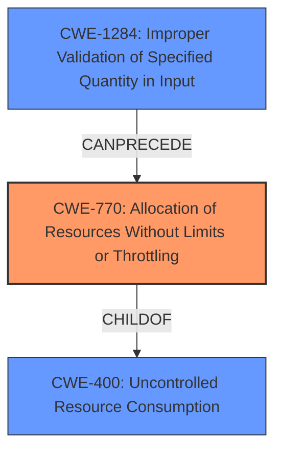

# Analysis for CVE-2021-20252

# Summary
| CWE ID | CWE Name | Confidence | CWE Abstraction Level | CWE Vulnerability Mapping Label | CWE-Vulnerability Mapping Notes |
|---|---|---|---|---|---|
| CWE-770 | Allocation of Resources Without Limits or Throttling | 0.9 | Base | Allowed | Primary CWE |
| CWE-1284 | Improper Validation of Specified Quantity in Input | 0.7 | Base | Allowed | Secondary Candidate |

## Evidence and Confidence

*   **Confidence Score:** 0.8
*   **Evidence Strength:** HIGH

## Relationship Analysis
The primary CWE, CWE-770 **Allocation of Resources Without Limits or Throttling**, is a child of CWE-400 **Uncontrolled Resource Consumption**. This relationship indicates that the uncontrolled resource consumption is due to the lack of limits or throttling on resource allocation. CWE-1284 **Improper Validation of Specified Quantity in Input** can precede CWE-770, suggesting that improper validation of input quantities can lead to uncontrolled resource allocation. Selecting the base CWEs provides the optimal level of specificity, detailing both the root cause of the weakness and the type of weakness.

## Vulnerability Chain
The vulnerability chain starts with **missing input validation** (**Improper Validation of Specified Quantity in Input**, CWE-1284), which leads to **allocation of resources without limits or throttling** (CWE-770). This, in turn, results in **resource exhaustion** (**Uncontrolled Resource Consumption**, CWE-400) and ultimately a **denial of service**.

## Summary of Analysis
The analysis identifies CWE-770 **Allocation of Resources Without Limits or Throttling** as the primary weakness. This determination is strongly supported by the evidence from the vulnerability description and the CVE Reference Links Content Summary. The key factor is the **failure to properly handle user-provided date ranges**, which allows for the submission of excessively large date ranges. This aligns directly with the description of CWE-770, where the product allocates resources without imposing restrictions on the size or number of resources.

The CVE Reference Links Content Summary states: "The vulnerability stems from the 3scale backend's **failure to properly handle user-provided date ranges** in certain database queries. This **lack of preventative handling** allows for the submission of **excessively large date ranges**."

CWE-1284 **Improper Validation of Specified Quantity in Input** is considered as a secondary CWE because the **missing input validation** is a prerequisite to the **allocation of resources without limits or throttling**.

The graph relationships influenced the final selection by highlighting the connection between the weaknesses, where **improper validation** leads to **uncontrolled resource allocation**, and eventually to **resource exhaustion**.

The selected CWEs are at the optimal level of specificity because they directly address the root cause of the vulnerability (CWE-770) and its immediate cause (CWE-1284). More generic CWEs like CWE-400 **Uncontrolled Resource Consumption** would not provide sufficient detail about the specific weakness that leads to the resource exhaustion.

Relevant CWE Information:
CWE-285 **Improper Authorization**, CWE-400 **Uncontrolled Resource Consumption**, CWE-401 **Missing Release of Memory after Effective Lifetime**, CWE-918 **Server-Side Request Forgery (SSRF)**, CWE-613 **Insufficient Session Expiration**, CWE-306 **Missing Authentication for Critical Function**, and CWE-863 **Incorrect Authorization** were considered but deemed less relevant as they did not directly address the root cause of the vulnerability, which is the **uncontrolled allocation of resources** due to the **lack of input validation** on user-provided date ranges. These alternatives focused on authorization or authentication issues, which were not central to this vulnerability.