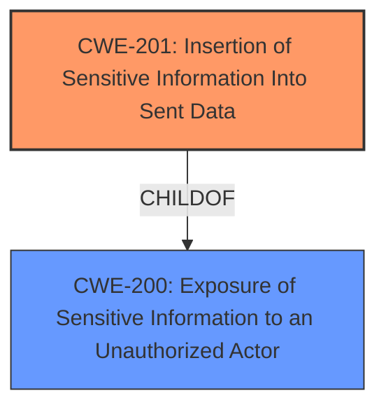

# Enhanced Analysis for CVE-2021-20256

# Summary
| CWE ID | CWE Name | Confidence | CWE Abstraction Level | CWE Vulnerability Mapping Label | CWE-Vulnerability Mapping Notes |
|---|---|---|---|---|---|
| CWE-201 | Insertion of Sensitive Information Into Sent Data | 0.9 | Base | Allowed | Primary CWE. The BMC password being exposed through the API directly fits the CWE description. |
| CWE-200 | Exposure of Sensitive Information to an Unauthorized Actor | 0.7 | Class | Discouraged | Secondary CWE. While the vulnerability results in information exposure, the root cause is the insertion of the sensitive data into the API response. |

## Evidence and Confidence

*   **Confidence Score:** 0.9
*   **Evidence Strength:** HIGH

## Relationship Analysis
The primary relationship influencing the CWE selection is the parent-child relationship between CWE-200 and CWE-201. CWE-201 is a child of CWE-200, representing a more specific case of information exposure where the sensitive information is explicitly inserted into sent data. This aligns directly with the vulnerability description.



## Vulnerability Chain
The vulnerability chain can be described as follows:
1.  **Root Cause:** The BMC interface exposes the password through the API.
2.  **Weakness:** The **insertion of the plaintext password into the API response** (CWE-201).
3.  **Impact:** An authenticated local attacker with `view_hosts` permission can access the password, leading to potential data confidentiality, integrity, and system availability issues.

## Summary of Analysis
Initially, CWE-200 was considered due to the exposure of sensitive information. However, based on the evidence, the vulnerability is more specifically about how the sensitive information (BMC password) is **inserted into the sent data** (API response). This aligns perfectly with CWE-201: Insertion of Sensitive Information Into Sent Data, which is a Base level CWE and a child of CWE-200. The vulnerability description key phrases state the impact is that the attacker can "access the password through the API". The CVE Reference Links Content Summary states the root cause is "The vulnerability stems from the Red Hat Satellite's BMC (Baseboard Management Controller) interface exposing the BMC password in plaintext through the compute host API".
CWE-201 is chosen because it accurately reflects the specific weakness. The MITRE mapping guidance allows for the use of CWE-201, and the retriever results list it as a relevant CWE. The confidence level is high because the evidence directly supports the classification.

Relevant CWE Information:

# Enhanced Context (25 CWEs)

## CWE-226: Sensitive Information in Resource Not Removed Before Reuse
**Abstraction Level**: Base
**Similarity Score**: 0.78
**Source**: dense

**Description**:
The product releases a resource such as memory or a file so that it can be made available for reuse, but it does not clear or "zeroize" the information contained in the resource before the product performs a critical state transition or makes the resource available for reuse by other entities.

*Reason Not Used*: This CWE focuses on the reuse of resources without clearing sensitive information, which is not the primary issue in this case. The vulnerability here is the direct exposure of the password through the API, rather than the reuse of a resource.

## CWE-404: Improper Resource Shutdown or Release
**Abstraction Level**: Class
**Similarity Score**: 0.77
**Source**: dense

**Description**:
The product does not release or incorrectly releases a resource before it is made available for re-use.

*Reason Not Used*: This CWE is not applicable because the vulnerability does not involve the improper shutdown or release of a resource.

## CWE-131: Incorrect Calculation of Buffer Size
**Abstraction Level**: Base
**Similarity Score**: 0.76
**Source**: dense

**Description**:
The product does not correctly calculate the size to be used when allocating a buffer, which could lead to a buffer overflow.

*Reason Not Used*: This CWE is not applicable as the vulnerability does not involve buffer size calculations.

## CWE-653: Improper Isolation or Compartmentalization
**Abstraction Level**: Class
**Similarity Score**: 0.76
**Source**: dense

**Description**:
The product does not properly compartmentalize or isolate functionality, processes, or resources that require different privilege levels, rights, or permissions.

*Reason Not Used*: This CWE is not applicable because the vulnerability does not involve improper isolation or compartmentalization of resources.

## CWE-667: Improper Locking
**Abstraction Level**: Class
**Similarity Score**: 0.75
**Source**: dense

**Description**:
The product does not properly acquire or release a lock on a resource, leading to unexpected resource state changes and behaviors.

*Reason Not Used*: This CWE is not applicable because the vulnerability does not involve improper locking mechanisms.

## CWE-274: Improper Handling of Insufficient Privileges
**Abstraction Level**: Base
**Similarity Score**: 0.75
**Source**: dense

**Description**:
The product does not handle or incorrectly handles when it has insufficient privileges to perform an operation, leading to resultant weaknesses.

*Reason Not Used*: The attacker has sufficient priviliges so is not applicable.

## CWE-119: Improper Restriction of Operations within the Bounds of a Memory Buffer
**Abstraction Level**: Class
**Similarity Score**: 0.75
**Source**: dense

**Description**:
The product performs operations on a memory buffer, but it reads from or writes to a memory location outside the buffer's intended boundary. This may result in read or write operations on unexpected memory locations that could be linked to other variables, data structures, or internal program data.

*Reason Not Used*: This CWE is not applicable because the vulnerability does not involve memory buffer operations.

## CWE-754: Improper Check for Unusual or Exceptional Conditions
**Abstraction Level**: Class
**Similarity Score**: 0.75
**Source**: dense

**Description**:
The product does not check or incorrectly checks for unusual or exceptional conditions that are not expected to occur frequently during day to day operation of the product.

*Reason Not Used*: This CWE is not applicable because the vulnerability does not directly involve the handling of unusual or exceptional conditions.

## CWE-805: Buffer Access with Incorrect Length Value
**Abstraction Level**: Base
**Similarity Score**: 0.75
**Source**: dense

**Description**:
The product uses a sequential operation to read or write a buffer, but it uses an incorrect length value that causes it to access memory that is outside of the bounds of the buffer.

*Reason Not Used*: This CWE is not applicable because the vulnerability does not involve buffer access with incorrect length values.

## CWE-280: Improper Handling of Insufficient Permissions or Privileges
**Abstraction Level**: Base
**Similarity Score**: 0.75
**Source**: dense

**Description**:
The product does not handle or incorrectly handles when it has insufficient privileges to access resources or functionality as specified by their permissions. This may cause it to follow unexpected code paths that may leave the product in an invalid state.

*Reason Not Used*: This CWE is not applicable because the vulnerability does not involve insufficient permissions.

## CWE-200: Exposure of Sensitive Information to an Unauthorized Actor
**Abstraction Level**: Class
**Similarity Score**: 6886.74
**Source**: sparse

**Description**:
The product exposes sensitive information to an actor that is not explicitly authorized to have access to that information.

*Reason Not Used*: This CWE is too general and describes the impact rather than the root cause. CWE-201 is more specific and better describes the root cause of the vulnerability.

## CWE-863: Incorrect Authorization
**Abstraction Level**: Class
**Similarity Score**: 6839.62
**Source**: sparse

**Description**:
The product performs an authorization check when an actor attempts to access a resource or perform an action, but it does not correctly perform the check.

*Reason Not Used*: The attacker is authorized to view the API.

## CWE-285: Improper Authorization
**Abstraction Level**: Class
**Similarity Score**: 6776.06
**Source**: sparse

**Description**:
The product does not perform or incorrectly performs an authorization check when an actor attempts to access a resource or perform an action.

*Reason Not Used*: The attacker is authorized to view the API.

## CWE-754: Improper Check for Unusual or Exceptional Conditions
**Abstraction Level**: Class
**Similarity Score**: 6660.55
**Source**: sparse

**Description**:
The product does not check or incorrectly checks for unusual or exceptional conditions that are not expected to occur frequently during day to day operation of the product.

*Reason Not Used*: Not applicable.

## CWE-287: Improper Authentication
**Abstraction Level**: Class
**Similarity Score


## CWE Relationship Analysis

Current CWEs represent these abstraction levels: .


### Vulnerability Chain Analysis

**Chain starting from CWE-667:**
- 667 (Improper Locking) - ROOT


**Chain starting from CWE-754:**
- 754 (Improper Check for Unusual or Exceptional Conditions) - ROOT


### CWE Relationship Diagram

```mermaid
graph TD
    classDef primary fill:#f96,stroke:#333,stroke-width:2px
    classDef secondary fill:#69f,stroke:#333
    classDef tertiary fill:#9e9,stroke:#333
```