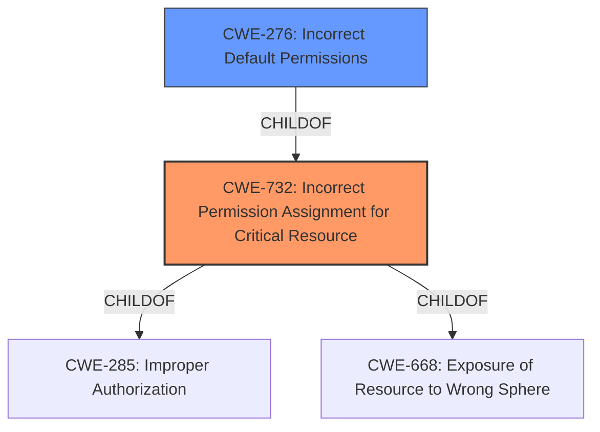

# Enhanced Analysis for CVE-2021-20264

# Summary
| CWE ID  | CWE Name                                                     | Confidence | CWE Abstraction Level | CWE Vulnerability Mapping Label | CWE-Vulnerability Mapping Notes |
|---------|--------------------------------------------------------------|------------|-----------------------|---------------------------------|---------------------------------|
| CWE-732 | Incorrect Permission Assignment for Critical Resource        | 0.9        | Class                 | Allowed-with-Review             | Primary CWE                     |
| CWE-276 | Incorrect Default Permissions                                | 0.7        | Base                  | Allowed                         | Secondary Candidate             |

## Evidence and Confidence

*   **Confidence Score:** 0.9
*   **Evidence Strength:** HIGH

## Relationship Analysis
The primary CWE is CWE-732, which is a Class-level CWE. It has child relationships to CWE-285 (Improper Authorization) and CWE-668 (Exposure of Resource to Wrong Sphere). The secondary CWE, CWE-276 (Incorrect Default Permissions), is a Base-level CWE and is a child of CWE-732.



## Vulnerability Chain
The vulnerability chain starts with **insecure permissions** assigned to the `/etc/passwd` file. This leads to a privilege escalation vulnerability, as attackers with container access can modify the file.
  - Root Cause: Incorrect file permissions on `/etc/passwd`.
  - Weakness: Privilege escalation due to modifiable `/etc/passwd` file.
  - Impact: Confidentiality, integrity, and availability issues; potential system compromise.

## Summary of Analysis
The initial analysis focused on the **insecure modification flaw** in the `/etc/passwd` file, leading to privilege escalation. The "CVE Reference Links Content Summary" clearly states that the vulnerability stems from incorrect file permissions being applied to `/etc/passwd`, allowing non-root users to modify it. This aligns well with CWE-732 (Incorrect Permission Assignment for Critical Resource). The retriever results also listed CWE-732 as the top candidate.

CWE-285 (Improper Authorization) and CWE-863 (Incorrect Authorization) were considered but deemed less specific than CWE-732, as the root cause is directly related to the incorrect assignment of permissions rather than a general authorization failure.

The final selection of CWE-732 is based on the evidence from the vulnerability description and the supporting information in the CVE reference links. The graph relationships confirm that CWE-732 is a more specific classification than its parent CWE-285. CWE-732 is at the optimal level of specificity, as it directly addresses the **incorrect permission assignment** issue.

Relevant CWE Information:

# Enhanced Context (25 CWEs)
The following CWEs were identified as potentially relevant to this vulnerability:

## CWE-667: Improper Locking
**Abstraction Level**: Class
**Similarity Score**: 0.79
**Source**: dense

**Description**:
The product does not properly acquire or release a lock on a resource, leading to unexpected resource state changes and behaviors.

**Mapping Guidance**:
- Usage: Allowed-with-Review
- Rationale: This CWE entry is a Class and might have Base-level children that would be more appropriate

*This CWE is not relevant because it deals with locking mechanisms, which are not part of the vulnerability description.*

## CWE-404: Improper Resource Shutdown or Release
**Abstraction Level**: Class
**Similarity Score**: 0.78
**Source**: dense

**Description**:
The product does not release or incorrectly releases a resource before it is made available for re-use.

**Mapping Guidance**:
- Usage: Allowed-with-Review
- Rationale: This CWE entry is a Class and might have Base-level children that would be more appropriate

*This CWE is not relevant because it focuses on resource release issues.*

## CWE-226: Sensitive Information in Resource Not Removed Before Reuse
**Abstraction Level**: Base
**Similarity Score**: 0.78
**Source**: dense

**Description**:
The product releases a resource such as memory or a file so that it can be made available for reuse, but it does not clear or "zeroize" the information contained in the resource before the product performs a critical state transition or makes the resource available for reuse by other entities.

**Mapping Guidance**:
- Usage: Allowed
- Rationale: This CWE entry is at the Base level of abstraction, which is a preferred level of abstraction for mapping to the root causes of vulnerabilities.

*This CWE is not relevant because the vulnerability isn't related to clearing sensitive information before resource reuse.*

## CWE-125: Out-of-bounds Read
**Abstraction Level**: Base
**Similarity Score**: 0.78
**Source**: dense

**Description**:
The product reads data past the end, or before the beginning, of the intended buffer.

**Mapping Guidance**:
- Usage: Allowed
- Rationale: This CWE entry is at the Base level of abstraction, which is a preferred level of abstraction for mapping to the root causes of vulnerabilities.

*This CWE is not relevant because the vulnerability isn't about reading out-of-bounds.*

## CWE-367: Time-of-check Time-of-use (TOCTOU) Race Condition
**Abstraction Level**: Base
**Similarity Score**: 0.77
**Source**: dense

**Description**:
The product checks the state of a resource before using that resource, but the resource's state can change between the check and the use in a way that invalidates the results of the check. This can cause the product to perform invalid actions when the resource is in an unexpected state.

**Mapping Guidance**:
- Usage: Allowed
- Rationale: This CWE entry is at the Base level of abstraction, which is a preferred level of abstraction for mapping to the root causes of vulnerabilities.

*This CWE is not relevant because the vulnerability isn't related to race conditions.*

## CWE-362: Concurrent Execution using Shared Resource with Improper Synchronization ('Race Condition')
**Abstraction Level**: Class
**Similarity Score**: 0.77
**Source**: dense

**Description**:
The product contains a concurrent code sequence that requires temporary, exclusive access to a shared resource, but a timing window exists in which the shared resource can be modified by another code sequence operating concurrently.

**Mapping Guidance**:
- Usage: Allowed-with-Review
- Rationale: This CWE entry is a Class and might have Base-level children that would be more appropriate

*This CWE is not relevant because the vulnerability isn't related to race conditions.*

## CWE-59: Improper Link Resolution Before File Access ('Link Following')
**Abstraction Level**: Base
**Similarity Score**: 0.77
**Source**: dense

**Description**:
The product attempts to access a file based on the filename, but it does not properly prevent that filename from identifying a link or shortcut that resolves to an unintended resource.

**Mapping Guidance**:
- Usage: Allowed
- Rationale: This CWE entry is at the Base level of abstraction, which is a preferred level of abstraction for mapping to the root causes of vulnerabilities.

*This CWE is not relevant because the vulnerability isn't related to link following.*

## CWE-131: Incorrect Calculation of Buffer Size
**Abstraction Level**: Base
**Similarity Score**: 0.77
**Source**: dense

**Description**:
The product does not correctly calculate the size to be used when allocating a buffer, which could lead to a buffer overflow.

**Mapping Guidance**:
- Usage: Allowed
- Rationale: This CWE entry is at the Base level of abstraction, which is a preferred level of abstraction for mapping to the root causes of vulnerabilities.

*This CWE is not relevant because the vulnerability isn't related to buffer size calculations.*

## CWE-908: Use of Uninitialized Resource
**Abstraction Level**: Base
**Similarity Score**: 0.76
**Source**: dense

**Description**:
The product uses or accesses a resource that has not been initialized.

**Mapping Guidance**:
- Usage: Allowed
- Rationale: This CWE entry is at the Base level of abstraction, which is a preferred level of abstraction for mapping to the root causes of vulnerabilities.

*This CWE is not relevant because the vulnerability isn't about using uninitialized resources.*

## CWE-41: Improper Resolution of Path Equivalence
**Abstraction Level**: Base
**Similarity Score**: 0.76
**Source**: dense

**Description**:
The product is vulnerable to file system contents disclosure through path equivalence. Path equivalence involves


## CWE Relationship Analysis

Current CWEs represent these abstraction levels: .


### Vulnerability Chain Analysis

**Chain starting from CWE-732:**
- 732 (Incorrect Permission Assignment for Critical Resource) - ROOT


**Chain starting from CWE-667:**
- 667 (Improper Locking) - ROOT


### CWE Relationship Diagram

```mermaid
graph TD
    classDef primary fill:#f96,stroke:#333,stroke-width:2px
    classDef secondary fill:#69f,stroke:#333
    classDef tertiary fill:#9e9,stroke:#333
```