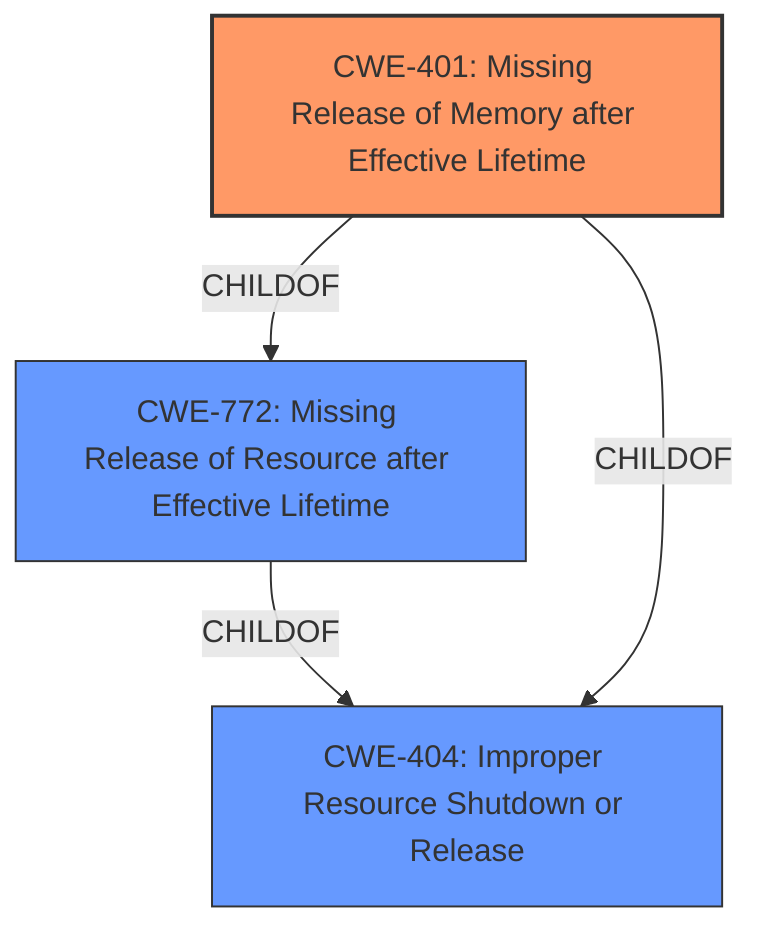

# Enhanced Analysis for CVE-2021-20265

# Summary
| CWE ID  | CWE Name                                                        | Confidence | CWE Abstraction Level | CWE Vulnerability Mapping Label | CWE-Vulnerability Mapping Notes |
| :-------- | :-------------------------------------------------------------- | :--------- | :-------------------- | :------------------------------ | :------------------------------ |
| CWE-401 | Missing Release of Memory after Effective Lifetime             | 0.9        | Variant               | Allowed                       | Primary CWE                    |
| CWE-772 | Missing Release of Resource after Effective Lifetime             | 0.75       | Base                 | Allowed                       | Secondary CWE                    |
| CWE-404 | Improper Resource Shutdown or Release             | 0.6        | Class                 | Allowed-with-Review                       | Secondary CWE                    |

## Evidence and Confidence

*   **Confidence Score:** 0.9
*   **Evidence Strength:** HIGH

## Relationship Analysis
The primary relationship informing the CWE selection is the parent-child relationship between CWE-772 (Missing Release of Resource after Effective Lifetime) and CWE-401 (Missing Release of Memory after Effective Lifetime). Since the vulnerability specifically describes a memory leak, CWE-401, a variant of CWE-772, is the more specific and appropriate choice. CWE-404 is a parent of CWE-401 and CWE-772 and was also considered.



## Vulnerability Chain
The vulnerability chain starts with a **memory leak** in the `unix_stream_recvmsg` function due to **improper resource management**, specifically the failure to call `scm_destroy(&scm)` when a signal interrupts the loop. This leads to memory exhaustion, ultimately causing the system to crash (Denial of Service).

## Summary of Analysis
The analysis is strongly based on the provided evidence, specifically the "CVE Reference Links Content Summary" which states: "The core **weakness** is **improper resource management**, specifically a **missing** `scm_destroy(&scm)` call when a signal interrupts the `unix_stream_recvmsg` loop" and "Memory leak due to not freeing the socket control message (`scm`) structure in the `unix_stream_recvmsg` function when interrupted by a signal." The **weakness** is a **memory leak**, and the root cause is a **missing** resource release.

The retriever results strongly support CWE-401 as the primary candidate. The graph relationships also support this selection, as it is a child of the more general CWE-772 (Missing Release of Resource after Effective Lifetime). CWE-401 is at the Variant level of abstraction, which is preferred, and directly addresses the specific memory leak issue. CWE-772 and CWE-404 were considered as parent classes, but the more specific CWE-401 was ultimately chosen.

Relevant CWE Information:

# Enhanced Context (25 CWEs)
The following CWEs were identified as potentially relevant to this vulnerability:

## CWE-404: Improper Resource Shutdown or Release
**Abstraction Level**: Class
**Similarity Score**: 0.78
**Source**: dense

**Description**:
The product does not release or incorrectly releases a resource before it is made available for re-use.

**Mapping Guidance**:
- Usage: Allowed-with-Review
- Rationale: This CWE entry is a Class and might have Base-level children that would be more appropriate

## CWE-401: Missing Release of Memory after Effective Lifetime
**Abstraction:** Variant
**Status:** Draft

### Description
The product does not sufficiently track and release allocated memory after it has been used, which slowly consumes remaining memory.

### Extended Description
This is often triggered by improper handling of malformed data or unexpectedly interrupted sessions. In some languages, developers are responsible for tracking memory allocation and releasing the memory. If there are no more pointers or references to the memory, then it can no longer be tracked and identified for release.

### Alternative Terms
Memory Leak

### Relationships
ChildOf -> CWE-772
ChildOf -> CWE-404
ChildOf -> CWE-404

### Mapping Guidance
**Usage:** Allowed
**Rationale:** This CWE entry is at the Variant level of abstraction, which is a preferred level of abstraction for mapping to the root causes of vulnerabilities.
**Comments:** Carefully read both the name and description to ensure that this mapping is an appropriate fit. Do not try to 'force' a mapping to a lower-level Base/Variant simply to comply with this preferred level of abstraction.
**Reasons:**
- Acceptable-Use

## CWE-772: Missing Release of Resource after Effective Lifetime
**Abstraction Level**: base
**Similarity Score**: 4.33
**Source**: graph

**Description**:
CWE-772: Missing Release of Resource after Effective Lifetime

**Mapping Guidance**:
- Usage: Allowed
- Rationale: This CWE entry is at the Base level of abstraction, which is a preferred level of abstraction for mapping to the root causes of vulnerabilities.

**Relationships**:
- CANFOLLOW -> CWE-911
- PARENTOF -> CWE-775
- PARENTOF -> CWE-401
- PARENTOF -> CWE-1091
- CHILDOF -> CWE-404


## CWE Relationship Analysis

Current CWEs represent these abstraction levels: .


### Vulnerability Chain Analysis

**Chain starting from CWE-404:**
- 404 (Improper Resource Shutdown or Release) - ROOT


**Chain starting from CWE-401:**
- 401 (Missing Release of Memory after Effective Lifetime) - ROOT


### CWE Relationship Diagram

```mermaid
graph TD
    classDef primary fill:#f96,stroke:#333,stroke-width:2px
    classDef secondary fill:#69f,stroke:#333
    classDef tertiary fill:#9e9,stroke:#333
```