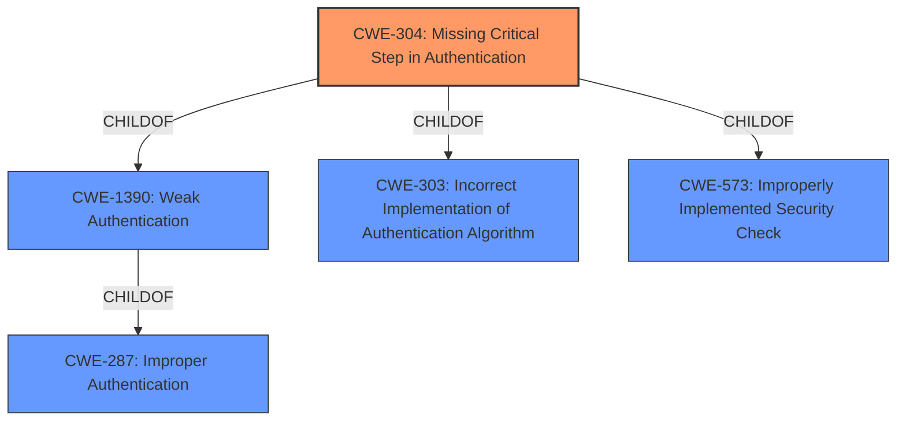

# Enhanced Analysis for CVE-2021-20278

# Summary
| CWE ID | CWE Name | Confidence | CWE Abstraction Level | CWE Vulnerability Mapping Label | CWE-Vulnerability Mapping Notes |
|---|---|---|---|---|---|
| CWE-304 | Missing Critical Step in Authentication | 0.9 | Base | Allowed | Primary CWE |
| CWE-1390 | Weak Authentication | 0.7 | Class | Allowed-with-Review | Secondary Candidate |
| CWE-287 | Improper Authentication | 0.6 | Class | Discouraged | Secondary Candidate |

## Evidence and Confidence

*   **Confidence Score:** 0.9
*   **Evidence Strength:** HIGH

## Relationship Analysis
The primary CWE selected is CWE-304, a Base-level CWE, which is a child of both CWE-303 and CWE-573. The vulnerability involves **improper token validation** in Kiali when RBAC is disabled, representing a **missing critical step** in the authentication process. CWE-1390 (Weak Authentication) is a parent Class of CWE-304 and could be considered as a more general classification. CWE-287 (Improper Authentication) is a parent Class of CWE-1390 and even more general classification. The relationship analysis shows a progression from a general authentication problem (CWE-287) to a more specific case of weak authentication (CWE-1390) and finally to the specific **missing critical step** (CWE-304) that allows the authentication bypass. The abstraction levels guided the selection of CWE-304 as the most specific and appropriate choice.



## Vulnerability Chain
The vulnerability chain starts with the **improper token validation** due to Kiali's reliance on the underlying cluster for validation when RBAC is enabled. When RBAC is disabled, this validation doesn't occur (CWE-304). This leads to **weak authentication** (CWE-1390) and, ultimately, an **authentication bypass**, allowing a malicious user to gain unauthorized access.

## Summary of Analysis
The analysis is based on the provided vulnerability description and CVE reference content, which clearly indicates that the **improper token validation** when RBAC is disabled is the root cause.

The graph relationships helped to identify the appropriate level of specificity. While CWE-1390 and CWE-287 are relevant, CWE-304 provides the most accurate description of the vulnerability because it specifies the **missing critical step**.

The selection of CWE-304 is justified by the following evidence from the vulnerability description: "When RBAC is enabled, Kiali assumes that some of the token validation is handled by the underlying cluster. When OpenID `implicit flow` is used with RBAC turned off, this token validation doesnt occur, and this allows a malicious user to bypass the authentication." This statement directly supports the "Missing Critical Step in Authentication".

CWE-304 is at the optimal level of specificity because it describes the exact mechanism by which the authentication is bypassed, rather than just stating that the authentication is weak or improper.

Relevant CWE Information:

# Enhanced Context (25 CWEs)

## CWE-1391: Use of Weak Credentials
**Abstraction Level**: Class
**Similarity Score**: 0.78
**Source**: dense

**Description**:
The product uses weak credentials (such as a default key or hard-coded password) that can be calculated, derived, reused, or guessed by an attacker.

**Mapping Guidance**:
- Usage: Allowed-with-Review
- Rationale: This CWE entry is a Class and might have Base-level children that would be more appropriate

This CWE was not selected because the vulnerability is not due to the use of weak credentials but rather a **missing step** in the authentication process.

## CWE-304: Missing Critical Step in Authentication
**Abstraction Level**: Base
**Similarity Score**: 0.77
**Source**: dense

**Description**:
The product implements an authentication technique, but it skips a step that weakens the technique.

**Mapping Guidance**:
- Usage: Allowed
- Rationale: This CWE entry is at the Base level of abstraction, which is a preferred level of abstraction for mapping to the root causes of vulnerabilities.

This CWE was selected as the primary CWE because the Kiali vulnerability involves skipping token validation when RBAC is disabled, which directly aligns with the description of **missing a critical step** in authentication.

## CWE-1390: Weak Authentication
**Abstraction Level**: Class
**Similarity Score**: 0.77
**Source**: dense

**Description**:
The product uses an authentication mechanism to restrict access to specific users or identities, but the mechanism does not sufficiently prove that the claimed identity is correct.

**Mapping Guidance**:
- Usage: Allowed-with-Review
- Rationale: This CWE entry is a Class and might have Base-level children that would be more appropriate

This CWE was considered as a secondary CWE because the vulnerability leads to **weak authentication** in Kiali. However, CWE-304 is more specific in describing the cause.

## CWE-303: Incorrect Implementation of Authentication Algorithm
**Abstraction Level**: Base
**Similarity Score**: 0.76
**Source**: dense

**Description**:
The requirements for the product dictate the use of an established authentication algorithm, but the implementation of the algorithm is incorrect.

**Mapping Guidance**:
- Usage: Allowed
- Rationale: This CWE entry is at the Base level of abstraction, which is a preferred level of abstraction for mapping to the root causes of vulnerabilities.

This CWE was not selected because the issue is not an incorrect implementation of an algorithm, but rather the complete **omission of a validation step**.

## CWE-305: Authentication Bypass by Primary Weakness
**Abstraction Level**: Base
**Similarity Score**: 0.75
**Source**: dense

**Description**:
The authentication algorithm is sound, but the implemented mechanism can be bypassed as the result of a separate weakness that is primary to the authentication error.

**Mapping Guidance**:
- Usage: Allowed
- Rationale: This CWE entry is at the Base level of abstraction, which is a preferred level of abstraction for mapping to the root causes of vulnerabilities.

This CWE was not selected because the vulnerability's description indicates the authentication issue is the primary weakness.

## CWE-289: Authentication Bypass by Alternate Name
**Abstraction Level**: Base
**Similarity Score**: 0.75
**Source**: dense

**Description**:
The product performs authentication based on the name of a resource being accessed, or the name of the actor performing the access, but it does not properly check all possible names for that resource or actor.

**Mapping Guidance**:
- Usage: Allowed
- Rationale: This CWE entry is at the Base level of abstraction, which is a preferred level of abstraction for mapping to the root causes of vulnerabilities.

This CWE was not selected as the authentication bypass isn't related to alternate names but rather the lack of token validation.

## CWE-307: Improper Restriction of Excessive Authentication Attempts
**Abstraction Level**: Base
**Similarity Score**: 0.75
**Source**: dense

**Description**:
The product does not implement sufficient measures to prevent multiple failed authentication attempts within a short time frame.

**Mapping Guidance**:
- Usage: Allowed
- Rationale: This CWE entry is at the Base level of abstraction, which is a preferred level of abstraction for mapping to the root causes of vulnerabilities.

This CWE was not selected as the issue isn't about excessive authentication attempts.

## CWE-807: Reliance on Untrusted Inputs in a Security Decision
**Abstraction Level**: Base
**Similarity Score**: 0.75
**Source**: dense

**Description**:
The product uses a protection mechanism that relies on the existence or values of an input, but the input can be modified by an untrusted actor in a way that bypasses the protection mechanism.

**Mapping Guidance**:
- Usage: Allowed
- Rationale: This CWE entry is at the Base level of abstraction, which is a preferred level of abstraction for mapping to the root causes of vulnerabilities.

This CWE was not selected because the vulnerability doesn't directly relate to the product relying on untrusted inputs for security decisions but rather the **missing validation


## CWE Relationship Analysis

Current CWEs represent these abstraction levels: .


### Vulnerability Chain Analysis

**Chain starting from CWE-303:**
- 303 (Incorrect Implementation of Authentication Algorithm) - ROOT


**Chain starting from CWE-807:**
- 807 (Reliance on Untrusted Inputs in a Security Decision) - ROOT


### CWE Relationship Diagram

```mermaid
graph TD
    classDef primary fill:#f96,stroke:#333,stroke-width:2px
    classDef secondary fill:#69f,stroke:#333
    classDef tertiary fill:#9e9,stroke:#333
```