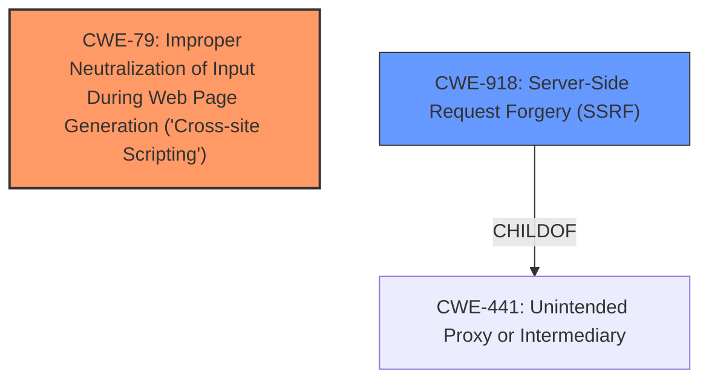

# Analysis for CVE-2021-20280

# Summary
| CWE ID | CWE Name | Confidence | CWE Abstraction Level | CWE Vulnerability Mapping Label | CWE-Vulnerability Mapping Notes |
|---|---|---|---|---|---|
| CWE-79 | Improper Neutralization of Input During Web Page Generation ('Cross-site Scripting') | 0.9 | Base | Primary | Allowed |
| CWE-918 | Server-Side Request Forgery (SSRF) | 0.9 | Base | Secondary | Allowed |

## Evidence and Confidence

*   **Confidence Score:** 0.9
*   **Evidence Strength:** HIGH

## Relationship Analysis
The primary weakness is **stored XSS**, which maps directly to CWE-79. The secondary weakness is **blind SSRF**, which maps to CWE-918. Both CWE-79 and CWE-918 are base-level CWEs, providing the right level of specificity. CWE-918 is a child of CWE-441 (Unintended Proxy or Intermediary).

## Vulnerability Chain
The vulnerability chain involves:
1.  **Improper Neutralization of Input (CWE-79):** User-provided input is not properly sanitized.
2.  **Server-Side Request Forgery (CWE-918):** The application makes requests to external servers based on user-controlled input, without proper validation, leading to potential SSRF.

CWE-79 and CWE-918 are independent weaknesses exploited via text-based feedback answers.

## Summary of Analysis
The analysis identifies two primary weaknesses: **stored XSS** and **blind SSRF**. The vulnerability description clearly states that "Text-based feedback answers required additional sanitizing to prevent **stored XSS** and **blind SSRF** risks." The most relevant CWEs are CWE-79 for **stored XSS** and CWE-918 for **blind SSRF**. Both CWEs are at the Base level of abstraction, which is the preferred level.

CWE-79 (Improper Neutralization of Input During Web Page Generation ('Cross-site Scripting')) is selected because the vulnerability description explicitly mentions "stored XSS," indicating that user input is not properly neutralized before being displayed on a web page.

CWE-918 (Server-Side Request Forgery (SSRF)) is selected because the vulnerability description explicitly mentions "blind SSRF," indicating that the application is making requests to external servers based on user-controlled input without proper validation.

Other CWEs like CWE-174 (Double Decoding of the Same Data) and CWE-611 (Improper Restriction of XML External Entity Reference) were considered but deemed less relevant because the description directly indicates XSS and SSRF. The primary focus is on the **improper sanitization** that leads to both vulnerabilities.

Relevant CWE Information:

# Enhanced Context (25 CWEs)
The following CWEs were identified as potentially relevant to this vulnerability:

## CWE-80: Improper Neutralization of Script-Related HTML Tags in a Web Page (Basic XSS)
**Abstraction Level**: Variant
**Similarity Score**: 0.73
**Source**: dense

**Description**:
The product receives input from an upstream component, but it does not neutralize or incorrectly neutralizes special characters such as "<", ">", and "&" that could be interpreted as web-scripting elements when they are sent to a downstream component that processes web pages.

**Mapping Guidance**:
- Usage: Allowed
- Rationale: This CWE entry is at the Variant level of abstraction, which is a preferred level of abstraction for mapping to the root causes of vulnerabilities.

## CWE-472: External Control of Assumed-Immutable Web Parameter
**Abstraction Level**: Base
**Similarity Score**: 0.72
**Source**: dense

**Description**:
The web application does not sufficiently verify inputs that are assumed to be immutable but are actually externally controllable, such as hidden form fields.

**Mapping Guidance**:
- Usage: Allowed
- Rationale: This CWE entry is at the Base level of abstraction, which is a preferred level of abstraction for mapping to the root causes of vulnerabilities.

## CWE-1391: Use of Weak Credentials
**Abstraction Level**: Class
**Similarity Score**: 0.71
**Source**: dense

**Description**:
The product uses weak credentials (such as a default key or hard-coded password) that can be calculated, derived, reused, or guessed by an attacker.

**Mapping Guidance**:
- Usage: Allowed-with-Review
- Rationale: This CWE entry is a Class and might have Base-level children that would be more appropriate

## CWE-807: Reliance on Untrusted Inputs in a Security Decision
**Abstraction Level**: Base
**Similarity Score**: 0.71
**Source**: dense

**Description**:
The product uses a protection mechanism that relies on the existence or values of an input, but the input can be modified by an untrusted actor in a way that bypasses the protection mechanism.

**Mapping Guidance**:
- Usage: Allowed
- Rationale: This CWE entry is at the Base level of abstraction, which is a preferred level of abstraction for mapping to the root causes of vulnerabilities.

## CWE-425: Direct Request ('Forced Browsing')
**Abstraction Level**: Base
**Similarity Score**: 0.70
**Source**: dense

**Description**:
The web application does not adequately enforce appropriate authorization on all restricted URLs, scripts, or files.

**Mapping Guidance**:
- Usage: Allowed
- Rationale: This CWE entry is at the Base level of abstraction, which is a preferred level of abstraction for mapping to the root causes of vulnerabilities.

## CWE-657: Violation of Secure Design Principles
**Abstraction Level**: Class
**Similarity Score**: 0.70
**Source**: dense

**Description**:
The product violates well-established principles for secure design.

**Mapping Guidance**:
- Usage: Discouraged
- Rationale: This CWE entry is a level-1 Class (i.e., a child of a Pillar). It might have lower-level children that would be more appropriate

## CWE-204: Observable Response Discrepancy
**Abstraction Level**: Base
**Similarity Score**: 0.69
**Source**: dense

**Description**:
The product provides different responses to incoming requests in a way that reveals internal state information to an unauthorized actor outside of the intended control sphere.

**Mapping Guidance**:
- Usage: Allowed
- Rationale: This CWE entry is at the Base level of abstraction, which is a preferred level of abstraction for mapping to the root causes of vulnerabilities.

## CWE-209: Generation of Error Message Containing Sensitive Information
**Abstraction Level**: Base
**Similarity Score**: 0.69
**Source**: dense

**Description**:
The product generates an error message that includes sensitive information about its environment, users, or associated data.

**Mapping Guidance**:
- Usage: Allowed
- Rationale: This CWE entry is at the Base level of abstraction, which is a preferred level of abstraction for mapping to the root causes of vulnerabilities.

## CWE-303: Incorrect Implementation of Authentication Algorithm
**Abstraction Level**: Base
**Similarity Score**: 0.69
**Source**: dense

**Description**:
The requirements for the product dictate the use of an established authentication algorithm, but the implementation of the algorithm is incorrect.

**Mapping Guidance**:
- Usage: Allowed
- Rationale: This CWE entry is at the Base level of abstraction, which is a preferred level of abstraction for mapping to the root causes of vulnerabilities.

## CWE-319: Cleartext Transmission of Sensitive Information
**Abstraction Level**: Base
**Similarity Score**: 0.69
**Source**: dense

**Description**:
The product transmits sensitive or security-critical data in cleartext in a communication channel that can be sniffed by unauthorized actors.

**Mapping Guidance**:
- Usage: Allowed
- Rationale: This CWE entry is at the Base level of abstraction, which is a preferred level of abstraction for mapping to the root causes of vulnerabilities.

## CWE-116: Improper Encoding or Escaping of Output
**Abstraction Level**: Class
**Similarity Score**: 1981.83
**Source**: sparse

**Description**:
The product prepares a structured message for communication with another component, but encoding or escaping of the data is either missing or done incorrectly. As a result, the intended structure of the message is not preserved.

**Mapping Guidance**:
- Usage: Allowed-with-Review
- Rationale: This CWE entry is a Class and might have Base-level children that would be more appropriate

## CWE-611: Improper Restriction of XML External Entity Reference
**

# Enhanced Query for CVE-2021-20280

# Vulnerability Description

    Text-based feedback answers required additional sanitizing to prevent **stored XSS** and **blind SSRF** risks in moodle before 3.10.2, 3.9.5, 3.8.8, 3.5.17.

    # Keyphrase-Specific CWE Analysis
    This vulnerability contains multiple keyphrases that may map to different CWEs. 
    Please analyze each keyphrase separately and determine the most appropriate CWE(s) for each.

    ## WEAKNESS: 'stored XSS'

Relevant CWEs for this WEAKNESS:

### 1. CWE-174: Double Decoding of the Same Data (Score: 307.35)

The product decodes the same input twice, which can limit the effectiveness of any protection mechanism that occurs in between the decoding operations....

### 2. CWE-79: Improper Neutralization of Input During Web Page Generation ('Cross-site Scripting') (Score: 173.54)

The product does not neutralize or incorrectly neutralizes user-controllable input before it is placed in output that is used as a web page that is served to other users....

### 3. CWE-116: Improper Encoding or Escaping of Output (Score: 162.88)

The product prepares a structured message for communication with another component, but encoding or escaping of the data is either missing or done incorrectly. As a result, the intended structure of the message is not preserved....

### 4. CWE-312: Cleartext Storage of Sensitive Information (Score: 153.31)

The product stores sensitive information in cleartext within a resource that might be accessible to another control sphere....

### 5. CWE-352: Cross-Site Request Forgery (CSRF) (Score: 152.29)

The web application does not, or can not, sufficiently verify whether a well-formed, valid, consistent request was intentionally provided by the user who submitted the request....

## WEAKNESS: 'blind SSRF'

Relevant CWEs for this WEAKNESS:

### 1. CWE-174: Double Decoding of the Same Data (Score: 307.35)

The product decodes the same input twice, which can limit the effectiveness of any protection mechanism that occurs in between the decoding operations....

### 2. CWE-918: Server-Side Request Forgery (SSRF) (Score: 193.17)

The web server receives a URL or similar request from an upstream component and retrieves the contents of this URL, but it does not sufficiently ensure that the request is being sent to the expected destination....

### 3. CWE-611: Improper Restriction of XML External Entity Reference (Score: 148.20)

The product processes an XML document that can contain XML entities with URIs that resolve to documents outside of the intended sphere of control, causing the product to embed incorrect documents into its output....

### 4. CWE-138: Improper Neutralization of Special Elements (Score: 141.67)

The product receives input from an upstream component, but it does not neutralize or incorrectly neutralizes special elements that could be interpreted as control elements or syntactic markers when they are sent to a downstream component....

### 5. CWE-1286: Improper Validation of Syntactic Correctness of Input (Score: 130.87)

The product receives input that is expected to be well-formed - i.e., to comply with a certain syntax - but it does not validate or incorrectly validates that the input complies with the syntax....

## PRODUCT: 'moodle'

Relevant CWEs for this PRODUCT:

### 1. CWE-174: Double Decoding of the Same Data (Score: 307.35)

The product decodes the same input twice, which can limit the effectiveness of any protection mechanism that occurs in between the decoding operations....

### 2. CWE-918: Server-Side Request Forgery (SSRF) (Score: 193.17)

The web server receives a URL or similar request from an upstream component and retrieves the contents of this URL, but it does not sufficiently ensure that the request is being sent to the expected destination....

### 3. CWE-79: Improper Neutralization of Input During Web Page Generation ('Cross-site Scripting') (Score: 173.54)

The product does not neutralize or incorrectly neutralizes user-controllable input before it is placed in output that is used as a web page that is served to other users....

### 4. CWE-138: Improper Neutralization of Special Elements (Score: 141.67)

The product receives input from an upstream component, but it does not neutralize or incorrectly neutralizes special elements that could be interpreted as control elements or syntactic markers when they are sent to a downstream component....

### 5. CWE-863: Incorrect Authorization (Score: 46.74)

The product performs an authorization check when an actor attempts to access a resource or perform an action, but it does not correctly perform the check....

## VERSION: 'before 3.10.2, 3.9.5, 3.8.8, 3.5.17'

Relevant CWEs for this VERSION:

### 1. CWE-174: Double Decoding of the Same Data (Score: 307.35)

The product decodes the same input twice, which can limit the effectiveness of any protection mechanism that occurs in between the decoding operations....

### 2. CWE-918: Server-Side Request Forgery (SSRF) (Score: 193.17)

The web server receives a URL or similar request from an upstream component and retrieves the contents of this URL, but it does not sufficiently ensure that the request is being sent to the expected destination....

### 3. CWE-79: Improper Neutralization of Input During Web Page Generation ('Cross-site Scripting') (Score: 173.54)

The product does not neutralize or incorrectly neutralizes user-controllable input before it is placed in output that is used as a web page that is served to other users....

### 4. CWE-1286: Improper Validation of Syntactic Correctness of Input (Score: 130.87)

The product receives input that is expected to be well-formed - i.e., to comply with a certain syntax - but it does not validate or incorrectly validates that the input complies with the syntax....

### 5. CWE-126: Buffer Over-read (Score: 81.98)

The product reads from a buffer using buffer access mechanisms such as indexes or pointers that reference memory locations after the targeted buffer....

## COMPONENT: 'Text-based feedback answers'

Relevant CWEs for this COMPONENT:

### 1. CWE-174: Double Decoding of the Same Data (Score: 307.35)

The product decodes the same input twice, which can limit the effectiveness of any protection mechanism that occurs in between the decoding operations....

### 2. CWE-918: Server-Side Request Forgery (SSRF) (Score: 193.17)

The web server receives a URL or similar request from an upstream component and retrieves the contents of this URL, but it does not sufficiently ensure that the request is being sent to the expected destination....

### 3. CWE-79: Improper Neutralization of Input During Web Page Generation ('Cross-site Scripting') (Score: 173.54)

The product does not neutralize or incorrectly neutralizes user-controllable input before it is placed in output that is used as a web page that is served to other users....

### 4. CWE-312: Cleartext Storage of Sensitive Information (Score: 153.31)

The product stores sensitive information in cleartext within a resource that might be accessible to another control sphere....

### 5. CWE-256: Plaintext Storage of a Password (Score: 50.38)

Storing a password in plaintext may result in a system compromise....

    # Analysis Instructions
    1. For each keyphrase, identify the most appropriate CWE(s) that represent the weakness.
    2. Consider how the different keyphrases might relate to each other in the vulnerability chain.
    3. Provide a final determination of primary CWE(s) and any secondary CWEs.
    4. Format your response using the standard analysis template.

    Please analyze how these different weaknesses interact and provide a comprehensive CWE classification.
    