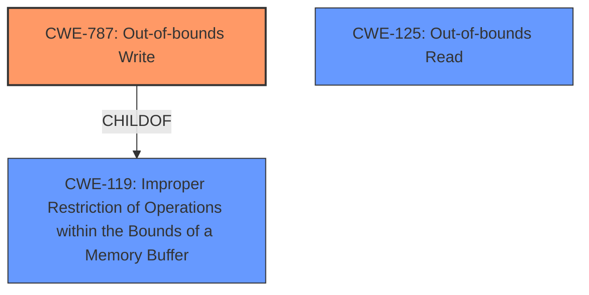

# Raw Analyzer Response for CVE-2021-20285

# Summary
| CWE ID | CWE Name | Confidence | CWE Abstraction Level | CWE Vulnerability Mapping Label | CWE-Vulnerability Mapping Notes |
|---|---|---|---|---|---|
| CWE-787 | Out-of-bounds Write | 1.0 | Base | Allowed | Primary CWE |
| CWE-125 | Out-of-bounds Read | 0.7 | Base | Allowed | Secondary Candidate |
| CWE-119 | Improper Restriction of Operations within the Bounds of a Memory Buffer | 0.6 | Class | Discouraged | Secondary Candidate |

## Evidence and Confidence

*   **Confidence Score:** 0.8
*   **Evidence Strength:** HIGH

## Relationship Analysis
The primary CWE is CWE-787 (**Out-of-bounds Write**), which is a child of CWE-119 (**Improper Restriction of Operations within the Bounds of a Memory Buffer**). CWE-125 (**Out-of-bounds Read**) is a peer and can be related, depending on the specific vulnerability details. The relationships influenced the decision by providing a hierarchy of specificity, where CWE-787 is more specific than its parent, CWE-119, and thus a better fit.

## Vulnerability Chain
The vulnerability chain starts with a **lack of proper bounds checking** on the `rel_off` value. This leads to an **out-of-bounds write** due to the memory access using the unchecked `rel_off` value, which results in a **denial of service** due to a crash or other unspecified impacts.

## Summary of Analysis
The initial analysis focused on the **buffer overflow** mentioned in the vulnerability description. However, the CVE Reference Links Content Summary provides a clearer picture, pointing to a **lack of proper bounds checking** on the `rel_off` value, leading to an **out-of-bounds write**.

The selection of CWE-787 is primarily based on the following evidence from the CVE Reference Links Content Summary:

*   "The vulnerability stems from a **lack of proper bounds checking** within the `canPack` function in `p_lx_elf.cpp` of UPX version 3.96. Specifically, the code fails to validate the `rel_off` value before using it to access memory through the `file_image` array."
*   "**Buffer Overflow/Illegal Memory Access:** The missing check on `rel_off` leads to an out-of-bounds memory access when creating the `rp` pointer which can lead to a crash (SEGV) or other unspecified impacts, because the `rp` pointer points to an invalid memory address."
*   "The code at `p_lx_elf.cpp:2571` attempts to dereference `rp->r_offset`, where `rp` is calculated based on `rel_off`. If `rel_off` is invalid, this results in a memory access violation."

The relationship analysis reinforced this selection, showing that CWE-787 is a specific type of CWE-119. The retriever results also support this, with CWE-787 being a relevant candidate.

CWE-119 was considered but not chosen as the primary because it is a broader category. While technically correct, CWE-787 is more specific and accurately reflects the nature of the vulnerability (an **out-of-bounds write**).

CWE-125 was considered because an out-of-bounds write often implies the possibility of an out-of-bounds read. Given the available information, the primary operation is a write, so CWE-787 is prioritized, but the possibility of a read cannot be ruled out entirely.

The selected CWEs are at the optimal level of specificity because they directly describe the **root cause** (CWE-787) and the broader context (CWE-119, CWE-125) of the vulnerability, based on the provided evidence.