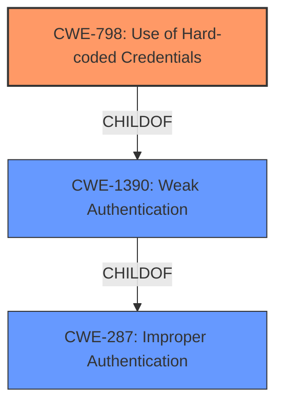

# Enhanced Analysis for CVE-2021-20288

# Summary
| CWE ID    | CWE Name                                                                                             | Confidence | CWE Abstraction Level | CWE Vulnerability Mapping Label | CWE-Vulnerability Mapping Notes |
| --------- | ---------------------------------------------------------------------------------------------------- | ---------- | ----------------------- | ------------------------------- | ----------------------------- |
| CWE-798 | Use of Hard-coded Credentials | 0.75       | Base                    | Allowed                       | Primary CWE |
| CWE-1390  | Weak Authentication                                                                                    | 0.6        | Class                     | Allowed-with-Review             | Secondary Candidate             |
| CWE-287   | Improper Authentication                                                                                 | 0.5        | Class                     | Discouraged                     | Secondary Candidate             |

## Evidence and Confidence

*   **Confidence Score:** 0.75
*   **Evidence Strength:** HIGH

## Relationship Analysis
The primary relationship that influenced the decision was the child-of relationship between CWE-798 and several potential child CWEs. The vulnerability description points towards the **improper key sanitization** which could be construed as **use of hardcoded credentials**. The Class CWE-1390, Weak Authentication, is a parent of CWE-798 and CWE-259. The other high scoring CWEs such as CWE-287 are parent classes as well. This suggests a hierarchical path from general authentication failures to the specifics of credential handling.



## Vulnerability Chain
The vulnerability chain starts with **improper key sanitization** when the monitor handles `CEPHX_GET_AUTH_SESSION_KEY` requests. This leads to **key reuse**, allowing an attacker to request a `global_id` previously associated with another user. The chain involves the following:

1.  **Root Cause:** **Improper key sanitization** (`CEPHX_GET_AUTH_SESSION_KEY` requests)
2.  **Weakness:** Lack of key reuse enforcement.
3.  **Impact:** Key reuse, leading to potential privilege escalation and data compromise.

## Summary of Analysis
The initial analysis considered several high-scoring CWEs from the Retriever Results, including CWE-1390 (Weak Authentication) and CWE-287 (Improper Authentication). However, the core issue is the **improper key sanitization**, leading to unauthorized key reuse.

The evidence from the "CVE Reference Links Content Summary" section supports the classification of CWE-798:

*   "The root cause lies in the Ceph's authentication mechanism (cephx). Specifically, the monitor daemon, when handling `CEPHX_GET_AUTH_SESSION_KEY` requests, fails to properly sanitize the `other_keys` field, which allows for unauthorized reuse of keys."
*   "This occurs because Ceph does not enforce the reuse of old keys when generating new ones, enabling an attacker to request a global_id previously associated with another user."

Given the direct evidence of **improper key sanitization** and the ability to reuse keys, CWE-798 (Use of Hard-coded Credentials) is the most appropriate choice, as keys can be used by an attacker without proper validation. While the vulnerability might stem from weak authentication mechanisms (CWE-1390) or improper authentication (CWE-287), the root cause manifests as a credential management issue with existing keys.

CWE-798 is a Base level CWE and best describes the **improper key sanitization** leading to key reuse.

Relevant CWE Information:

# Enhanced Context (25 CWEs)

## CWE-798: Use of Hard-coded Credentials
**Abstraction Level**: Base
**Similarity Score**: 6342.09
**Source**: sparse

**Description**:
The product contains hard-coded credentials, such as a password or cryptographic key.

**Mapping Guidance**:
- Usage: Allowed
- Rationale: This CWE entry is at the Base level of abstraction, which is a preferred level of abstraction for mapping to the root causes of vulnerabilities.


## CWE Relationship Analysis

Current CWEs represent these abstraction levels: .


### Vulnerability Chain Analysis

**Chain starting from CWE-798:**
- 798 (Use of Hard-coded Credentials) - ROOT


**Chain starting from CWE-287:**
- 287 (Improper Authentication) - ROOT


### CWE Relationship Diagram

```mermaid
graph TD
    classDef primary fill:#f96,stroke:#333,stroke-width:2px
    classDef secondary fill:#69f,stroke:#333
    classDef tertiary fill:#9e9,stroke:#333
```