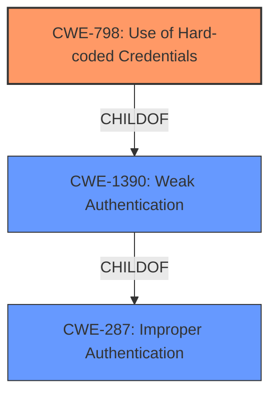

# Analysis for CVE-2021-20288

# Summary
| CWE ID    | CWE Name                                                                                             | Confidence | CWE Abstraction Level | CWE Vulnerability Mapping Label | CWE-Vulnerability Mapping Notes |
| --------- | ---------------------------------------------------------------------------------------------------- | ---------- | ----------------------- | ------------------------------- | ----------------------------- |
| CWE-798 | Use of Hard-coded Credentials | 0.75       | Base                    | Allowed                       | Primary CWE |
| CWE-1390  | Weak Authentication                                                                                    | 0.6        | Class                     | Allowed-with-Review             | Secondary Candidate             |
| CWE-287   | Improper Authentication                                                                                 | 0.5        | Class                     | Discouraged                     | Secondary Candidate             |

## Evidence and Confidence

*   **Confidence Score:** 0.75
*   **Evidence Strength:** HIGH

## Relationship Analysis
The primary relationship that influenced the decision was the child-of relationship between CWE-798 and several potential child CWEs. The vulnerability description points towards the **improper key sanitization** which could be construed as **use of hardcoded credentials**. The Class CWE-1390, Weak Authentication, is a parent of CWE-798 and CWE-259. The other high scoring CWEs such as CWE-287 are parent classes as well. This suggests a hierarchical path from general authentication failures to the specifics of credential handling.



## Vulnerability Chain
The vulnerability chain starts with **improper key sanitization** when the monitor handles `CEPHX_GET_AUTH_SESSION_KEY` requests. This leads to **key reuse**, allowing an attacker to request a `global_id` previously associated with another user. The chain involves the following:

1.  **Root Cause:** **Improper key sanitization** (`CEPHX_GET_AUTH_SESSION_KEY` requests)
2.  **Weakness:** Lack of key reuse enforcement.
3.  **Impact:** Key reuse, leading to potential privilege escalation and data compromise.

## Summary of Analysis
The initial analysis considered several high-scoring CWEs from the Retriever Results, including CWE-1390 (Weak Authentication) and CWE-287 (Improper Authentication). However, the core issue is the **improper key sanitization**, leading to unauthorized key reuse.

The evidence from the "CVE Reference Links Content Summary" section supports the classification of CWE-798:

*   "The root cause lies in the Ceph's authentication mechanism (cephx). Specifically, the monitor daemon, when handling `CEPHX_GET_AUTH_SESSION_KEY` requests, fails to properly sanitize the `other_keys` field, which allows for unauthorized reuse of keys."
*   "This occurs because Ceph does not enforce the reuse of old keys when generating new ones, enabling an attacker to request a global_id previously associated with another user."

Given the direct evidence of **improper key sanitization** and the ability to reuse keys, CWE-798 (Use of Hard-coded Credentials) is the most appropriate choice, as keys can be used by an attacker without proper validation. While the vulnerability might stem from weak authentication mechanisms (CWE-1390) or improper authentication (CWE-287), the root cause manifests as a credential management issue with existing keys.

CWE-798 is a Base level CWE and best describes the **improper key sanitization** leading to key reuse.

Relevant CWE Information:

# Enhanced Context (25 CWEs)

## CWE-798: Use of Hard-coded Credentials
**Abstraction Level**: Base
**Similarity Score**: 6342.09
**Source**: sparse

**Description**:
The product contains hard-coded credentials, such as a password or cryptographic key.

**Mapping Guidance**:
- Usage: Allowed
- Rationale: This CWE entry is at the Base level of abstraction, which is a preferred level of abstraction for mapping to the root causes of vulnerabilities.

# Enhanced Query for CVE-2021-20288

## Vulnerability Description
An authentication flaw was found in ceph in versions before 14.2.20. When the monitor handles CEPHX_GET_AUTH_SESSION_KEY requests, it doesnt sanitize other_keys, allowing key reuse. An attacker who can request a global_id can exploit the ability of any user to request a global_id previously associated with another user, as ceph does not force the reuse of old keys to generate new ones. The highest threat from this vulnerability is to data confidentiality and integrity as well as system availability.

### Vulnerability Description Key Phrases
- **rootcause:** **improper key sanitization**
- **impact:** key reuse
- **product:** ceph
- **version:** before 14.2.20
- **component:** CEPHX_GET_AUTH_SESSION_KEY handler

## CVE Reference Links Content Summary
Based on the provided documents, here's an analysis of CVE-2021-20288:

**Root Cause of Vulnerability:**

The root cause lies in the Ceph's authentication mechanism (cephx). Specifically, the monitor daemon, when handling `CEPHX_GET_AUTH_SESSION_KEY` requests, fails to properly sanitize the `other_keys` field, which allows for unauthorized reuse of keys. This occurs because Ceph does not enforce the reuse of old keys when generating new ones, enabling an attacker to request a global_id previously associated with another user.

**Weaknesses/Vulnerabilities Present:**

1.  **Insufficient Input Validation:** The monitor daemon does not adequately validate the `other_keys` field during `CEPHX_GET_AUTH_SESSION_KEY` requests, allowing an attacker to inject arbitrary key data.
2.  **Lack of Key Reuse Enforcement:** Ceph's authentication protocol does not enforce the reuse of existing keys or tickets when generating new ones. This allows an attacker to use a known global ID without proving prior legitimate ownership.
3.  **Missing Global ID Validation:**  The monitor fails to verify that a presented ticket belongs to the entity claiming a given global ID, leading to unauthorized global ID re-use.

**Impact of Exploitation:**

*   **Privilege Escalation:** An attacker who possesses a valid authentication key can potentially impersonate other clients by reusing their global ID.
*   **Data Confidentiality and Integrity:** The unauthorized reuse of global IDs could lead to a loss of data confidentiality and integrity because a malicious actor can potentially manipulate data or access resources that are supposed to be protected.
*  **System Availability:** The ability to reuse or steal global IDs can lead to disruption of cluster services, potentially causing denial of service.

**Attack Vectors:**

*   **Network Access:** An attacker needs network access to the Ceph cluster to intercept and replay legitimate client connection attempts.
*   **Authentication:** The attacker must have some form of valid authentication key or credentials to initiate contact with a monitor.
*   **Client Impersonation:** The attacker has to be able to make `CEPHX_GET_AUTH_SESSION_KEY` requests to the monitor with a target global ID.

**Required Attacker Capabilities/Position:**

*   **Valid Credentials:** The attacker requires a legitimate authentication key within the cluster.
*   **Network Proximity:** The attacker has to be on a network that can access the Ceph cluster’s monitors to perform a man in the middle attack and replay packets
*   **Modified Client:**  The attacker needs a modified Ceph client implementation that does not comply with correct behavior of the auth protocol.
*   **Knowledge of Global IDs:** The attacker must have knowledge of a valid global ID to be able to impersonate a client.

**Additional Notes:**

*   This vulnerability was a re-introduction of a previously fixed vulnerability (CVE-2018-1128), re-emerging in the msgr2 protocol.
*   The vulnerability has been addressed in newer versions of Ceph by requiring a secure key reclaim method.

The provided content offers specific insights into the following:

*   **Red Hat Ceph Storage:** Red Hat acknowledged and addressed the issue across different versions of their Ceph Storage product line, including security advisories (RHSA-2021:2445, RHSA-2022:1394) for their 3 and 4 releases. Patches included fixes in `ceph`, `ceph-ansible` and `tcmu-runner` packages.
*   **Fedora:** Fedora also pushed out fixes for the vulnerability, as demonstrated by the included mailing list messages.
*   **Gentoo:** Gentoo addressed the vulnerability with a security advisory (GLSA 202105-39).
*  **GitHub:** GitHub Security Advisories also has an entry for the issue and is marked with a High severity score.

The fixes and changes to the code are described in detail with associated code commits, pull requests, and issue links. The commits also show that the fix involves modifying the behavior of monitor daemons and implementing a check for the validation of a client's provided ticket with its global\_id in its re-authentication request. Also, the changes include adding mechanisms to detect vulnerable clients and allow administrators to enforce stricter security.

## Retriever Results

### Top Combined Results

| Rank | CWE ID | Name | Abstraction | Usage  | Retrievers | Individual Scores |
|------|--------|------|-------------|-------|------------|-------------------|
| 1 | 1390 | Weak Authentication | Class | Allowed-with-Review | sparse | 0.479 |
| 2 | 287 | Improper Authentication | Class | Discouraged | sparse | 0.477 |
| 3 | 1391 | Use of Weak Credentials | Class | Allowed-with-Review | sparse | 0.451 |
| 4 | 259 | Use of Hard-coded Password | Variant | Allowed | sparse | 0.444 |
| 5 | 306 | Missing Authentication for Critical Function | Base | Allowed | sparse | 0.443 |
| 6 | 384 | Session Fixation | Compound | Allowed | dense | 0.579 |
| 7 | 262 | Not Using Password Aging | Base | Allowed | graph | 0.002 |
| 8 | 226 | Sensitive Information in Resource Not Removed Before Reuse | Base | Allowed | sparse | 0.440 |
| 9 | 863 | Incorrect Authorization | Class | Allowed-with-Review | sparse | 0.438 |
| 10 | 201 | Insertion of Sensitive Information Into Sent Data | Base | Allowed | sparse | 0.437 |


# Complete CWE Specifications


## CWE-1390: Weak Authentication
**Abstraction:** Class
**Status:** Incomplete

### Description
The product uses an authentication mechanism to restrict access to specific users or identities, but the mechanism does not sufficiently prove that the claimed identity is correct.

### Extended Description


Attackers may be able to bypass weak authentication faster and/or with less effort than expected.


### Alternative Terms
None

### Relationships
ChildOf -> CWE-287

### Mapping Guidance
**Usage:** Allowed-with-Review
**Rationale:** This CWE entry is a Class and might have Base-level children that would be more appropriate
**Comments:** Examine children of this entry to see if there is a better fit
**Reasons:**
- Abstraction


### Observed Examples
- **CVE-2022-30034:** Chain: Web UI for a Python RPC framework does not use regex anchors to validate user login emails (CWE-777), potentially allowing bypass of OAuth (CWE-1390).
- **CVE-2022-35248:** Chat application skips validation when Central Authentication Service (CAS) is enabled, effectively removing the second factor from two-factor authentication
- **CVE-2021-3116:** Chain: Python-based HTTP Proxy server uses the wrong boolean operators (CWE-480) causing an incorrect comparison (CWE-697) that identifies an authN failure if all three conditions are met instead of only one, allowing bypass of the proxy authentication (CWE-1390)


## CWE-287: Improper Authentication
**Abstraction:** Class
**Status:** Draft

### Description
When an actor claims to have a given identity, the product does not prove or insufficiently proves that the claim is correct.

### Extended Description
Not provided

### Alternative Terms
authentification: An alternate term is "authentification", which appears to be most commonly used by people from non-English-speaking countries.
AuthN: "AuthN" is typically used as an abbreviation of "authentication" within the web application security community. It is also distinct from "AuthZ," which is an abbreviation of "authorization." The use of "Auth" as an abbreviation is discouraged, since it could be used for either authentication or authorization.
AuthC: "AuthC" is used as an abbreviation of "authentication," but it appears to used less frequently than "AuthN."

### Relationships
ChildOf -> CWE-284
ChildOf -> CWE-284

### Mapping Guidance
**Usage:** Discouraged
**Rationale:** This CWE entry might be misused when lower-level CWE entries are likely to be applicable. It is a level-1 Class (i.e., a child of a Pillar).
**Comments:** Consider children or descendants, beginning with CWE-1390: Weak Authentication or CWE-306: Missing Authentication for Critical Function.
**Reasons:**
- Frequent Misuse
**Suggested Alternatives:**
- CWE-1390: Weak Authentication
- CWE-306: Missing Authentication for Critical Function


### Additional Notes
**[Relationship]** This can be resultant from SQL injection vulnerabilities and other issues.

**[Maintenance]** The Taxonomy_Mappings to ISA/IEC 62443 were added in CWE 4.10, but they are still under review and might change in future CWE versions. These draft mappings were performed by members of the "Mapping CWE to 62443" subgroup of the CWE-CAPEC ICS/OT Special Interest Group (SIG), and their work is incomplete as of CWE 4.10. The mappings are included to facilitate discussion and review by the broader ICS/OT community, and they are likely to change in future CWE versions.


### Observed Examples
- **CVE-2022-35248:** Chat application skips validation when Central Authentication Service (CAS) is enabled, effectively removing the second factor from two-factor authentication
- **CVE-2022-36436:** Python-based authentication proxy does not enforce password authentication during the initial handshake, allowing the client to bypass authentication by specifying a 'None' authentication type.
- **CVE-2022-30034:** Chain: Web UI for a Python RPC framework does not use regex anchors to validate user login emails (CWE-777), potentially allowing bypass of OAuth (CWE-1390).


## CWE-1391: Use of Weak Credentials
**Abstraction:** Class
**Status:** Incomplete

### Description
The product uses weak credentials (such as a default key or hard-coded password) that can be calculated, derived, reused, or guessed by an attacker.

### Extended Description


By design, authentication protocols try to ensure that attackers must perform brute force attacks if they do not know the credentials such as a key or password. However, when these credentials are easily predictable or even fixed (as with default or hard-coded passwords and keys), then the attacker can defeat the mechanism without relying on brute force.


Credentials may be weak for different reasons, such as:


  - Hard-coded (i.e., static and unchangeable by the administrator)

  - Default (i.e., the same static value across different deployments/installations, but able to be changed by the administrator)

  - Predictable (i.e., generated in a way that produces unique credentials across deployments/installations, but can still be guessed with reasonable efficiency)

Even if a new, unique credential is intended to be generated for each product installation, if the generation is predictable, then that may also simplify guessing attacks.

### Alternative Terms
None

### Relationships
ChildOf -> CWE-1390

### Mapping Guidance
**Usage:** Allowed-with-Review
**Rationale:** This CWE entry is a Class and might have Base-level children that would be more appropriate
**Comments:** Examine children of this entry to see if there is a better fit
**Reasons:**
- Abstraction


### Observed Examples
- **[REF-1374]:** Chain: JavaScript-based cryptocurrency library can fall back to the insecure Math.random() function instead of reporting a failure (CWE-392), thus reducing the entropy (CWE-332) and leading to generation of non-unique cryptographic keys for Bitcoin wallets (CWE-1391)
- **CVE-2022-30270:** Remote Terminal Unit (RTU) uses default credentials for some SSH accounts
- **CVE-2022-29965:** Distributed Control System (DCS) uses a deterministic algorithm to generate utility passwords


## CWE-259: Use of Hard-coded Password
**Abstraction:** Variant
**Status:** Draft

### Description
The product contains a hard-coded password, which it uses for its own inbound authentication or for outbound communication to external components.

### Extended Description


A hard-coded password typically leads to a significant authentication failure that can be difficult for the system administrator to detect. Once detected, it can be difficult to fix, so the administrator may be forced into disabling the product entirely. There are two main variations:

```
		Inbound: the product contains an authentication mechanism that checks for a hard-coded password.
		Outbound: the product connects to another system or component, and it contains hard-coded password for connecting to that component.
```
In the Inbound variant, a default administration account is created, and a simple password is hard-coded into the product and associated with that account. This hard-coded password is the same for each installation of the product, and it usually cannot be changed or disabled by system administrators without manually modifying the program, or otherwise patching the product. If the password is ever discovered or published (a common occurrence on the Internet), then anybody with knowledge of this password can access the product. Finally, since all installations of the product will have the same password, even across different organizations, this enables massive attacks such as worms to take place.

The Outbound variant applies to front-end systems that authenticate with a back-end service. The back-end service may require a fixed password which can be easily discovered. The programmer may simply hard-code those back-end credentials into the front-end product. Any user of that program may be able to extract the password. Client-side systems with hard-coded passwords pose even more of a threat, since the extraction of a password from a binary is usually very simple.


### Alternative Terms
None

### Relationships
ChildOf -> CWE-798
ChildOf -> CWE-798
ChildOf -> CWE-798
PeerOf -> CWE-321
PeerOf -> CWE-257

### Mapping Guidance
**Usage:** Allowed
**Rationale:** This CWE entry is at the Variant level of abstraction, which is a preferred level of abstraction for mapping to the root causes of vulnerabilities.
**Comments:** Carefully read both the name and description to ensure that this mapping is an appropriate fit. Do not try to 'force' a mapping to a lower-level Base/Variant simply to comply with this preferred level of abstraction.
**Reasons:**
- Acceptable-Use


### Additional Notes
**[Maintenance]** This entry could be split into multiple variants: an inbound variant (as seen in the second demonstrative example) and an outbound variant (as seen in the first demonstrative example). These variants are likely to have different consequences, detectability, etc. More importantly, from a vulnerability theory perspective, they could be characterized as different behaviors.


### Observed Examples
- **CVE-2022-29964:** Distributed Control System (DCS) has hard-coded passwords for local shell access
- **CVE-2021-37555:** Telnet service for IoT feeder for dogs and cats has hard-coded password [REF-1288]
- **CVE-2021-35033:** Firmware for a WiFi router uses a hard-coded password for a BusyBox shell, allowing bypass of authentication through the UART port


## CWE-306: Missing Authentication for Critical Function
**Abstraction:** Base
**Status:** Draft

### Description
The product does not perform any authentication for functionality that requires a provable user identity or consumes a significant amount of resources.

### Extended Description
Not provided

### Alternative Terms
None

### Relationships
ChildOf -> CWE-287
ChildOf -> CWE-287

### Mapping Guidance
**Usage:** Allowed
**Rationale:** This CWE entry is at the Base level of abstraction, which is a preferred level of abstraction for mapping to the root causes of vulnerabilities.
**Comments:** Carefully read both the name and description to ensure that this mapping is an appropriate fit. Do not try to 'force' a mapping to a lower-level Base/Variant simply to comply with this preferred level of abstraction.
**Reasons:**
- Acceptable-Use


### Observed Examples
- **CVE-2022-31260:** Chain: a digital asset management program has an undisclosed backdoor in the legacy version of a PHP script (CWE-912) that could allow an unauthenticated user to export metadata (CWE-306)
- **CVE-2022-29951:** TCP-based protocol in Programmable Logic Controller (PLC) has no authentication.
- **CVE-2022-29952:** Condition Monitor firmware uses a protocol that does not require authentication.


## CWE-384: Session Fixation
**Abstraction:** Compound
**Status:** Incomplete

### Description
Authenticating a user, or otherwise establishing a new user session, without invalidating any existing session identifier gives an attacker the opportunity to steal authenticated sessions.

### Extended Description


Such a scenario is commonly observed when:


  - A web application authenticates a user without first invalidating the existing session, thereby continuing to use the session already associated with the user.

  - An attacker is able to force a known session identifier on a user so that, once the user authenticates, the attacker has access to the authenticated session.

  - The application or container uses predictable session identifiers.

In the generic exploit of session fixation vulnerabilities, an attacker creates a new session on a web application and records the associated session identifier. The attacker then causes the victim to associate, and possibly authenticate, against the server using that session identifier, giving the attacker access to the user's account through the active session.

### Alternative Terms
None

### Relationships
ChildOf -> CWE-610
ChildOf -> CWE-610
Requires -> CWE-346
Requires -> CWE-472
Requires -> CWE-441

### Mapping Guidance
**Usage:** Allowed
**Rationale:** This is a well-known Composite of multiple weaknesses that must all occur simultaneously, although it is attack-oriented in nature.
**Comments:** While attack-oriented composites are supported in CWE, they have not been a focus of research. There is a chance that future research or CWE scope clarifications will change or deprecate them. Perform root-cause analysis to determine which weaknesses allow session fixation to occur, and map to those weaknesses. For example, predictable session identifiers might enable session fixation attacks to succeed; if this occurs, they might be better characterized as randomness/predictability weaknesses.
**Reasons:**
- Other


### Additional Notes
**[Other]** Other attack vectors include DNS poisoning and related network based attacks where an attacker causes the user to visit a malicious site by redirecting a request for a valid site. Network based attacks typically involve a physical presence on the victim's network or control of a compromised machine on the network, which makes them harder to exploit remotely, but their significance should not be overlooked. Less secure session management mechanisms, such as the default implementation in Apache Tomcat, allow session identifiers normally expected in a cookie to be specified on the URL as well, which enables an attacker to cause a victim to use a fixed session identifier simply by emailing a malicious URL.


### Observed Examples
- **CVE-2022-2820:** Website software for game servers does not proprerly terminate user sessions, allowing for possible session fixation


## CWE-262: Not Using Password Aging
**Abstraction:** Base
**Status:** Draft

### Description
The product does not have a mechanism in place for managing password aging.

### Extended Description


Password aging (or password rotation) is a policy that forces users to change their passwords after a defined time period passes, such as every 30 or 90 days. Without mechanisms such as aging, users might not change their passwords in a timely manner.


Note that while password aging was once considered an important security feature, it has since fallen out of favor by many, because it is not as effective against modern threats compared to other mechanisms such as slow hashes. In addition, forcing frequent changes can unintentionally encourage users to select less-secure passwords. However, password aging is still in use due to factors such as compliance requirements, e.g., Payment Card Industry Data Security Standard (PCI DSS).


### Alternative Terms
None

### Relationships
ChildOf -> CWE-1390
PeerOf -> CWE-309
PeerOf -> CWE-324

### Mapping Guidance
**Usage:** Allowed
**Rationale:** This CWE entry is at the Base level of abstraction, which is a preferred level of abstraction for mapping to the root causes of vulnerabilities.
**Comments:** Carefully read both the name and description to ensure that this mapping is an appropriate fit. Do not try to 'force' a mapping to a lower-level Base/Variant simply to comply with this preferred level of abstraction.
**Reasons:**
- Acceptable-Use


## CWE-226: Sensitive Information in Resource Not Removed Before Reuse
**Abstraction:** Base
**Status:** Draft

### Description
The product releases a resource such as memory or a file so that it can be made available for reuse, but it does not clear or "zeroize" the information contained in the resource before the product performs a critical state transition or makes the resource available for reuse by other entities.

### Extended Description


When resources are released, they can be made available for reuse. For example, after memory is de-allocated, an operating system may make the memory available to another process, or disk space may be reallocated when a file is deleted. As removing information requires time and additional resources, operating systems do not usually clear the previously written information.


Even when the resource is reused by the same process, this weakness can arise when new data is not as large as the old data, which leaves portions of the old data still available. Equivalent errors can occur in other situations where the length of data is variable but the associated data structure is not. If memory is not cleared after use, the information may be read by less trustworthy parties when the memory is reallocated.


This weakness can apply in hardware, such as when a device or system switches between power, sleep, or debug states during normal operation, or when execution changes to different users or privilege levels.


### Alternative Terms
None

### Relationships
ChildOf -> CWE-459
ChildOf -> CWE-212
CanPrecede -> CWE-201

### Mapping Guidance
**Usage:** Allowed
**Rationale:** This CWE entry is at the Base level of abstraction, which is a preferred level of abstraction for mapping to the root causes of vulnerabilities.
**Comments:** Carefully read both the name and description to ensure that this mapping is an appropriate fit. Do not try to 'force' a mapping to a lower-level Base/Variant simply to comply with this preferred level of abstraction.
**Reasons:**
- Acceptable-Use


### Additional Notes
**[Relationship]** There is a close association between CWE-226 and CWE-212. The difference is partially that of perspective. CWE-226 is geared towards the final stage of the resource lifecycle, in which the resource is deleted, eliminated, expired, or otherwise released for reuse. Technically, this involves a transfer to a different control sphere, in which the original contents of the resource are no longer relevant. CWE-212, however, is intended for sensitive data in resources that are intentionally shared with others, so they are still active. This distinction is useful from the perspective of the CWE research view (CWE-1000).

**[Maintenance]** This entry needs modification to clarify the differences with CWE-212. The description also combines two problems that are distinct from the CWE research perspective: the inadvertent transfer of information to another sphere, and improper initialization/shutdown. Some of the associated taxonomy mappings reflect these different uses.

**[Research Gap]** This is frequently found for network packets, but it can also exist in local memory allocation, files, etc.


### Observed Examples
- **CVE-2019-3733:** Cryptography library does not clear heap memory before release
- **CVE-2003-0001:** Ethernet NIC drivers do not pad frames with null bytes, leading to infoleak from malformed packets.
- **CVE-2003-0291:** router does not clear information from DHCP packets that have been previously used


## CWE-863: Incorrect Authorization
**Abstraction:** Class
**Status:** Incomplete

### Description
The product performs an authorization check when an actor attempts to access a resource or perform an action, but it does not correctly perform the check.

### Extended Description
Not provided

### Alternative Terms
AuthZ: "AuthZ" is typically used as an abbreviation of "authorization" within the web application security community. It is distinct from "AuthN" (or, sometimes, "AuthC") which is an abbreviation of "authentication." The use of "Auth" as an abbreviation is discouraged, since it could be used for either authentication or authorization.

### Relationships
ChildOf -> CWE-285
ChildOf -> CWE-284

### Mapping Guidance
**Usage:** Allowed-with-Review
**Rationale:** This CWE entry is a Class and might have Base-level children that would be more appropriate
**Comments:** Examine children of this entry to see if there is a better fit
**Reasons:**
- Abstraction


### Additional Notes
**[Terminology]** 

Assuming a user with a given identity, authorization is the process of determining whether that user can access a given resource, based on the user's privileges and any permissions or other access-control specifications that apply to the resource.


### Observed Examples
- **CVE-2021-39155:** Chain: A microservice integration and management platform compares the hostname in the HTTP Host header in a case-sensitive way (CWE-178, CWE-1289), allowing bypass of the authorization policy (CWE-863) using a hostname with mixed case or other variations.
- **CVE-2019-15900:** Chain: sscanf() call is used to check if a username and group exists, but the return value of sscanf() call is not checked (CWE-252), causing an uninitialized variable to be checked (CWE-457), returning success to allow authorization bypass for executing a privileged (CWE-863).
- **CVE-2009-2213:** Gateway uses default "Allow" configuration for its authorization settings.


## CWE-201: Insertion of Sensitive Information Into Sent Data
**Abstraction:** Base
**Status:** Draft

### Description
The code transmits data to another actor, but a portion of the data includes sensitive information that should not be accessible to that actor.

### Extended Description
Not provided

### Alternative Terms
None

### Relationships
ChildOf -> CWE-200
CanAlsoBe -> CWE-209
CanAlsoBe -> CWE-202

### Mapping Guidance
**Usage:** Allowed
**Rationale:** This CWE entry is at the Base level of abstraction, which is a preferred level of abstraction for mapping to the root causes of vulnerabilities.
**Comments:** Carefully read both the name and description to ensure that this mapping is an appropriate fit. Do not try to 'force' a mapping to a lower-level Base/Variant simply to comply with this preferred level of abstraction.
**Reasons:**
- Acceptable-Use


### Additional Notes
**[Other]** Sensitive information could include data that is sensitive in and of itself (such as credentials or private messages), or otherwise useful in the further exploitation of the system (such as internal file system structure).


### Observed Examples
- **CVE-2022-0708:** Collaboration platform does not clear team emails in a response, allowing leak of email addresses

