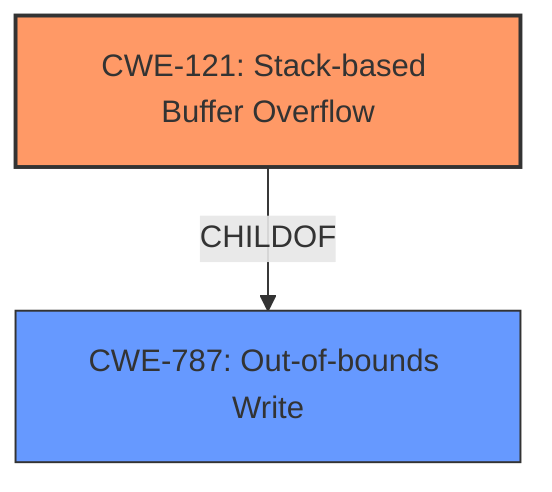

# Analysis for CVE-2021-20294

# Summary
| CWE ID | CWE Name | Confidence | CWE Abstraction Level | CWE Vulnerability Mapping Label | CWE-Vulnerability Mapping Notes |
|---|---|---|---|---|---|
| CWE-121 | Stack-based Buffer Overflow | 1.0 | Base | Primary | Allowed |
| CWE-787 | Out-of-bounds Write | 0.9 | Base | Secondary | Allowed |

## Evidence and Confidence

*   **Confidence Score:** 0.95
*   **Evidence Strength:** HIGH

## Relationship Analysis
The primary weakness is a stack-based buffer overflow (CWE-121), which is a specific type of out-of-bounds write. CWE-787 (Out-of-bounds Write) is a parent of more specific buffer overflow variants, including stack-based overflows. The relationship is therefore ChildOf(CWE-121, CWE-787). The **stack buffer overflow** leads to an **out-of-bounds write**.

## Vulnerability Chain
The vulnerability chain starts with the crafted file being read by readelf, which leads to a **stack buffer overflow**, resulting in an **out-of-bounds write**. The root cause is the improper handling of the crafted file, leading to the buffer overflow on the stack and the subsequent write beyond buffer boundaries.

## Summary of Analysis
The initial analysis identified a **stack buffer overflow** and an **out-of-bounds write** as the primary weaknesses. The vulnerability description explicitly states that a "crafted file could trigger a **stack buffer overflow**, **out-of-bounds write** of arbitrary data supplied by the attacker." The retriever results and keyphrase-specific CWE analysis confirm the relevance of CWE-121 and CWE-787.

CWE-121 (Stack-based Buffer Overflow) is the primary weakness because the overflow occurs on the stack. CWE-787 (Out-of-bounds Write) is a related weakness since the overflow leads to writing outside the buffer's boundaries.

The selection of CWE-121 is at the optimal level of specificity because the vulnerability involves a buffer overflow on the stack, which is a specific type of out-of-bounds write.

Relevant CWE Information:
# Vulnerability Description

A flaw was found in binutils readelf 2.35 program. An attacker who is able to convince a victim using readelf to read a crafted file could trigger a **stack buffer overflow**, **out-of-bounds write** of arbitrary data supplied by the attacker. The highest impact of this flaw is to confidentiality, integrity, and availability.

# Enhanced Context (25 CWEs)

## CWE-121: Stack-based Buffer Overflow
**Technical Explanation:** The vulnerability involves a **stack buffer overflow**, which means a buffer allocated on the stack is being overwritten. This aligns directly with the definition of CWE-121.
**Security Implications:** A **stack buffer overflow** can allow an attacker to overwrite return addresses, function pointers, or other critical data on the stack, leading to arbitrary code execution.
**Relationship Analysis:** CWE-121 is a specific type of buffer overflow, which is a kind of out-of-bounds write (CWE-787).
**Mapping Guidance Influence:** The mapping guidance for CWE-121 is ALLOWED, indicating it is appropriate for this type of vulnerability.

## CWE-787: Out-of-bounds Write
**Technical Explanation:** The vulnerability also involves an **out-of-bounds write**, where data is written past the end or before the beginning of the intended buffer. This aligns with CWE-787.
**Security Implications:** An **out-of-bounds write** can lead to memory corruption, denial of service, or arbitrary code execution.
**Relationship Analysis:** CWE-787 is a broader category that includes stack-based buffer overflows (CWE-121).
**Mapping Guidance Influence:** The mapping guidance for CWE-787 is ALLOWED, indicating it is appropriate.

Other CWEs Considered but Not Used:

*   CWE-119 (Improper Restriction of Operations within the Bounds of a Memory Buffer): While related, it's a more general description. The description specifies stack, so CWE-121 is more precise.
*   CWE-125 (Out-of-bounds Read): The vulnerability description specifies an out-of-bounds *write*, not a read.
*   CWE-190 (Integer Overflow or Wraparound): There is no mention of integer overflows in the description.