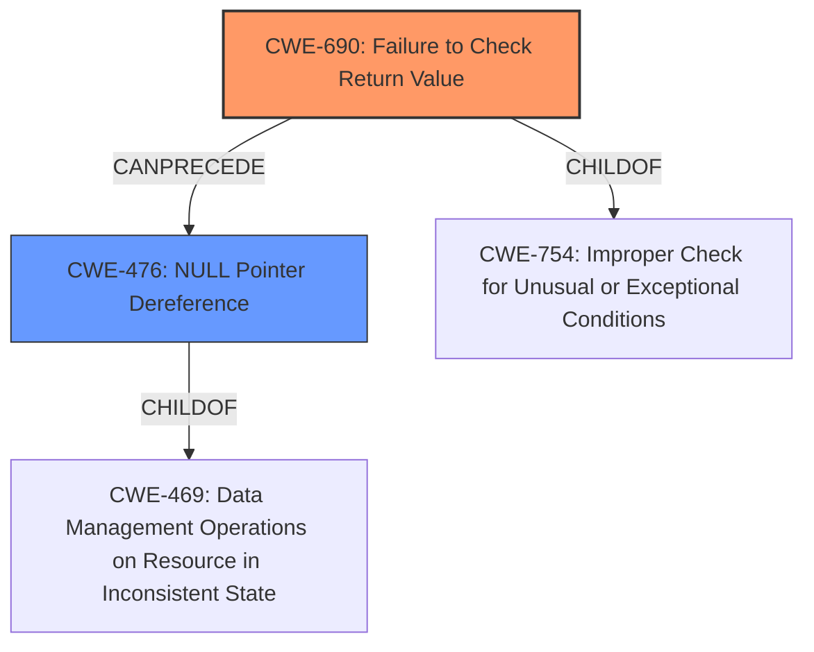

# Analysis Report for CVE-2021-20297

# Vulnerability Analysis Report: CVE-2021-20297

## Description


## Analysis (with Relationship Data)

# Summary
| CWE ID | CWE Name | Confidence | CWE Abstraction Level | CWE Vulnerability Mapping Label | CWE-Vulnerability Mapping Notes |
|---|---|---|---|---|---|
| CWE-690 | Failure to Check Return Value | 0.9 | Base | Primary | Allowed |
| CWE-476 | NULL Pointer Dereference | 0.8 | Base | Secondary | Allowed |

## Evidence and Confidence

*   **Confidence Score:** 0.85
*   **Evidence Strength:** HIGH

## Relationship Analysis
The primary weakness is **CWE-690 [Failure to Check Return Value]**, which can **lead to** **CWE-476 [NULL Pointer Dereference]**. This is because if a function returns NULL and this value isn't checked before being dereferenced, it will crash the application. The parent of **CWE-476 [NULL Pointer Dereference]** is **CWE-469 [Data Management Operations on Resource in Inconsistent State]**. **CWE-690 [Failure to Check Return Value]** is a child of **CWE-754 [Improper Check for Unusual or Exceptional Conditions]**.



## Vulnerability Chain
The chain of root cause and weaknesses is as follows:
1.  **Root Cause:** **CWE-690 [Failure to Check Return Value]** in `nm_wildcard_match_check`.
2.  **Weakness:** **CWE-476 [NULL Pointer Dereference]** due to the unchecked NULL return.
3.  **Impact:** Crash of NetworkManager service, leading to denial of service.

## Summary of Analysis
Initial Analysis:
The vulnerability involves a crash in NetworkManager when setting `match.path` and activating a profile. The root cause lies in `nm_wildcard_match_check` function, which **does not handle NULL input properly**, and uses `__fnmatch` which dereferences a null string.

Retriever Results:
The retriever results suggest several CWEs, including **CWE-401 [Missing Release of Memory after Effective Lifetime]**, **CWE-732 [Incorrect Permission Assignment for Critical Resource]**, **CWE-201 [Insertion of Sensitive Information Into Sent Data]**, **CWE-754 [Improper Check for Unusual or Exceptional Conditions]**, and **CWE-121 [Stack-based Buffer Overflow]**. However, these do not directly address the **root cause** of the vulnerability.

Final Conclusion:
The **root cause** of the crash is the **failure to check the return value** from a function that can return NULL, leading to a **NULL pointer dereference**. This is a classic case of **CWE-690 [Failure to Check Return Value]** leading to **CWE-476 [NULL Pointer Dereference]**.

The evidence from the CVE Reference Links Content Summary is: "The vulnerability is caused by a crash triggered when a NetworkManager profile with the 'match.path' setting is activated, because `nm_wildcard_match_check` **does not handle NULL input properly**. Specifically, the function uses __fnmatch, which dereferences a null string."

**CWE-690 [Failure to Check Return Value]** is selected as the primary CWE because the function `nm_wildcard_match_check` fails to check for a NULL return value. This directly leads to the crash. **CWE-476 [NULL Pointer Dereference]** is selected as a secondary CWE because it describes the specific type of error that occurs when the NULL value is dereferenced.

The abstraction level is Base for both CWEs, which is the preferred level.

Other CWEs Considered:

*   **CWE-401 [Missing Release of Memory after Effective Lifetime]**: This is not applicable because the vulnerability is not related to memory leaks.
*   **CWE-732 [Incorrect Permission Assignment for Critical Resource]**: This is not applicable because the vulnerability is not related to incorrect permission assignments.
*   **CWE-201 [Insertion of Sensitive Information Into Sent Data]**: This is not applicable because the vulnerability is not related to the insertion of sensitive information.
*   **CWE-754 [Improper Check for Unusual or Exceptional Conditions]**: While related, **CWE-690 [Failure to Check Return Value]** is a more specific instance of failing to check for exceptional conditions.
*   **CWE-121 [Stack-based Buffer Overflow]**: This is not applicable because the vulnerability is not related to buffer overflows.
*   **CWE-119 [Improper Restriction of Operations within the Bounds of a Memory Buffer]**: This is too general.

Relevant CWE Information:
## CWE-690: Failure to Check Return Value
**Abstraction Level**: Base
**Description**: The program does not check the return value from a function call, and this can lead to exploitable conditions.

The function `nm_wildcard_match_check` does not check for a NULL return value, and this leads to a crash.

## CWE-476: NULL Pointer Dereference
**Abstraction Level**: Base
**Description**: The product dereferences a pointer that is null, which could cause a crash, exit, or other unintended behavior.

The `__fnmatch` function dereferences a null string, which leads to a crash.


## CWE Relationship Analysis

Current CWEs represent these abstraction levels: .


### Vulnerability Chain Analysis

**Chain starting from CWE-476:**
- 476 (NULL Pointer Dereference) - ROOT


**Chain starting from CWE-754:**
- 754 (Improper Check for Unusual or Exceptional Conditions) - ROOT


### CWE Relationship Diagram

```mermaid
graph TD
    classDef primary fill:#f96,stroke:#333,stroke-width:2px
    classDef secondary fill:#69f,stroke:#333
    classDef tertiary fill:#9e9,stroke:#333
```


*Report generated on 2025-04-02 13:31:41*
