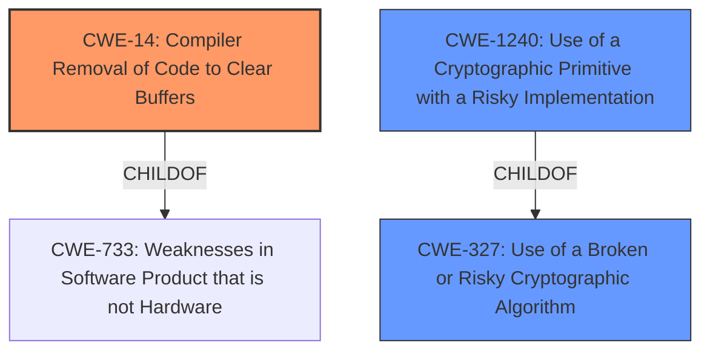

# Analysis Report for CVE-2021-20313

# Vulnerability Analysis Report: CVE-2021-20313

## Description


## Analysis (with Relationship Data)

# Summary

| CWE ID   | CWE Name                                                   | Confidence | CWE Abstraction Level | CWE Vulnerability Mapping Label | CWE-Vulnerability Mapping Notes |
| :-------- | :--------------------------------------------------------- | :--------- | :-------------------- | :------------------------------ | :------------------------------ |
| CWE-14  | Compiler Removal of Code to Clear Buffers | 0.8        | Variant               | Allowed                       |                                 Primary CWE               |
| CWE-1240 | Use of a Cryptographic Primitive with a Risky Implementation | 0.6        | Base                  | Allowed                       |                                 Secondary CWE           |
| CWE-327 | Use of a Broken or Risky Cryptographic Algorithm | 0.4        | Class            | Allowed-with-Review                       |                                 Secondary CWE                 |

## Evidence and Confidence

*   **Confidence Score:** 0.8
*   **Evidence Strength:** HIGH

## Relationship Analysis

The primary relationship that impacted the decision was the parent-child relationship between CWE-14 and CWE-733. CWE-14 is a variant of CWE-733, which focuses on the specific issue of compiler optimizations removing code intended to clear sensitive data from memory. This variant is more specific and accurately describes the vulnerability. CWE-1240 is related to CWE-327 as a child, further clarifying the cryptographic aspect.



## Vulnerability Chain

The vulnerability chain starts with the **cipher leak** due to the potential removal of memory clearing code by the compiler. This leads to the exposure of sensitive information and compromises data confidentiality.

*   Root Cause: **Compiler Removal of Code to Clear Buffers (CWE-14)**
*   Weakness: **Use of a Cryptographic Primitive with a Risky Implementation (CWE-1240)**
*   Impact: Data Confidentiality breach

## Summary of Analysis

The initial analysis focused on identifying the **root cause** of the vulnerability, which is the potential **cipher leak**. The CVE Reference Links Content Summary highlights that the code uses `memset` to clear the `W` array, but this can be optimized away by the compiler. This led to considering **CWE-14: Compiler Removal of Code to Clear Buffers** as the primary weakness.

The analysis also considered **CWE-1240: Use of a Cryptographic Primitive with a Risky Implementation** and **CWE-327: Use of a Broken or Risky Cryptographic Algorithm** due to the cryptographic nature of the vulnerability.

Ultimately, **CWE-14** was selected as the primary CWE because the fix involved preventing compiler optimizations from removing the buffer clearing, which directly addresses the **root cause**. The other CWEs, **CWE-1240** and **CWE-327**, are related to the cryptographic context but are not the direct cause of the vulnerability.

The selection of **CWE-14** is based on the evidence from the CVE Reference Links Content Summary, which states that "The code uses memset to clear the W array but this can be optimized away by the compiler" and "The fix prevents compiler optimizations from removing the buffer clearing".

The graph relationships influenced the final selection by emphasizing the importance of identifying the most specific CWE that accurately represents the vulnerability. **CWE-14** is a variant that specifically addresses the compiler optimization issue, making it the optimal choice.

Relevant CWE Information:

# Enhanced Context (25 CWEs)

## CWE-14: Compiler Removal of Code to Clear Buffers
**Abstraction:** Variant
**Status:** Draft

### Description
Sensitive memory is cleared according to the source code, but compiler optimizations leave the memory untouched when it is not read from again, aka "dead store removal."

### Extended Description
This compiler optimization error occurs when:
1. Secret data are stored in memory.
2. The secret data are scrubbed from memory by overwriting its contents.
3. The source code is compiled using an optimizing compiler, which identifies and removes the function that overwrites the contents as a dead store because the memory is not used subsequently.

### Relationships
ChildOf -> CWE-733

### Mapping Guidance
**Usage:** Allowed
**Rationale:** This CWE entry is at the Variant level of abstraction, which is a preferred level of abstraction for mapping to the root causes of vulnerabilities.

## CWE-1240: Use of a Cryptographic Primitive with a Risky Implementation
**Abstraction:** Base
**Status:** Draft

### Description
To fulfill the need for a cryptographic primitive, the product implements a cryptographic algorithm using a non-standard, unproven, or disallowed/non-compliant cryptographic implementation.

### Relationships
ChildOf -> CWE-327

### Mapping Guidance
**Usage:** Allowed
**Rationale:** This CWE entry is at the Base level of abstraction, which is a preferred level of abstraction for mapping to the root causes of vulnerabilities.

## CWE-327: Use of a Broken or Risky Cryptographic Algorithm
**Abstraction:** Class
**Status:** Draft

### Description
The product uses a broken or risky cryptographic algorithm or protocol.

### Relationships
ChildOf -> CWE-693

### Mapping Guidance
**Usage:** Allowed-with-Review
**Rationale:** This CWE entry is a Class and might have Base-level children that would be more appropriate


## CWE Relationship Analysis

Current CWEs represent these abstraction levels: .


### Vulnerability Chain Analysis

**Chain starting from CWE-14:**
- 14 (Compiler Removal of Code to Clear Buffers) - ROOT


**Chain starting from CWE-733:**
- 733 (Compiler Optimization Removal or Modification of Security-critical Code) - ROOT


### CWE Relationship Diagram

```mermaid
graph TD
    classDef primary fill:#f96,stroke:#333,stroke-width:2px
    classDef secondary fill:#69f,stroke:#333
    classDef tertiary fill:#9e9,stroke:#333
```


*Report generated on 2025-04-01 17:38:03*
