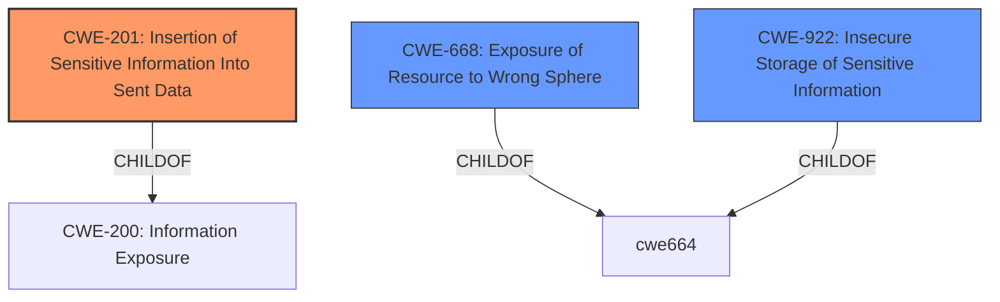

# Enhanced Analysis for CVE-2021-20331

# Summary
| CWE ID | CWE Name | Confidence | CWE Abstraction Level | CWE Vulnerability Mapping Label | CWE-Vulnerability Mapping Notes |
|---|---|---|---|---|---|
| CWE-201 | Insertion of Sensitive Information Into Sent Data | 1 | Base | Primary | Allowed |
| CWE-668 | Exposure of Resource to Wrong Sphere | 0.5 | Class | Secondary | Discouraged |
| CWE-922 | Insecure Storage of Sensitive Information | 0.4 | Class | Secondary | Allowed-with-Review |

## Evidence and Confidence

*   **Confidence Score:** 0.8
*   **Evidence Strength:** HIGH

## Relationship Analysis
The primary relationship that impacted the decision was the parent-child relationship between CWE-200 (Information Exposure) and CWE-201 (Insertion of Sensitive Information Into Sent Data). CWE-201 is a more specific case of information exposure, making it a better fit given the details provided in the vulnerability description.
CWE-668 (Exposure of Resource to Wrong Sphere) is a high-level class that is often misused, so is a secondary consideration.
CWE-922 (Insecure Storage of Sensitive Information) is also a class, making it less specific than CWE-201.



## Vulnerability Chain
The vulnerability chain starts with the **failure to redact sensitive commands** in the MongoDB C# driver, leading to the **insertion of sensitive information into command started events**, which ultimately results in the **exposure of authentication credentials** and user details.

## Summary of Analysis
The initial analysis focused on identifying the root cause of the vulnerability, which lies in the failure to redact sensitive commands in the MongoDB C# driver. This leads to the insertion of sensitive information into sent data, specifically command started events.

The evidence supporting this assessment is derived from the "CVE Reference Links Content Summary," which states: "A regression was introduced in the C# driver for MongoDB due to a commit related to speculative SCRAM-SHA authentication. This resulted in **security-sensitive commands not being redacted** in command started events." Furthermore, the summary explicitly mentions that this **failure to redact sensitive command information** could lead to the exposure of authentication credentials.

Given this evidence, CWE-201 (Insertion of Sensitive Information Into Sent Data) is the most appropriate choice. Its description aligns perfectly: "The code transmits data to another actor, but a portion of the data includes **sensitive information that should not be accessible to that actor**." In this case, the data being transmitted are the command started events, and the sensitive information includes authentication credentials and user details.

CWE-668 (Exposure of Resource to Wrong Sphere) was considered but ultimately deemed less specific. While the vulnerability does result in exposure, CWE-201 directly addresses the mechanism by which the exposure occurs, namely the insertion of sensitive information into sent data. The mapping guidance for CWE-668 discourages its use as a catch-all when lower-level CWE IDs are applicable.

CWE-922 (Insecure Storage of Sensitive Information) was also considered, but is not applicable because the sensitive data is not being stored, but being sent in events.

The selection of CWE-201 is at the optimal level of specificity because it directly addresses the coding error that leads to the vulnerability. It is a Base-level CWE, which is preferred for mapping to the root causes of vulnerabilities. The MITRE mapping guidance allows for the use of CWE-201 in this scenario.


## CWE Relationship Analysis

Current CWEs represent these abstraction levels: .


### Vulnerability Chain Analysis

**Chain starting from CWE-922:**
- 922 (Insecure Storage of Sensitive Information) - ROOT


**Chain starting from CWE-668:**
- 668 (Exposure of Resource to Wrong Sphere) - ROOT


### CWE Relationship Diagram

```mermaid
graph TD
    classDef primary fill:#f96,stroke:#333,stroke-width:2px
    classDef secondary fill:#69f,stroke:#333
    classDef tertiary fill:#9e9,stroke:#333
```