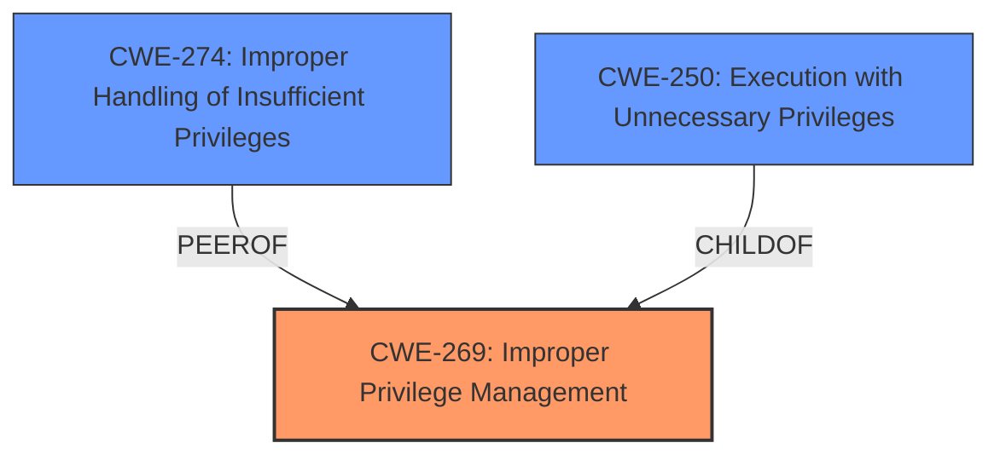

# Analysis for CVE-2021-20334

# Summary
| CWE ID | CWE Name | Confidence | CWE Abstraction Level | CWE Vulnerability Mapping Label | CWE-Vulnerability Mapping Notes |
|---|---|---|---|---|---|
| CWE-269 | Improper Privilege Management | 0.9 | Class | Allowed | This is the primary CWE because the vulnerability involves a failure to properly manage privileges, allowing a malicious actor to execute arbitrary software with elevated privileges.|
| CWE-274 | Improper Handling of Insufficient Privileges | 0.6 | Base | Discouraged | This is a secondary candidate because the system might not be handling cases where it doesn't have enough privileges correctly. However, CWE-269 is a better fit. |
| CWE-250 | Execution with Unnecessary Privileges | 0.5 | Base | Allowed | This is a secondary candidate because the component might be executing with privileges it doesn't need, amplifying the consequences of the **improper privilege management**. |

## Evidence and Confidence

*   **Confidence Score:** 0.9
*   **Evidence Strength:** HIGH

## Relationship Analysis
The analysis considered the following relationships:
  - **CWE-269** is a Class-level CWE that represents a high-level view of privilege management issues.
  - **CWE-274** is a Base-level CWE, representing the improper handling of insufficient privileges.
  - **CWE-250** is a Base-level CWE, indicating execution with unnecessary privileges.

The choice of CWE-269 as the primary weakness reflects the overall **improper privilege management**, which is the root cause of the vulnerability. Although more specific CWEs exist, they represent facets of the issue rather than the core problem. The other CWEs are secondary issues that highlight how the improper privilege management is implemented.

## Vulnerability Chain
The chain of events for this vulnerability is as follows:
  1. **Root Cause:** **Improper Privilege Management** (CWE-269)
  2. A malicious third party gains local access to the Windows machine.
  3. The malicious actor exploits the **improper privilege management**.
  4. **Impact:** The attacker can execute arbitrary software with the elevated privileges of the user running MongoDB Compass.

## Summary of Analysis
The initial analysis focused on identifying the root cause of the vulnerability, which is related to how MongoDB Compass manages privileges on Windows. The "CVE Reference Links Content Summary" section explicitly mentions "**Improper privilege management** within MongoDB Compass on Windows" as the root cause.

Based on the evidence, the primary CWE is CWE-269 (Improper Privilege Management). The "Retriever Results" also list CWE-269 as the top combined result. The vulnerability description highlights that a malicious actor can execute arbitrary software with elevated privileges, indicating a failure in the correct assignment, modification, tracking, or checking of privileges.

The graph relationships influenced the decision to choose CWE-269 as the primary weakness, as it serves as a high-level classification that encompasses the different facets of the privilege management issue.

CWE-269 is the most appropriate level of specificity because it directly addresses the identified root cause. Although more specific CWEs exist, they represent components of the issue rather than the core problem of **improper privilege management**.

Relevant CWE Information:
# Enhanced Context (25 CWEs)
The following CWEs were identified as potentially relevant to this vulnerability:

## CWE-274: Improper Handling of Insufficient Privileges
**Abstraction Level**: Base
**Similarity Score**: 0.78
**Source**: dense

**Description**:
The product does not handle or incorrectly handles when it has insufficient privileges to perform an operation, leading to resultant weaknesses.

**Mapping Guidance**:
- Usage: Discouraged
- Rationale: This CWE entry could be deprecated in a future version of CWE.

This CWE was considered but not chosen as the primary because the issue isn't about the system not handling cases where it lacks privileges; it is about the system allowing too many privileges.

## CWE-668: Exposure of Resource to Wrong Sphere
**Abstraction Level**: Class
**Similarity Score**: 0.78
**Source**: dense

**Description**:
The product exposes a resource to the wrong control sphere, providing unintended actors with inappropriate access to the resource.

**Mapping Guidance**:
- Usage: Discouraged
- Rationale: CWE-668 is high-level and is often misused as a catch-all when lower-level CWE IDs might be applicable. It is sometimes used for low-information vulnerability reports [REF-1287]. It is a level-1 Class (i.e., a child of a Pillar). It is not useful for trend analysis.

This CWE was considered but not chosen as the primary because it is a high level and not useful for trend analysis.

## CWE-280: Improper Handling of Insufficient Permissions or Privileges
**Abstraction Level**: Base
**Similarity Score**: 0.78
**Source**: dense

**Description**:
The product does not handle or incorrectly handles when it has insufficient privileges to access resources or functionality as specified by their permissions. This may cause it to follow unexpected code paths that may leave the product in an invalid state.

**Mapping Guidance**:
- Usage: Allowed
- Rationale: This CWE entry is at the Base level of abstraction, which is a preferred level of abstraction for mapping to the root causes of vulnerabilities.

This CWE was considered but not chosen as the primary because the issue isn't about the system not handling cases where it lacks privileges; it is about the system allowing too many privileges.

## CWE-807: Reliance on Untrusted Inputs in a Security Decision
**Abstraction Level**: Base
**Similarity Score**: 0.78
**Source**: dense

**Description**:
The product uses a protection mechanism that relies on the existence or values of an input, but the input can be modified by an untrusted actor in a way that bypasses the protection mechanism.

**Mapping Guidance**:
- Usage: Allowed
- Rationale: This CWE entry is at the Base level of abstraction, which is a preferred level of abstraction for mapping to the root causes of vulnerabilities.

This CWE was not chosen because there is nothing in the vulnerability description that says untrusted inputs are the root cause.

## CWE-345: Insufficient Verification of Data Authenticity
**Abstraction Level**: Class
**Similarity Score**: 0.77
**Source**: dense

**Description**:
The product does not sufficiently verify the origin or authenticity of data, in a way that causes it to accept invalid data.

**Mapping Guidance**:
- Usage: Discouraged
- Rationale: This CWE entry is a level-1 Class (i.e., a child of a Pillar). It might have lower-level children that would be more appropriate

This CWE was not chosen because there is nothing in the vulnerability description that says data authenticity is the root cause.

## CWE-59: Improper Link Resolution Before File Access ('Link Following')
**Abstraction Level**: Base
**Similarity Score**: 0.77
**Source**: dense

**Description**:
The product attempts to access a file based on the filename, but it does not properly prevent that filename from identifying a link or shortcut that resolves to an unintended resource.

**Mapping Guidance**:
- Usage: Allowed
- Rationale: This CWE entry is at the Base level of abstraction, which is a preferred level of abstraction for mapping to the root causes of vulnerabilities.

This CWE was not chosen because there is nothing in the vulnerability description about file access.

## CWE-41: Improper Resolution of Path Equivalence
**Abstraction Level**: Base
**Similarity Score**: 0.77
**Source**: dense

**Description**:
The product is vulnerable to file system contents disclosure through path equivalence. Path equivalence involves the use of special characters in file and directory names. The associated manipulations are intended to generate multiple names for the same object.

**Mapping Guidance**:
- Usage: Allowed
- Rationale: This CWE entry is at the Base level of abstraction, which is a preferred level of abstraction for mapping to the root causes of vulnerabilities.

This CWE was not chosen because there is nothing in the vulnerability description about file path equivalence.

## CWE-266: Incorrect Privilege Assignment
**Abstraction Level**: Base
**Similarity Score**: 0.77
**Source**: dense

**Description**:
A product incorrectly assigns a privilege to a particular actor, creating an unintended sphere of control for that actor.

**Mapping Guidance**:
- Usage: Allowed
- Rationale: This CWE entry is at the Base level of abstraction, which is a preferred level of abstraction for mapping to the root causes of vulnerabilities