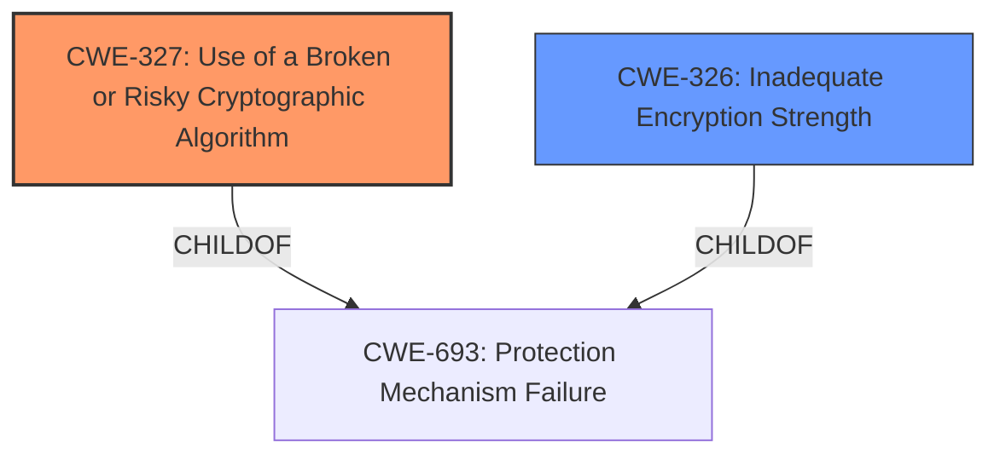

# Enhanced Analysis for CVE-2021-20369

# Summary
| CWE ID  | CWE Name | Confidence | CWE Abstraction Level | CWE Vulnerability Mapping Label | CWE-Vulnerability Mapping Notes |
|-----------------|------------------------------------------------------------|-------------------|-------------------------|-----------------------------------|-------------------------------------------------------------------------------------------------------------------------------------------|
| CWE-327 | Use of a Broken or Risky Cryptographic Algorithm | 1 | Class | Primary | Allowed-with-Review |
| CWE-326 | Inadequate Encryption Strength | 0.8 | Class | Secondary | Allowed-with-Review |

## Evidence and Confidence

*   **Confidence Score:** 0.9
*   **Evidence Strength:** HIGH

## Relationship Analysis
The primary relationship influencing the decision is the hierarchical structure. CWE-327 and CWE-326 are both classes. The vulnerability description indicates the use of **weak cryptographic algorithms**, which aligns more directly with using a broken or risky algorithm (CWE-327) but could also indicate inadequate strength (CWE-326). Both are children of CWE-693.



## Vulnerability Chain
The chain of root cause and weaknesses for the Vulnerability Description is as follows:
1.  **Root Cause:** Use of **weak cryptographic algorithms** (CWE-327)
2.  **Impact:** Potential to decrypt highly sensitive information.

## Summary of Analysis
The initial analysis identified CWE-327 as the primary candidate due to the explicit mention of **weak cryptographic algorithms**. The "CWE for similar CVE Descriptions" section also lists CWE-327 as the primary match. The CVE Reference Links Content Summary reinforces this, stating that the root cause is the use of an inadequate encryption algorithm.

CWE-326 was also considered, as inadequate encryption strength can sometimes manifest as using algorithms that are not strong enough. However, the description leans more towards the algorithm itself being flawed or risky (CWE-327) rather than just not strong enough (CWE-326).

The final decision is based on the evidence provided, specifically the **rootcause** key phrase "**weak cryptographic algorithms**" and the CVE Reference Links Content Summary, both of which point towards a problem with the algorithm itself rather than its strength.

The selected CWEs are at the optimal level of specificity because they are Class level CWEs and the vulnerability description does not provide enough information to choose a more specific Base level CWE.

Relevant CWE Information:

# Enhanced Context (25 CWEs)

## CWE-311: Missing Encryption of Sensitive Data
**Abstraction Level**: Class
**Similarity Score**: 0.81
**Source**: dense

**Description**:
The product does not encrypt sensitive or critical information before storage or transmission.

**Mapping Guidance**:
- Usage: Discouraged
- Rationale: CWE-311 is high-level with more precise children available. It is a level-1 Class (i.e., a child of a Pillar).

*Not Used:* This is not a case of missing encryption, but of using encryption that is inadequate.

## CWE-312: Cleartext Storage of Sensitive Information
**Abstraction Level**: Base
**Similarity Score**: 0.80
**Source**: dense

**Description**:
The product stores sensitive information in cleartext within a resource that might be accessible to another control sphere.

**Mapping Guidance**:
- Usage: Allowed
- Rationale: This CWE entry is at the Base level of abstraction, which is a preferred level of abstraction for mapping to the root causes of vulnerabilities.

*Not Used:* This CWE does not apply because the vulnerability involves the use of inadequate encryption algorithms, rather than storing data in cleartext.

## CWE-319: Cleartext Transmission of Sensitive Information
**Abstraction Level**: Base
**Similarity Score**: 0.79
**Source**: dense

**Description**:
The product transmits sensitive or security-critical data in cleartext in a communication channel that can be sniffed by unauthorized actors.

**Mapping Guidance**:
- Usage: Allowed
- Rationale: This CWE entry is at the Base level of abstraction, which is a preferred level of abstraction for mapping to the root causes of vulnerabilities.

*Not Used:* This CWE does not apply because the vulnerability involves the use of inadequate encryption algorithms, rather than transmitting data in cleartext.

## CWE-1240: Use of a Cryptographic Primitive with a Risky Implementation
**Abstraction Level**: Base
**Similarity Score**: 0.77
**Source**: dense

**Description**:
To fulfill the need for a cryptographic primitive, the product implements a cryptographic algorithm using a non-standard, unproven, or disallowed/non-compliant cryptographic implementation.

**Mapping Guidance**:
- Usage: Allowed
- Rationale: This CWE entry is at the Base level of abstraction, which is a preferred level of abstraction for mapping to the root causes of vulnerabilities.

*Not Used:* The description focuses on weak algorithms, which aligns better with CWE-327. While a risky implementation could contribute to weakness, the primary issue is the algorithm choice itself.

## CWE-1391: Use of Weak Credentials
**Abstraction Level**: Class
**Similarity Score**: 0.77
**Source**: dense

**Description**:
The product uses weak credentials (such as a default key or hard-coded password) that can be calculated, derived, reused, or guessed by an attacker.

**Mapping Guidance**:
- Usage: Allowed-with-Review
- Rationale: This CWE entry is a Class and might have Base-level children that would be more appropriate

*Not Used:* The vulnerability does not involve weak credentials. The issue lies in the cryptographic algorithms used.

## CWE-203: Observable Discrepancy
**Abstraction Level**: Base
**Similarity Score**: 0.77
**Source**: dense

**Description**:
The product behaves differently or sends different responses under different circumstances in a way that is observable to an unauthorized actor, which exposes security-relevant information about the state of the product, such as whether a particular operation was successful or not.

**Mapping Guidance**:
- Usage: Allowed
- Rationale: This CWE entry is at the Base level of abstraction, which is a preferred level of abstraction for mapping to the root causes of vulnerabilities.

*Not Used:* This CWE does not directly apply. While the weakness in the encryption algorithm might lead to observable discrepancies, the root cause is the algorithm itself.

## CWE-345: Insufficient Verification of Data Authenticity
**Abstraction Level**: Class
**Similarity Score**: 0.76
**Source**: dense

**Description**:
The product does not sufficiently verify the origin or authenticity of data, in a way that causes it to accept invalid data.

**Mapping Guidance**:
- Usage: Discouraged
- Rationale: This CWE entry is a level-1 Class (i.e., a child of a Pillar). It might have lower-level children that would be more appropriate

*Not Used:* This is about verifying data authenticity, and that is not the problem described.

## CWE-226: Sensitive Information in Resource Not Removed Before Reuse
**Abstraction Level**: Base
**Similarity Score**: 0.76
**Source**: dense

**Description**:
The product releases a resource such as memory or a file so that it can be made available for reuse, but it does not clear or "zeroize" the information contained in the resource before the product performs a critical state transition or makes the resource available for reuse by other entities.

**Mapping Guidance**:
- Usage: Allowed
- Rationale: This CWE entry is at the Base level of abstraction, which is a preferred level of abstraction for mapping to the root causes of vulnerabilities.

*Not Used:* This is not about resource reuse, but about using weak encryption.

## CWE-208: Observable Timing Discrepancy
**Abstraction Level**: Base
**Similarity Score**: 0.76
**Source**: dense

**Description**:
Two separate operations in a product require different amounts of time to complete, in a way that is observable to an actor and reveals security-relevant information about the state of the product, such as whether a particular operation was successful or not.

**Mapping Guidance**:
- Usage: Allowed
- Rationale: This CWE entry is at the Base level of abstraction, which is a preferred level of abstraction for mapping to the root causes of vulnerabilities.

*Not Used:* This is about timing discrepancy, not about weak encryption.

## CWE-326: Inadequate Encryption Strength
**Abstraction Level**: Class
**Similarity Score**: 0.76
**Source**: dense

**Description**:
The product stores or transmits sensitive data using an encryption scheme that is theoretically sound, but is


## CWE Relationship Analysis

Current CWEs represent these abstraction levels: .


### Vulnerability Chain Analysis

**Chain starting from CWE-208:**
- 208 (Observable Timing Discrepancy) - ROOT


**Chain starting from CWE-312:**
- 312 (Cleartext Storage of Sensitive Information) - ROOT


### CWE Relationship Diagram

```mermaid
graph TD
    classDef primary fill:#f96,stroke:#333,stroke-width:2px
    classDef secondary fill:#69f,stroke:#333
    classDef tertiary fill:#9e9,stroke:#333
```