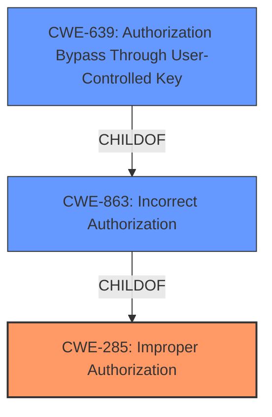

# Analysis for CVE-2021-20375

# Summary

| CWE ID  | CWE Name                                                                   | Confidence | CWE Abstraction Level | CWE Vulnerability Mapping Label | CWE-Vulnerability Mapping Notes |
| ------- | -------------------------------------------------------------------------- | ---------- | --------------------- | ------------------------------- | ----------------------------- |
| CWE-285 | Improper Authorization                                                     | 0.75       | Class                 | Primary CWE                     | Discouraged                   |
| CWE-863 | Incorrect Authorization                                                  | 0.65       | Class                 | Secondary                       | Allowed-with-Review         |
| CWE-639 | Authorization Bypass Through User-Controlled Key                           | 0.55       | Base                  | Secondary                       | Allowed                       |

## Evidence and Confidence

*   **Confidence Score:** 0.7
*   **Evidence Strength:** MEDIUM

## Relationship Analysis

The primary relationship impacting the decision is the hierarchical one. CWE-285 is a high-level Class, while CWE-863 and CWE-639 are children and more specific. Although the description is vague, the **improper access controls** root cause and the ability for an authenticated user to intercept and replace messages indicates an authorization problem. The hierarchical relationships (CWE-863 and CWE-639 are children of CWE-285 and other authorization-related CWEs) support refining the classification from the general "Improper Access Control" to more specific authorization issues.

## Vulnerability Chain

The chain starts with **improper access controls**, leading to the ability to intercept and replace messages.
  - **Root Cause:** **Improper access controls**
  - **Weakness:** Authorization flaw
  - **Impact:** Intercept and replace messages

## Summary of Analysis

Initially, the vulnerability description points towards a general access control issue due to "**improper access controls**." The ability for an authenticated user to intercept and replace messages suggests an authorization flaw. The description lacks specifics on *how* the access control is flawed, making precise CWE selection difficult.

The retriever results point to several authorization-related CWEs, including CWE-285, CWE-863, and CWE-639. Given the limited information, I selected CWE-285 as the primary, but acknowledge that more specific CWEs (CWE-863, CWE-639) are also relevant but difficult to confirm without further information.

CWE-284 (Improper Access Control) was considered but rejected because it is a very high-level Pillar, and the retriever results provide lower-level Class and Base options. CWE-862 (Missing Authorization) was considered, but the description says "**improper** access controls" which implies that there are access controls, just that they are not implemented correctly.

CWE-285 is selected as the primary because it is a Class level CWE, and the description says "**improper** access controls" which implies that there are access controls, just that they are not implemented correctly.

Relevant CWE Information:

# Enhanced Context (25 CWEs)

## CWE-312: Cleartext Storage of Sensitive Information
**Abstraction Level**: Base
**Similarity Score**: 0.79

**Description**:
The product stores sensitive information in cleartext within a resource that might be accessible to another control sphere.

**Mapping Guidance**:
- Usage: Allowed

## CWE-311: Missing Encryption of Sensitive Data
**Abstraction Level**: Class
**Similarity Score**: 0.79

**Description**:
The product does not encrypt sensitive or critical information before storage or transmission.

**Mapping Guidance**:
- Usage: Discouraged

## CWE-319: Cleartext Transmission of Sensitive Information
**Abstraction Level**: Base
**Similarity Score**: 0.79

**Description**:
The product transmits sensitive or security-critical data in cleartext in a communication channel that can be sniffed by unauthorized actors.

**Mapping Guidance**:
- Usage: Allowed

## CWE-807: Reliance on Untrusted Inputs in a Security Decision
**Abstraction Level**: Base
**Similarity Score**: 0.78

**Description**:
The product uses a protection mechanism that relies on the existence or values of an input, but the input can be modified by an untrusted actor in a way that bypasses the protection mechanism.

**Mapping Guidance**:
- Usage: Allowed

## CWE-668: Exposure of Resource to Wrong Sphere
**Abstraction Level**: Class
**Similarity Score**: 0.77

**Description**:
The product exposes a resource to the wrong control sphere, providing unintended actors with inappropriate access to the resource.

**Mapping Guidance**:
- Usage: Discouraged

## CWE-345: Insufficient Verification of Data Authenticity
**Abstraction Level**: Class
**Similarity Score**: 0.77

**Description**:
The product does not sufficiently verify the origin or authenticity of data, in a way that causes it to accept invalid data.

**Mapping Guidance**:
- Usage: Discouraged

## CWE-1391: Use of Weak Credentials
**Abstraction Level**: Class
**Similarity Score**: 0.76

**Description**:
The product uses weak credentials (such as a default key or hard-coded password) that can be calculated, derived, reused, or guessed by an attacker.

**Mapping Guidance**:
- Usage: Allowed-with-Review

## CWE-303: Incorrect Implementation of Authentication Algorithm
**Abstraction Level**: Base
**Similarity Score**: 0.76

**Description**:
The requirements for the product dictate the use of an established authentication algorithm, but the implementation of the algorithm is incorrect.

**Mapping Guidance**:
- Usage: Allowed

## CWE-657: Violation of Secure Design Principles
**Abstraction Level**: Class
**Similarity Score**: 0.76

**Description**:
The product violates well-established principles for secure design.

**Mapping Guidance**:
- Usage: Discouraged

## CWE-538: Insertion of Sensitive Information into Externally-Accessible File or Directory
**Abstraction Level**: Base
**Similarity Score**: 0.76

**Description**:
The product places sensitive information into files or directories that are accessible to actors who are allowed to have access to the files, but not to the sensitive information.

**Mapping Guidance**:
- Usage: Allowed

## CWE-319: Cleartext Transmission of Sensitive Information
**Abstraction Level**: Base
**Similarity Score**: 6114.34

**Description**:
The product transmits sensitive or security-critical data in cleartext in a communication channel that can be sniffed by unauthorized actors.

**Mapping Guidance**:
- Usage: Allowed

## CWE-327: Use of a Broken or Risky Cryptographic Algorithm
**Abstraction Level**: Class
**Similarity Score**: 6107.28

**Description**:
The product uses a broken or risky cryptographic algorithm or protocol.

**Mapping Guidance**:
- Usage: Allowed-with-Review

## CWE-863: Incorrect Authorization
**Abstraction Level**: Class
**Similarity Score**: 6093.92

**Description**:
The product performs an authorization check when an actor attempts to access a resource or perform an action, but it does not correctly perform the check.

**Mapping Guidance**:
- Usage: Allowed-with-Review

## CWE-285: Improper Authorization
**Abstraction Level**: Class
**Similarity Score**: 6011.40

**Description**:
The product does not perform or incorrectly performs an authorization check when an actor attempts to access a resource or perform an action.

**Mapping Guidance**:
- Usage: Discouraged

## CWE-639: Authorization Bypass Through User-Controlled Key
**Abstraction Level**: Base
**Similarity Score**: 5997.22

**Description**:
The system's authorization functionality does not prevent one user from gaining access to another user's data or record by modifying the key value identifying the data.

**Mapping Guidance**:
- Usage: Allowed

## CWE-488: Exposure of Data Element to Wrong Session
**Abstraction Level**: base
**Similarity Score**: 4.33

**Description**:
CWE-488: Exposure of Data Element to Wrong Session

**Mapping Guidance**:
- Usage: Allowed

## CWE-567: Unsynchronized Access to Shared Data in a Multithreaded Context
**Abstraction Level**: base
**Similarity Score**: 4.33

**Description**:
CWE-567: Unsynchronized Access to Shared Data in a Multithreaded Context

**Mapping Guidance**:
- Usage: Allowed

## CWE-32